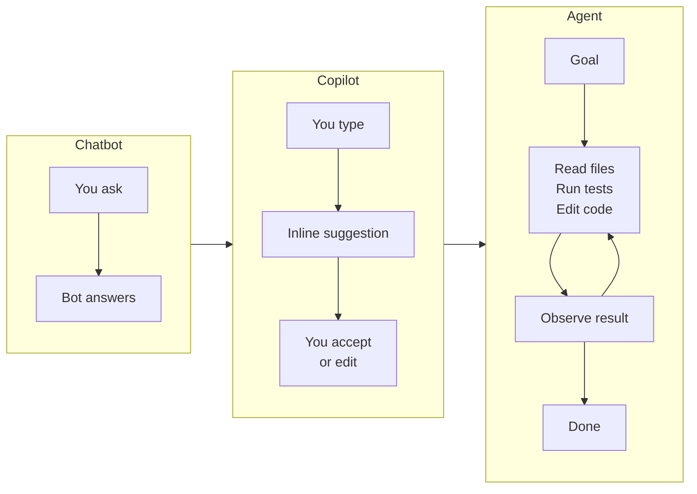
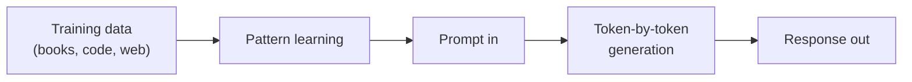
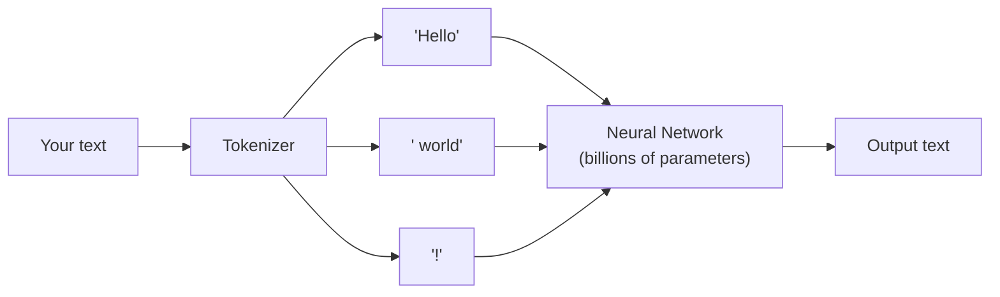
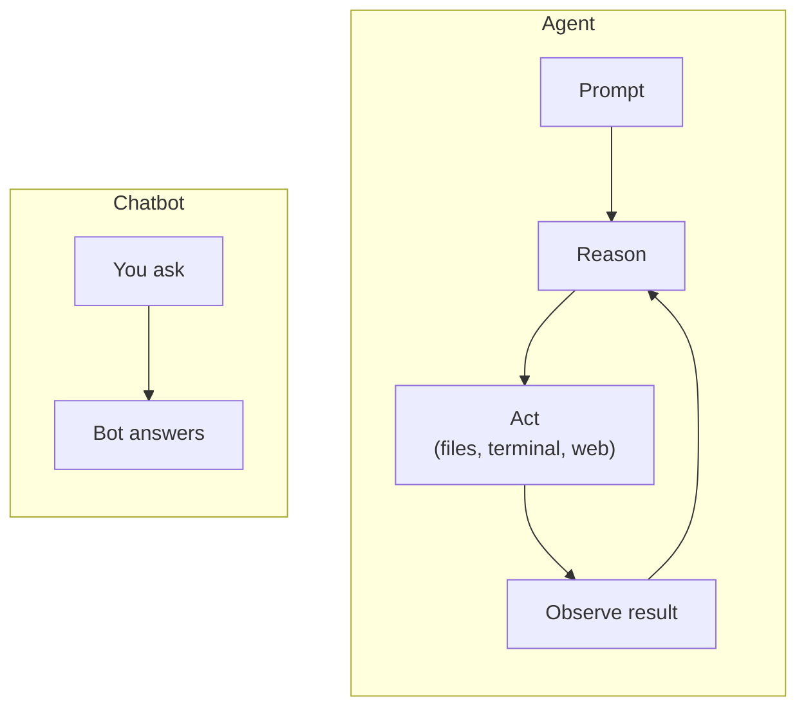
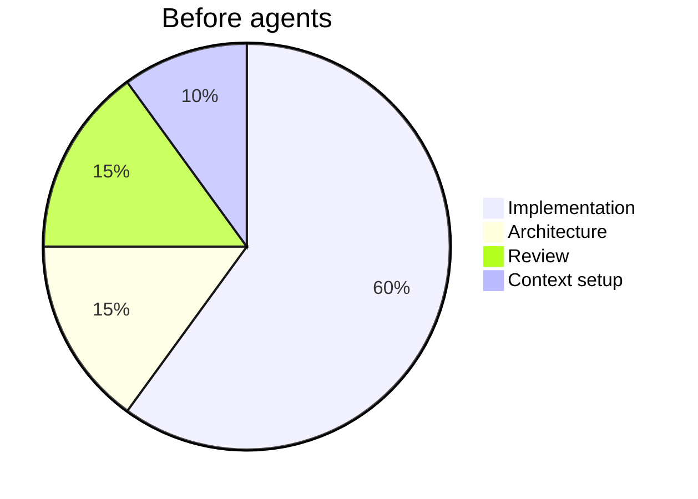
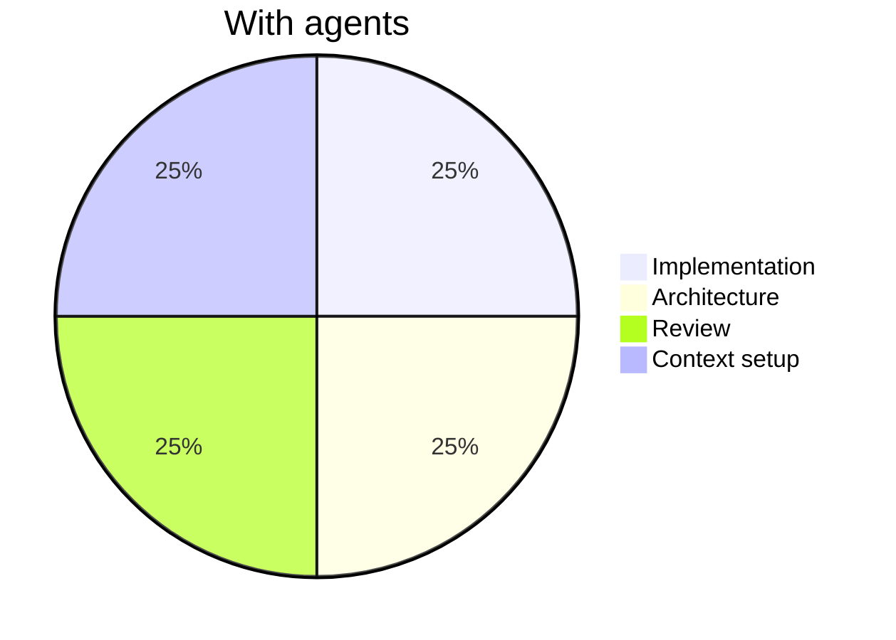

*Already comfortable with LLMs, tokens, and context windows? [Skip to Part 2](/blog/agentic-ai-2-what-is-a-coding-agent) where we get into how coding agents actually work.*

A couple of years ago, if you'd told me I'd be talking to my code editor instead of typing into it, I'd have assumed you were describing science fiction or a very optimistic VC pitch deck. That I'd watch it reason through a problem, push a fix, run the tests, and come back with a summary. But here we are. The tools exist, the workflows are real, and teams are already shipping with them. *"Will AI change how we build software?"* stopped being the question a while ago. The one left is whether you understand it well enough to use it well. That's what this series is about.

A note on where I'm writing from. I'm a frontend engineer, previously at Payoneer, and I've spent the past year building with coding agents every day. Claude Code, Cursor, and most of what sits next to them. This series is the field guide I wish someone had handed me at the start.

One idea runs through the whole series, so here it is up front. **Agents amplify clarity and ambiguity equally.** Vague intent gets you confidently wrong output. Sharp specification gets you real leverage. The rest is mechanics.

[Alex Azimbaev](https://medium.com/@alex-azimbaev/building-ai-agents-that-actually-ship-a-practical-guide-for-2025-0c84e2233218) framed it in a way that stuck with me. 2024 was the year of prototypes and proof-of-concepts, when everyone experimented and few shipped. 2025 is when the infrastructure caught up with the ambition. The models got better, the tooling matured, and the patterns settled enough for teams to build on them. That's where we are now.

We're starting at the foundation, and not because I doubt anyone's intelligence. Most of the confusion I see in teams, developers very much included, traces back to a shaky mental model at the base level. So before agents, workflows, and team structure, let's agree on the vocabulary.

> **Two tracks for this series.** Developers should read all six parts in order. If you're an engineering lead, PM, or founder with less appetite for day-to-day mechanics, read Parts 1, 5, and 6. That path covers the fundamentals, team-level adoption, and tooling decisions, and skips the implementation detail in between.

---

## What generative AI actually is (and isn't)

You've heard the term a thousand times. Let me give you the version that actually sticks.

Generative AI is software that produces new content, whether text, code, images, or audio, rather than classifying or retrieving content that already exists. The "generative" part is the whole distinction. A search engine finds things. A recommendation algorithm ranks things. Generative AI *creates* things.

Here's what it isn't. It isn't thinking. It isn't conscious. And it isn't looking anything up in a database. It generates responses from patterns it learned during training. Models *can* be wired to retrieval systems, a technique called RAG, but that's a layer bolted on top rather than how the model itself works. We'll get there.

What it does is pattern completion, at a scale where it stops feeling like pattern completion. Train on enough human-produced text and the model learns to continue patterns coherently, tracking the context it was handed.

An imperfect analogy. Imagine someone who has read close to everything written on the internet and absorbed how ideas connect, how arguments get built, how code is written. They can produce a fluent answer on demand. They aren't retrieving a memorized one. They're constructing it as they go.

> Not retrieval. Not reasoning. Pattern completion.

That's generative AI. Impressive? Yes. Magic? No. Holding that distinction in your head is most of what separates the people who use it well from the people it burns.

---

## LLMs, the engine under the hood

Almost all of it runs on large language models. GPT, Gemini, and Claude are all LLMs. Here's what that means in plain terms.

An LLM is a neural network trained to predict what comes next in a sequence of text. That's it. The trick is that past a certain size, on diverse enough data, it starts to generalize. It stops merely completing sentences and picks up grammar, reasoning, code syntax, tone, domain knowledge, logical structure. All of that falls out of trying to predict the next token really, really well.

Pause on one term, because it never stops coming up. A **token** is roughly a word or a fragment of one, the smallest unit an LLM works with. You type a message and the model never sees your letters or sentences, only tokens. It runs them through the network and produces the most probable continuation. This matters because tokens are the unit of context, of cost, and of rate limits everywhere in this space. Understand them and pricing, context windows, and latency all stop being mysterious later in the series.

Plain-English version

Imagine the model can only read in puzzle pieces, not letters. A "token" is one puzzle piece, sometimes a whole word and sometimes part of one. Everything you type gets chopped into pieces before the model sees it.

The "context window" is the maximum number of pieces it can hold in its head at once. When the conversation gets too long, the oldest pieces fall out.

A few things worth internalizing:

**Context is everything.** LLMs have no long-term memory by default. Everything the model knows about your situation lives in the *context window*, the text currently in the conversation. Working memory, essentially. When the conversation ends it's gone, unless the system around it was built to persist it. Good agents are.

**The same prompt can produce different outputs.** LLMs are often non-deterministic. Ask the same question twice, get two different answers. It catches people off guard the first time, and it has real consequences for reliability and testing. As much a feature as a bug, but something you design around rather than wish away.

**They can be wrong with total confidence.** The model generates plausible text, not verified facts, so it will hand you fluent, self-assured nonsense. The term of art is "hallucination." We'll keep coming back to it.

**Bigger isn't always better.** Big models for hard reasoning, small cheap fast ones for everything else. Knowing which to reach for is half of using this well.

---

## From chatbot to agent

For a while, LLMs lived inside chat interfaces. You typed, it replied. Useful, but closer to a very smart search box than a collaborator.

The shift happened when developers started giving models access to **tools**.

A model could now call a function, read a file, search the web, run a terminal command, and act on what came back. It went from answering questions to *doing* things. Chain those actions together, plan, act, observe, plan again, and you have an **agent**.

Think of the difference this way. A chatbot is like calling a consultant and asking for advice. An agent is like hiring that consultant, giving them access to your systems, and having them do the work. File the report, send the email, run the build.

That's a different relationship with the technology, and it drags trust, control, and oversight along with it. We'll dig into all three later.

---

## Why this moment matters for your team

I want to take a step back here, because I know some of you reading this are developers who already live in this world, and some of you are team leads or PMs trying to figure out what the noise actually means for your roadmap.

For both of you, this is not a marginal productivity improvement. The nature of the work is changing.

Developers spend less time on implementation boilerplate and more on architecture, judgment, and review. Team leads review output from humans *and* agents. PMs scope work differently because some tasks now cost a fraction of what they used to. The org chart hasn't changed yet. The workflows already have.

None of that means jobs disappear tomorrow. It does mean the teams who actually understand this technology, rather than carrying a vague sense that "AI is a thing," will make better calls than the teams who don't.

That's the gap this series is trying to close.

---

## What's coming next

Next part we go hands-on and break down what a coding agent actually is. Not the marketing version. What it does, how it reasons, where it goes wrong, and what working with one looks like day to day.

We'll use Claude Code as our primary example, but the patterns apply broadly. If you've used Cursor, GitHub Copilot, or any of the other agents emerging in the space, you'll recognize the architecture.

The goal isn't to sell you on any particular tool. It's to give you the mental model that makes all of them make sense.

*See you in Part 2.*
