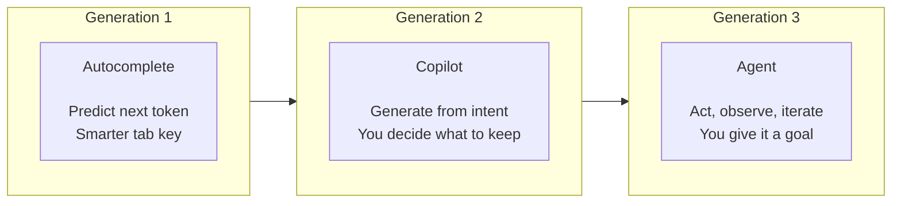
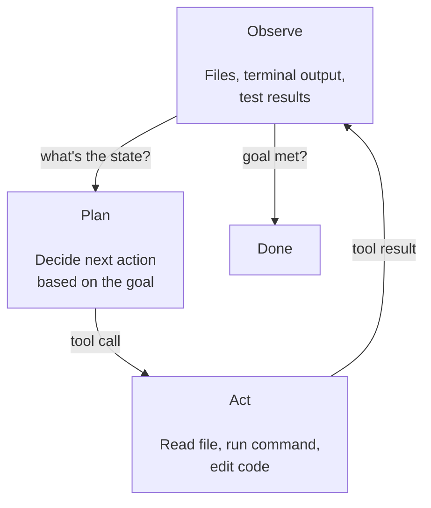
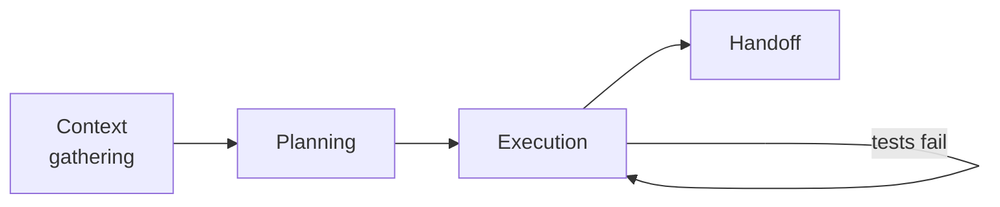

If [Part 1](/blog/agentic-ai-1-the-new-stack) was about understanding the engine, this one is about opening the hood.

By the end of this piece you'll know exactly what a coding agent is, how it actually works under the surface, and — just as importantly — where it breaks down. We'll use Claude Code as our main worked example, but the architecture we're describing applies to Cursor, GitHub Copilot, and the rest of the field. The names differ. The bones are mostly the same.

Let's start with how we got here.

---

## The Evolution: Autocomplete → Copilot → Agent

It helps to think of this as three distinct generations, each one a meaningful leap over the last.

**Generation 1: Autocomplete.** Tools like Tabnine and early IntelliSense used smaller models to predict the next token or line based on what you'd already typed. Useful for reducing keystrokes. Not much more than a smarter tab key.

**Generation 2: Copilot.** GitHub Copilot, when it launched, felt like a step change. Suddenly you could describe intent — in a comment, in a function name — and get back a plausible implementation. It understood context across the file, could generate whole functions, and often got it right. But it was still fundamentally *reactive*. You asked, it answered. You took the output, you decided what to do with it.

**Generation 3: Agent.** This is where we are now. An agent doesn't just respond — it *acts*. It reads your codebase, runs commands, checks results, self-corrects, and iterates — all in a loop, with minimal hand-holding. You give it a goal, not a prompt.



The difference between a copilot and an agent is the difference between a GPS that tells you where to turn and a self-driving car that just takes you there. Both useful. Very different relationships with the wheel.

---

## Anatomy of a Coding Agent

So what's actually happening when an agent "works"? Let's break it down into its core components.

### The Reasoning Loop

At the heart of every agent is a loop. It goes something like this:

1. **Observe** — what's the current state of the world? (files, terminal output, test results)
2. **Plan** — given the goal, what's the next action to take?
3. **Act** — execute that action via a tool
4. **Observe again** — did it work? what changed?
5. **Repeat** until the goal is met or the agent gets stuck

<details>
<summary>Plain-English version</summary>

Think of a fast helper following a recipe. You hand them a goal. They look at the kitchen (observe), decide what to do first (plan), do it (act), check whether it worked (observe again), and repeat. The loop is just that cycle running over and over until the goal's done or they get stuck and need help.

</details>

This is sometimes called a ReAct loop (Reason + Act), and it's the pattern underneath virtually every serious agent system today. The LLM isn't just generating text — it's deciding what to do next based on live feedback from the environment.

What's telling is how much the industry has converged on this. Anthropic's [guide to building effective agents](https://www.anthropic.com/research/building-effective-agents) lays out the core orchestration patterns — routing, parallelization, orchestrator-workers — and it reads like a blueprint for how every serious agent works under the hood. OpenAI published [their own practical guide](https://openai.com/business/guides-and-resources/a-practical-guide-to-building-ai-agents/) around the same time, and the overlap is striking. When competing companies independently converge on the same architecture, that's a strong signal you're looking at something durable, not a trend.



Think of it like a contractor on a job site. They don't just hand you a plan and leave — they assess the current state of the build, decide what to do next, do it, look at the result, and adjust. The loop is the work.

### Tools

An agent without tools is just a chatbot with ambitions. Tools are what give it hands.

In most coding agents, the tool set includes some combination of:

- **File system access** — read, write, create, delete files
- **Terminal / shell execution** — run commands, scripts, test suites
- **Code search** — semantic or text-based search across a codebase
- **Web browsing** — look up docs, check Stack Overflow, fetch an API spec
- **External APIs** — interact with GitHub, Jira, CI systems, and more

Each tool call is explicit — the model decides to use a tool, specifies the inputs, gets back a result, and reasons about what to do next. It's structured, traceable, and — crucially — auditable. You can see exactly what the agent did and why.

Worth knowing: in late 2024 Anthropic introduced the **Model Context Protocol (MCP)** — an open standard for how agents connect to external tools and data sources. Instead of every agent re-inventing custom integrations for GitHub, Jira, your filesystem, or your internal docs, MCP lets a tool be exposed once and consumed by any MCP-aware agent. By 2026 it's become the dominant connective tissue in the ecosystem, and *"does it support MCP?"* is a meaningful question when evaluating any agent. We'll come back to it in [Part 6](/blog/agentic-ai-6-choosing-your-agent-stack).

### Memory

This is where things get nuanced. As we covered in [Part 1](/blog/agentic-ai-1-the-new-stack), LLMs don't have persistent memory by default. Agents work around this in a few ways:

**In-context memory** is everything currently in the conversation window — the goal you set, the files the agent has read, the terminal output it's seen. This is the agent's working memory, and it's limited by the context window size.

**External memory** is anything the agent stores and retrieves from outside the model — vector databases, file summaries, prior session logs. This lets agents maintain awareness across sessions, across large codebases, across long-running tasks.

**Procedural memory** is baked into the system prompt — standing instructions, preferences, project conventions. Think of it as the agent's onboarding doc: "here's how we work, here's what to avoid."

Most production agents use all three in combination. The skill is in knowing which to lean on when.

<details>
<summary>Plain-English version</summary>

Three shelves, three kinds of memory:

- **In-context** — the desk you're working on right now. Everything in the current conversation.
- **External** — the filing cabinet across the room. Databases, summaries, notes from past sessions.
- **Procedural** — the standing instructions taped to the wall. "We do it this way here. Don't do that."

Good agents use all three, knowing which one fits the moment.

</details>

---

## Claude Code: A Case Study

```text
> Fix the failing auth tests

● Read(auth.test.ts)
  ⎿  Assertion failure on line 42. Test expects 401, handler returns 403.

● Read(auth.ts)
  ⎿  Read 89 lines

The handler on line 87 is returning the wrong status code. Updating it.

● Edit(auth.ts)
  ⎿  Updated line 87: 403 → 401

● Bash(npm test)
  ⎿  PASS  auth.test.ts — all 12 tests passing
```

Claude Code is Anthropic's CLI-based coding agent. Rather than living inside an IDE, it runs in your terminal and operates directly on your local filesystem. That architectural choice is deliberate — it gives it broader access and makes it easier to integrate into existing workflows and CI pipelines.

Here's roughly what happens when you give Claude Code a task:

**1. Context gathering.** Before writing a single line, it reads. It explores the repository structure, finds relevant files, reads your tests, checks your configs. It's building a picture of the environment before it acts — much like a new engineer's first day on a codebase.

**2. Planning.** It reasons through the approach. For complex tasks, you'll often see it lay out a plan in plain language before executing. This isn't just for your benefit — it's part of how the model structures its own reasoning.

**3. Execution.** It writes code, runs tests, reads the output, fixes failures, and iterates. The loop runs until the task is done or it needs your input.

**4. Handoff.** It summarizes what it did, what changed, and flags anything that needs a human decision. This is where the judgment boundary is — the agent knows when it's operating confidently and when it should stop and ask.



What makes this different from just prompting a model in a chat window? Primarily: persistence, tool access, and iteration. The agent doesn't give you one answer and wait. It works. It runs things. It checks its own output. It behaves less like a vending machine and more like a junior engineer who can move fast on well-defined tasks.

---

## The Rest of the Field

Claude Code isn't alone. A few other agents worth understanding:

**Cursor** lives inside a fork of VS Code, which makes it deeply integrated with the editing experience. Its strength is inline collaboration — you're always in the loop, co-piloting rather than delegating. Great for developers who want to stay hands-on.

**GitHub Copilot** has evolved well beyond autocomplete. Its agent mode can work across files, run terminal commands, and handle multi-step tasks — all from within VS Code or JetBrains. It benefits enormously from GitHub context: issues, PRs, repo history.

**Devin** (from Cognition) sits at the more autonomous end of the spectrum — designed for longer-horizon tasks with less human checkpointing. It made a lot of noise at launch and is a useful north-star for where the category is heading, even if the day-to-day reality is more nuanced.

The honest summary: they all implement the same core loop we described above. Where they differ is in autonomy level, IDE integration, context sources, and how much they keep you in the loop. Picking the right one is less about which model is "smarter" and more about how it fits into your workflow — which we'll cover properly in [Part 6](/blog/agentic-ai-6-choosing-your-agent-stack).

---

## What Agents Can and Can't Do

This is the section that's going to save you some frustration.

**Agents are genuinely great at:**
- Boilerplate and scaffolding — spinning up new features, writing tests for existing code, generating migrations
- Refactoring with clear patterns — "update all API calls to use the new client interface"
- Debugging with reproducible errors — give it a failing test and a stack trace (the error trail showing where the code crashed) and it will usually find the fix
- Documentation — reading code and producing accurate descriptions of what it does
- Cross-file edits — tasks that require touching multiple files in a consistent way

**Agents struggle with:**
- Ambiguous goals — if you're not sure what you want, the agent won't figure it out for you
- Novel architecture decisions — they're strong on patterns they've seen, weaker on genuine design judgment
- Long-horizon tasks without checkpoints — the longer the task, the more error accumulates
- Anything requiring real-world context you haven't provided — business logic, stakeholder preferences, unwritten conventions

The mental model I keep coming back to: agents are exceptional at tasks that are *well-specified* and *well-bounded*. The better you are at defining what "done" looks like, the better your agent will perform. That's not a limitation of the technology — it's a skill that compounds. The developers who get the most out of agents are the ones who've gotten good at framing problems cleanly.

---

## What's Coming Next

We've covered what agents are and how they work mechanically. The next piece gets practical: how do you actually communicate with one? What makes a good prompt for an agent versus a one-off chat query? How do you give it the right context, set guardrails, and stay in control without micromanaging?

[Part 3](/blog/agentic-ai-3-prompting-context-control) is where the theory starts turning into daily workflow. And where we'll start talking about the part most tutorials skip: what happens when things go wrong.

*See you in [Part 3](/blog/agentic-ai-3-prompting-context-control).*

---

**Further reading:** If you want to go deeper on agent architecture patterns — routing, handoffs, evaluation loops, and more — [21 Agentic Design Patterns](https://github.com/CarlBarl/agentic-design-patterns) is a well-organized reference worth bookmarking.
