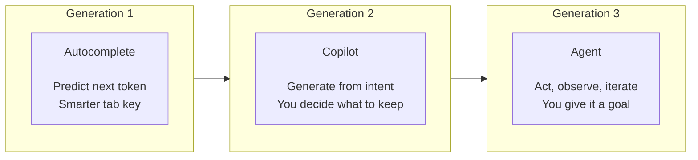
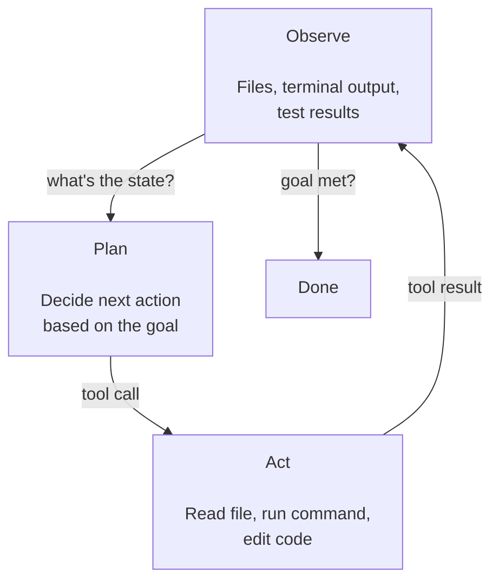
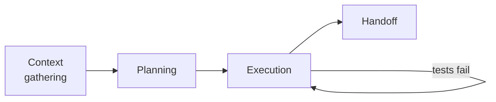

If [Part 1](/blog/agentic-ai-1-the-new-stack) was about understanding the engine, this one is about opening the hood.

By the end you'll know what a coding agent is, how it works under the surface, and, just as importantly, where it breaks down. Claude Code is the worked example, but the architecture applies to Cursor, GitHub Copilot, and the rest of the field. The names differ. The bones are mostly the same.

Let's start with how we got here.

---

## Three generations: autocomplete, copilot, agent

Three generations, each a real leap over the last.

**Generation 1, autocomplete.** Tabnine and early IntelliSense used small models to predict the next token or line from what you'd already typed. Useful for saving keystrokes. Not much more than a smarter tab key.

**Generation 2, copilot.** GitHub Copilot at launch felt like a step change. You could describe intent in a comment or a function name and get back a plausible implementation. It understood context across the file, generated whole functions, and often got it right. Still *reactive*, though. You asked, it answered, and you decided what to do with the output.

**Generation 3, agent.** Where we are now. An agent *acts*. It reads your codebase, runs commands, checks results, self-corrects, and iterates in a loop with minimal hand-holding. You give it a goal instead of a prompt.


```mermaid
flowchart LR
    subgraph Gen1["Generation 1"]
        A1["Autocomplete\n\nPredict next token\nSmarter tab key"]
    end

    subgraph Gen2["Generation 2"]
        A2["Copilot\n\nGenerate from intent\nYou decide what to keep"]
    end

    subgraph Gen3["Generation 3"]
        A3["Agent\n\nAct, observe, iterate\nYou give it a goal"]
    end

    Gen1 --> Gen2 --> Gen3
```

The difference between a copilot and an agent is the difference between a GPS that tells you where to turn and a self-driving car that just takes you there. Both useful. Very different relationships with the wheel.

---

## Anatomy of a coding agent

So what's actually happening when an agent "works"? Let's break it down into its core components.

### The reasoning loop

At the heart of every agent is a loop. It goes something like this:

1. **Observe.** What's the current state of the world? Files, terminal output, test results.
2. **Plan.** Given the goal, what's the next action?
3. **Act.** Execute that action through a tool.
4. **Observe again.** Did it work? What changed?
5. **Repeat** until the goal is met or the agent gets stuck.

<details>
<summary>Plain-English version</summary>

Think of a fast helper following a recipe. You hand them a goal. They look at the kitchen (observe), decide what to do first (plan), do it (act), check whether it worked (observe again), and repeat. The loop is that cycle running over and over until the goal's done or they get stuck and need help.

</details>

This is sometimes called a ReAct loop (Reason + Act), and it sits under nearly every serious agent system today. The LLM isn't generating text. It's deciding what to do next from live feedback out of the environment.

What's telling is how hard the industry converged on this. Anthropic's [guide to building effective agents](https://www.anthropic.com/research/building-effective-agents) lays out the orchestration patterns, routing, parallelization, orchestrator-workers, and it reads like a blueprint for how every serious agent works underneath. OpenAI published [their own practical guide](https://openai.com/business/guides-and-resources/a-practical-guide-to-building-ai-agents/) a few months later, and the overlap is hard to miss. Their manager pattern is Anthropic's orchestrator-workers wearing a different name. When competitors land on the same shapes without coordinating, you're looking at something durable rather than a trend.


```mermaid
flowchart TD
    Observe["Observe\n\nFiles, terminal output,\ntest results"] -- "what's the state?" --> Plan["Plan\n\nDecide next action\nbased on the goal"]
    Plan -- "tool call" --> Act["Act\n\nRead file, run command,\nedit code"]
    Act -- "tool result" --> Observe
    Observe -- "goal met?" --> Done["Done"]
```

Think of a contractor on a job site. They don't hand you a plan and leave. They assess the state of the build, decide what's next, do it, look at the result, adjust. The loop is the work.

### Tools

An agent without tools is a chatbot with ambitions. Tools give it hands.

In most coding agents, the tool set includes some combination of:

- **File system access.** Read, write, create, delete files.
- **Terminal and shell execution.** Run commands, scripts, test suites.
- **Code search.** Semantic or text search across a codebase.
- **Web browsing.** Look up docs, check Stack Overflow, fetch an API spec.
- **External APIs.** GitHub, Jira, CI systems.

Each tool call is explicit. The model decides to use a tool, specifies the inputs, gets a result, and reasons about what comes next. Structured, traceable, auditable. You can see exactly what the agent did and why.

Worth knowing. In late 2024 Anthropic introduced the **Model Context Protocol (MCP)**, an open standard for how agents connect to external tools and data. Rather than every agent re-inventing integrations for GitHub, Jira, your filesystem, or your internal docs, MCP lets you expose a tool once and have any MCP-aware agent consume it. By 2026 it's how most of the ecosystem plugs together, and *"does it support MCP?"* is a real question when you evaluate an agent. We'll come back to it in [Part 6](/blog/agentic-ai-6-choosing-your-agent-stack).

### Memory

This is where things get nuanced. As we covered in [Part 1](/blog/agentic-ai-1-the-new-stack), LLMs don't have persistent memory by default. Agents work around this in a few ways:

**In-context memory** is everything currently in the conversation window. The goal you set, the files the agent read, the terminal output it saw. This is working memory, capped by the size of the context window.

**External memory** is anything the agent stores and retrieves outside the model. Vector databases, file summaries, prior session logs. This is what carries awareness across sessions, across large codebases, across tasks that run for days.

**Procedural memory** lives in the system prompt. Standing instructions, preferences, project conventions. The agent's onboarding doc, basically. Here's how we work, here's what to avoid.

Most production agents use all three in combination. The skill is in knowing which to lean on when.

<details>
<summary>Plain-English version</summary>

Three shelves, three kinds of memory:

- **In-context.** The desk you're working on right now. Everything in the current conversation.
- **External.** The filing cabinet across the room. Databases, summaries, notes from past sessions.
- **Procedural.** The standing instructions taped to the wall. "We do it this way here. Don't do that."

Good agents use all three, knowing which one fits the moment.

</details>

---

## Claude Code as the worked example

```text
> Fix the failing auth tests

● Read(auth.test.ts)
  ⎿  Assertion failure on line 42. Test expects 401, handler returns 403.

● Read(auth.ts)
  ⎿  Read 89 lines

The handler on line 87 is returning the wrong status code. Updating it.

● Edit(auth.ts)
  ⎿  Updated line 87: 403 → 401

● Bash(npm test)
  ⎿  PASS  auth.test.ts  12 passed
```

Claude Code is Anthropic's CLI-based coding agent. Rather than living inside an IDE, it runs in your terminal and works directly on your local filesystem. That choice is deliberate. It buys broader access and drops into existing workflows and CI pipelines more easily.

Here's roughly what happens when you give Claude Code a task:

**1. Context gathering.** Before writing a single line, it reads. It explores the repository structure, finds relevant files, reads your tests, checks your configs. It builds a picture of the environment before acting, the way a new engineer spends their first day.

**2. Planning.** It reasons through the approach. On complex tasks you'll see it lay out a plan in plain language before executing. That isn't only for your benefit. Writing the plan is part of how the model structures its own reasoning.

**3. Execution.** It writes code, runs tests, reads the output, fixes failures, and iterates. The loop runs until the task is done or it needs your input.

**4. Handoff.** It summarizes what it did, what changed, and flags anything needing a human decision. That's the judgment boundary. A good agent knows when it's on solid ground and when to stop and ask.


```mermaid
flowchart LR
    G["Context\ngathering"] --> P["Planning"] --> E["Execution"] --> H["Handoff"]
    E -- "tests fail" --> E
```

What makes this different from prompting a model in a chat window? Persistence, tool access, and iteration. The agent doesn't hand you one answer and wait. It works. It runs things. It checks its own output. Less vending machine, more junior engineer who moves fast on well-defined tasks.

---

## The rest of the field

Claude Code isn't alone. A few other agents worth understanding:

**Cursor** lives inside a fork of VS Code, so it sits close to the editing experience. Its strength is inline collaboration. You stay in the loop, co-piloting rather than delegating. Good for developers who want their hands on the wheel.

**GitHub Copilot** has moved well past autocomplete. Agent mode works across files, runs terminal commands, and handles multi-step tasks from inside VS Code or JetBrains. Its real edge is GitHub context: issues, PRs, repo history.

**Devin** from Cognition sits at the autonomous end, built for longer tasks with fewer human checkpoints. It made a lot of noise at launch, and it's a useful picture of where the category is heading even if the day-to-day reality is messier.

The honest summary is that they all run the same loop described above. They differ in autonomy, IDE integration, context sources, and how often they check in with you. Picking one is less about which model is "smarter" and more about which fits your workflow, which [Part 6](/blog/agentic-ai-6-choosing-your-agent-stack) covers properly.

---

## What agents can and can't do

This is the section that's going to save you some frustration.

**Agents are very good at:**
- Boilerplate and scaffolding. New features, tests for code that already exists, migrations.
- Refactoring with a clear pattern, like "update all API calls to use the new client interface."
- Debugging reproducible errors. Give it a failing test and a stack trace, the error trail showing where the code crashed, and it usually finds the fix.
- Documentation. Reading code and describing what it does.
- Cross-file edits, where the same change has to land in ten places consistently.

**Agents struggle with:**
- Ambiguous goals. If you don't know what you want, the agent won't work it out for you.
- Novel architecture decisions. Strong on patterns they've seen, weak on design judgment.
- Long tasks without checkpoints. Error compounds the further it runs.
- Anything needing real-world context you didn't provide. Business logic, stakeholder preferences, unwritten conventions.

The mental model I keep coming back to is that agents are exceptional at tasks that are *well-specified* and *well-bounded*. The sharper your definition of "done," the better the agent performs. That isn't a limitation of the technology so much as a skill that compounds. The developers getting the most out of agents are the ones who got good at framing problems.

---

## What's coming next

We've covered what agents are and how they work mechanically. The next piece gets practical. How do you communicate with one? What makes a good prompt for an agent rather than a one-off chat query? How do you hand it the right context, set guardrails, and stay in control without micromanaging?

[Part 3](/blog/agentic-ai-3-prompting-context-control) is where the theory starts turning into daily workflow. And where we'll start talking about the part most tutorials skip: what happens when things go wrong.

*See you in [Part 3](/blog/agentic-ai-3-prompting-context-control).*

---

**Further reading.** For more on agent architecture patterns, [21 Agentic Design Patterns](https://github.com/josephsenior/Agentic-Design-Patterns) collects runnable reference implementations of routing, planning, tool use, reflection, and multi-agent workflows, one directory per pattern.
