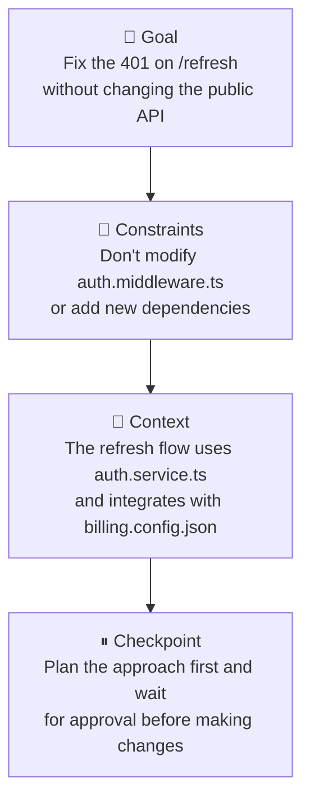
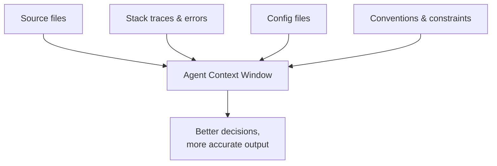
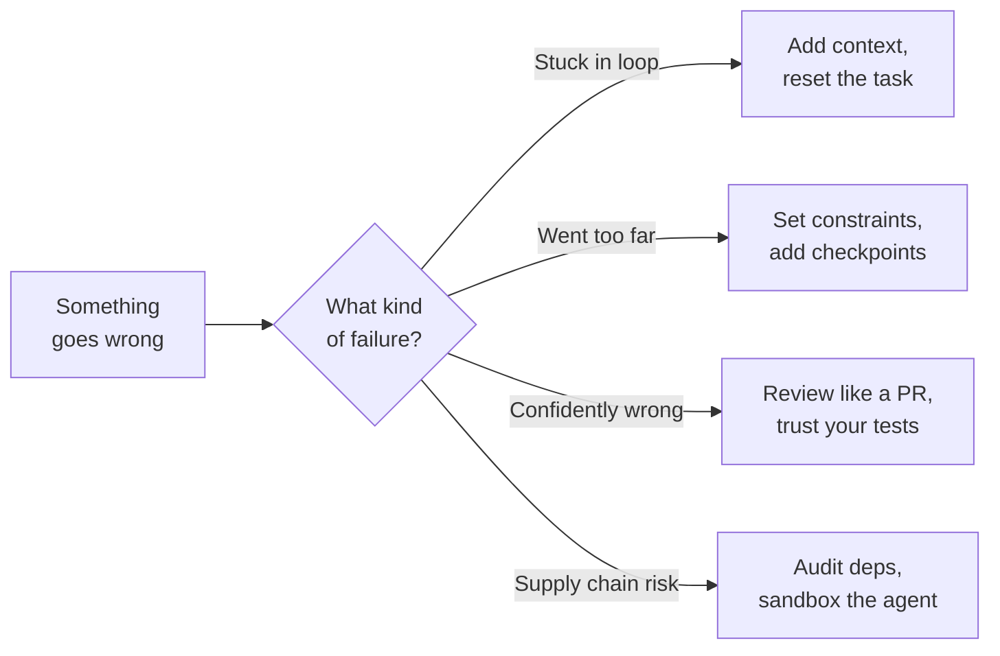

There's a gap between "I installed the agent" and "the agent is actually useful." Most people fall into it.

It usually goes like this: you try it once, give it a vague task, it produces something half-right, you manually fix it, and you conclude the technology is overhyped. Then you watch someone else use the same tool and they get something genuinely impressive out of it in a fraction of the time.

The difference isn't the tool. It's how they're talking to it.

This article is about closing that gap — how to prompt agents effectively, how to give them the right context, and how to stay in control without babysitting every step. We'll use Claude Code as the primary example, but the principles apply across the board.

---

## Why Prompting an Agent Is Different

When you prompt a one-shot model — asking it to write a function, summarize a document, explain a concept — the interaction is stateless. You ask, it answers, you move on. Getting good output is mostly about being specific in your request.

Agents are different. You're not asking for an answer. You're commissioning a *process*. The agent will make multiple decisions, run multiple tools, and produce work that compounds — which means early misunderstandings get amplified, not corrected.

Think of the difference between texting a friend a question versus briefing a contractor before they start work. The stakes of the briefing are higher, because a lot is going to happen before you see the result.

This shifts where the skill lives. With one-shot prompting, the skill is in the ask. With agents, the skill is in the *setup* — context, constraints, and checkpoints.

---

## The Anatomy of a Good Agent Prompt

A good agent prompt isn't necessarily longer. It's more *structured*. There are four things it should cover:

**1. The goal — what done looks like.**

Not "fix the authentication" but "the auth tests in `auth.test.ts` are failing with a 401 on the `/refresh` endpoint. The fix should not change the public API." The more precisely you define the finish line, the less the agent has to guess.

**2. The constraints — what not to do.**

This is the most commonly skipped part, and it's where agents cause the most unintended damage. If there are files it shouldn't touch, patterns it shouldn't introduce, or approaches you've already ruled out — say so. An agent that doesn't know your constraints will make locally reasonable decisions that are globally wrong.

**3. The context — what it needs to know.**

What's the broader system this fits into? Are there related files it should check? Is there a convention in this codebase it should follow? Agents are good at reading code, but they can't read your mind. Any context that lives in your head rather than the codebase needs to be surfaced explicitly.

**4. The checkpoint — when to pause.**

For anything non-trivial, tell the agent where to stop and check in before proceeding. "Plan the approach first and wait for my approval before making changes" is a legitimate and useful instruction. It costs you a few seconds and saves you from a rabbit hole.

Put together, a well-structured agent prompt looks less like a search query and more like a ticket in a well-run engineering team. Specific outcome, clear boundaries, relevant background, agreed stopping points.

Concrete is better than abstract. Here's the same task framed both ways.

**Bad:**

> Fix the auth tests.

**Good:**

> The auth tests in `apps/api/__tests__/auth.test.ts` are failing — three cases on the `/refresh` endpoint return 401 instead of 200. Investigate the failure and fix it without changing the public API surface or adding new dependencies. The refresh flow lives in `auth.service.ts` and uses config from `billing.config.json`. Plan the approach first, then wait for my approval before making changes.

The first will get you something. The second will get you the right thing — usually on the first attempt.

Here's roughly what happens after the good prompt: the agent reads the failing tests, traces the call into `auth.service.ts`, surfaces a hypothesis (*"the token validation is rejecting refresh tokens because the issuer claim changed in last week's update — here's the diff"*), proposes a fix, waits. You approve. It applies the fix, runs the tests, all pass, summarizes what changed and where. The same task framed badly would have produced a confident edit to the wrong file and twenty minutes of cleanup. The difference isn't the agent. It's the setup.

---

## Context: The Lever Most People Under-Use

If prompting is the what, context is the why and the how. And it's where most people leave the most performance on the table.

Anthropic's engineering team published a piece on [effective context engineering for AI agents](https://www.anthropic.com/engineering/effective-context-engineering-for-ai-agents) that reframes this well: the challenge isn't crafting the perfect prompt — it's curating what enters the model's limited attention budget. Every token in the context window is a slot that could hold something useful or something distracting. The developers who get the best output aren't the ones writing the longest prompts. They're the ones who are most deliberate about what the agent sees.

Agents reason about what they can see. If your prompt is the only thing they can see, they're operating on very little. The more relevant context you surface, the better the decisions they'll make.

A few specific things worth doing:

**Point it at the right files.** Don't assume the agent will find them. If the task involves `payment-service.ts` and it integrates with `billing.config.json`, mention both. Agents are good at exploring — but exploration takes tokens and time, and it can go in the wrong direction.

**Share the error, not just the symptom.** "It's broken" is a symptom. The full stack trace, the test output, the exact request and response — that's the error. Agents are excellent debuggers when given complete information. They're poor guessers when given partial information.

**Describe the conventions.** If your codebase uses a particular pattern for error handling, or has a strong preference for functional over class-based approaches, say so. The agent will default to whatever it's seen most in training, which may not match your standards.

**Use system prompts for standing context.** Most agents support a system prompt — a set of instructions that persist across all tasks in a session. This is the right place for project-level conventions, team preferences, things the agent should always or never do.

One pattern I've found particularly effective: start every new project session with a brief context-setting message before giving the first task. Something like: "We're working in a Next.js 14 app with a PostgreSQL backend. We follow the repository pattern for data access. All new endpoints need input validation with Zod. Don't install new dependencies without checking with me first." Thirty seconds of setup that pays dividends across every subsequent task in the session.

---

## Staying in Control Without Micromanaging

This is the tension at the center of agentic development: you want the agent to be autonomous enough to actually save you time, but not so autonomous that it goes off and does something you can't easily undo.

The right mental model isn't control versus autonomy — it's *reversibility*. The question to ask isn't "should I let the agent do this?" but "how hard is it to undo if it gets this wrong?"

Reading files? Zero risk. Generate away. Writing to a staging branch? Low risk. Go ahead. Deleting files, modifying production configs, making external API calls? Those warrant a checkpoint.

A few practical ways to stay in control:

**Run agents in sandboxed environments where possible.** If the agent can only touch a specific directory, or only has access to a test database, the blast radius of a mistake is limited. This isn't always practical, but it's worth engineering toward.

**Ask for a plan before execution.** For any task that touches more than a couple of files, instruct the agent to outline its approach first. Review the plan. Then give it the go-ahead. Claude Code does this naturally for complex tasks — you can also prompt it explicitly: "Before making any changes, describe what you're going to do."

**Use version control as your safety net.** This feels obvious, but it's worth stating: commit before you run an agent on anything you care about. A clean git state (no uncommitted work) means any agent-introduced changes are trivially reversible.

**Watch the tool calls, not just the output.** Most agents will show you what tools they're invoking as they go. Get in the habit of skimming these. It's much faster than reading every line of generated code, and it'll catch wrong turns early.

The developers I've seen get the most out of agents aren't the ones who trust them blindly and aren't the ones who hover over every keystroke. They've found a working rhythm — hand off the well-defined work, stay close on the judgment calls, and review at the seams.

---

## When Things Go Wrong

They will. Here's how to handle it without losing your mind.

**Agents can get stuck in loops.** If an agent keeps making the same mistake and correcting it and making it again, it's usually a context problem — it doesn't have enough information to break the pattern. The fix is to intervene, explain what it's missing, and reset.

**Agents can go too far.** If you didn't set clear stopping conditions, an agent will sometimes keep "improving" things beyond the scope you intended. This is why constraints matter — not just what to do, but what to leave alone.

**Agents can be confidently wrong.** As we covered in [Part 1](/blog/agentic-ai-1-the-new-stack), hallucination is a real phenomenon. Agents can produce code that looks correct and isn't. This is where your review process matters. Agent output should be read like a pull request from a fast, capable engineer who you don't fully trust yet — which is to say, it gets reviewed before it ships.

Brian Jenney, [writing about building agents in production](https://brianjenney.medium.com/a-practical-guide-on-building-ai-agents-30efce169473), makes a point that stuck with me: tests become even more critical in an agentic workflow because a model update or a prompt tweak can break things spectacularly with no obvious cause. The code didn't change. The tests still pass — until they don't. Your test suite isn't just validating your code anymore; it's validating the agent's judgment, and that judgment can shift under your feet.

**Agents can make your supply chain their attack surface.** This one is newer and worth taking seriously. In March 2026, [North Korean state actors compromised the axios npm package](https://cloud.google.com/blog/topics/threat-intelligence/north-korea-threat-actor-targets-axios-npm-package) — 300 million weekly downloads — by hijacking the maintainer's npm account and publishing versions laced with a remote access trojan. No GitHub PR, no CI pipeline — just a direct publish to the registry. Now imagine an agent running `npm install` or adding a dependency on your behalf. It's doing exactly what you asked, and it has no way to know that the package it just pulled is compromised. The agent isn't the vulnerability — but it's a new, fast-moving vector through which existing vulnerabilities can reach your system.

Plain-English version

The agent isn't the bad guy here — it just installed a library someone else had already poisoned. Imagine asking a robot to grab flour from the pantry: the robot does the job perfectly, but if a stranger swapped the flour for something nasty, the robot has no way to know.

Agents pulling packages on your behalf can't sniff out compromise either. The risk isn't new — it's just faster and more frequent now.

Around the same time, [Anthropic accidentally shipped 500,000 lines of Claude Code's own source code](https://fortune.com/2026/03/31/anthropic-source-code-claude-code-data-leak-second-security-lapse-days-after-accidentally-revealing-mythos/) in a public npm package — a source map file (an internal build artifact that exposes the original source code) that should never have been bundled made it into a routine release. It was the company's second exposure in five days. If the team building one of the most prominent coding agents can make a packaging mistake that leaks their entire codebase, the rest of us should be very honest about the kind of errors that automated workflows can amplify. Human error doesn't disappear when you add agents. It scales.

The good news is that these failure modes are predictable, which means they're manageable. You don't need to distrust the agent — you need to design your workflow so that mistakes are catchable.

---

## What's Coming Next

We've covered how agents think, and how to communicate with them. The next part zooms out: where do agents actually fit in a real development workflow? Planning, coding, review, testing, documentation — what should you delegate, what should you keep, and how does the day-to-day actually change?

[Part 4](/blog/agentic-ai-4-integrating-agents-workflow) is the most practical piece in the series. It's where the theory becomes a workflow.

*See you in [Part 4](/blog/agentic-ai-4-integrating-agents-workflow).*
