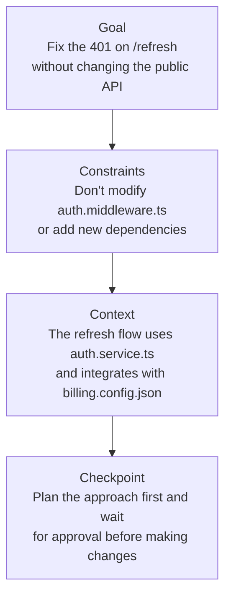
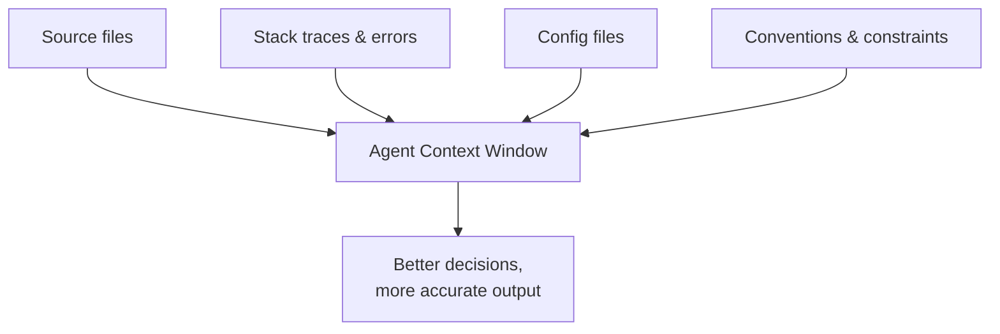
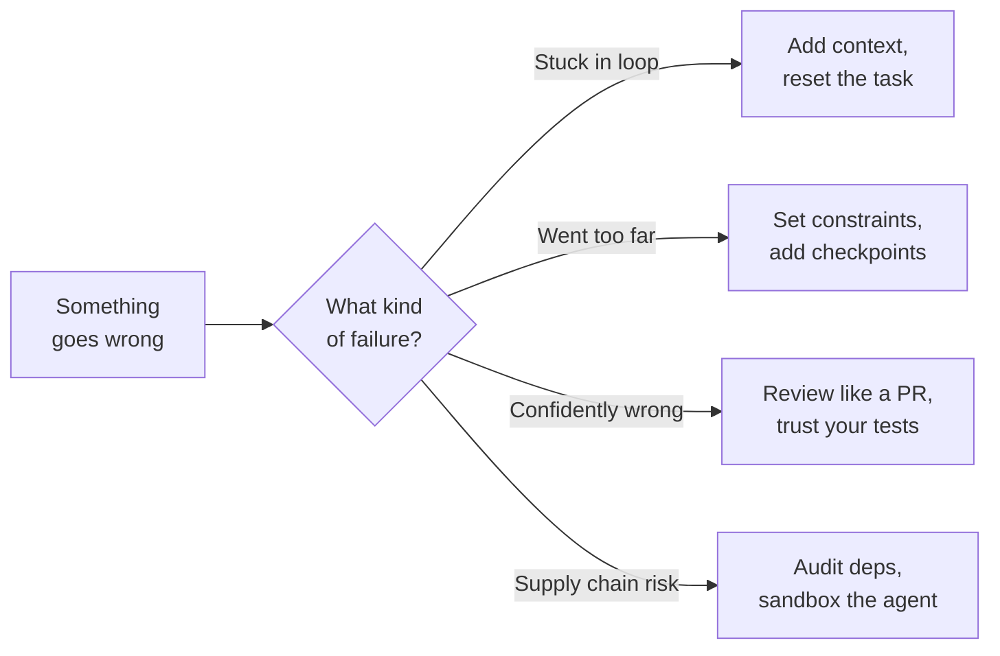

There's a gap between "I installed the agent" and "the agent is actually useful." Most people fall into it.

It usually goes like this. You try it once, give it a vague task, get something half-right, fix it by hand, and conclude the technology is overhyped. Then you watch someone else use the same tool and get something impressive out of it in a fraction of the time.

The difference isn't the tool. It's how they're talking to it.

This article is about closing that gap. How to prompt agents, how to give them the right context, and how to stay in control without babysitting every step. Claude Code is the example again, but the principles carry across tools.

---

## Why prompting an agent is different

When you prompt a one-shot model to write a function or summarize a document, the interaction is stateless. You ask, it answers, you move on. Good output is mostly a matter of being specific.

Agents are different. You're not asking for an answer, you're commissioning a *process*. The agent makes a series of decisions, runs a series of tools, and produces work that compounds. Early misunderstandings get amplified rather than corrected.

Think of the difference between texting a friend a question versus briefing a contractor before they start work. The stakes of the briefing are higher, because a lot is going to happen before you see the result.

This shifts where the skill lives. With one-shot prompting, the skill is in the ask. With agents, the skill is in the *setup*. Context, constraints, checkpoints.

---

## The anatomy of a good agent prompt

A good agent prompt isn't necessarily longer. It's more *structured*. There are four things it should cover:

**1. The goal, or what done looks like.**

Not "fix the authentication" but "the auth tests in `auth.test.ts` are failing with a 401 on the `/refresh` endpoint. The fix should not change the public API." The more precisely you define the finish line, the less the agent has to guess.

**2. The constraints, or what not to do.**

This is the most commonly skipped part, and it's where agents do the most unintended damage. If there are files it shouldn't touch, patterns it shouldn't introduce, or approaches you've already ruled out, say so. An agent that doesn't know your constraints makes locally reasonable decisions that are globally wrong.

**3. The context, or what it needs to know.**

What's the broader system this fits into? Are there related files it should check? Is there a convention in this codebase it should follow? Agents are good at reading code, but they can't read your mind. Any context that lives in your head rather than the codebase needs to be surfaced explicitly.

**4. The checkpoint, or when to pause.**

For anything non-trivial, tell the agent where to stop and check in before proceeding. "Plan the approach first and wait for my approval before making changes" is a legitimate and useful instruction. It costs you a few seconds and saves you from a rabbit hole.

```mermaid
flowchart TD
    Goal["Goal\nFix the 401 on /refresh\nwithout changing the public API"]
    Constraints["Constraints\nDon't modify auth.middleware.ts\nor add new dependencies"]
    Context["Context\nThe refresh flow uses auth.service.ts\nand integrates with billing.config.json"]
    Checkpoint["Checkpoint\nPlan the approach first and wait\nfor approval before making changes"]

    Goal --> Constraints --> Context --> Checkpoint
```

Put together, a well-structured agent prompt looks less like a search query and more like a ticket in a well-run engineering team. Specific outcome, clear boundaries, relevant background, agreed stopping points.

Concrete is better than abstract. Here's the same task framed both ways.

**Bad:**

> Fix the auth tests.

**Good:**

> The auth tests in `apps/api/__tests__/auth.test.ts` are failing. Three cases on the `/refresh` endpoint return 401 instead of 200. Investigate and fix it without changing the public API or adding new dependencies. The refresh flow lives in `auth.service.ts` and uses config from `billing.config.json`. Plan the approach first, then wait for my approval before making changes.

The first gets you something. The second gets you the right thing, usually on the first attempt.

Here's roughly what follows the good prompt. The agent reads the failing tests, traces the call into `auth.service.ts`, and comes back with a hypothesis: *"the token validation is rejecting refresh tokens because the issuer claim changed in last week's update, here's the diff."* It proposes a fix and waits. You approve. It applies the fix, runs the tests, they pass, and it summarizes what changed and where. The badly framed version of the same task produces a confident edit to the wrong file and twenty minutes of cleanup. The difference isn't the agent. It's the setup.

---

## Context is the part most people under-use

If prompting is the what, context is the why and the how. And it's where most people leave the most performance on the table.

Anthropic's engineering team published a piece on [effective context engineering for AI agents](https://www.anthropic.com/engineering/effective-context-engineering-for-ai-agents) that reframes the problem. In their words, the challenge "isn't just crafting the perfect prompt" but "thoughtfully curating what information enters the model's limited attention budget at each step." Every token in the context window is a slot holding something useful or something distracting. The developers with the best output aren't writing the longest prompts. They're the most deliberate about what the agent sees.

Agents reason about what they can see. If your prompt is the only thing they can see, they're operating on very little. The more relevant context you surface, the better the decisions they'll make.

A few specific things worth doing:

**Point it at the right files.** Don't assume the agent will find them. If the task involves `payment-service.ts` and that talks to `billing.config.json`, mention both. Agents explore well, but exploration costs tokens and time, and it can head the wrong way.

**Share the error, not the symptom.** "It's broken" is a symptom. The full stack trace, the test output, the exact request and response, that's the error. Agents debug well with complete information and guess badly with partial information.

**Describe the conventions.** If your codebase uses a particular pattern for error handling, or has a strong preference for functional over class-based approaches, say so. The agent will default to whatever it's seen most in training, which may not match your standards.

**Use system prompts for standing context.** Most agents support a system prompt, a set of instructions that persists across every task in a session. That's the right home for project conventions, team preferences, and the things the agent should always or never do.

```mermaid
flowchart TD
    F1["Source files"] --> CTX["Agent Context Window"]
    F2["Stack traces & errors"] --> CTX
    F3["Config files"] --> CTX
    F4["Conventions & constraints"] --> CTX
    CTX --> OUT["Better decisions,\nmore accurate output"]
```

One pattern I keep coming back to. Open every new project session with a short context-setting message before the first task. Something like: "We're working in a Next.js 14 app with a PostgreSQL backend. We follow the repository pattern for data access. All new endpoints need input validation with Zod. Don't install new dependencies without checking with me first." Thirty seconds of setup that every later task in the session gets to use.

---

## Staying in control without micromanaging

This is the tension at the center of agentic development. You want the agent autonomous enough to save you real time, and not so autonomous that it does something you can't undo.

The right mental model isn't control versus autonomy. It's *reversibility*. The question isn't "should I let the agent do this?" It's "how hard is this to undo if it gets it wrong?"

Reading files? Zero risk. Generate away. Writing to a staging branch? Low risk. Go ahead. Deleting files, modifying production configs, making external API calls? Those warrant a checkpoint.

A few practical ways to stay in control:

**Run agents in sandboxed environments where possible.** If the agent can only touch a specific directory, or only has access to a test database, the blast radius of a mistake is limited. This isn't always practical, but it's worth engineering toward.

**Ask for a plan before execution.** For any task touching more than a couple of files, have the agent outline its approach first. Review the plan. Then give it the go-ahead. Claude Code does this on its own for complex tasks, and you can ask for it directly: "Before making any changes, describe what you're going to do."

**Use version control as your safety net.** Obvious, but worth stating. Commit before you run an agent on anything you care about. From a clean git state, every change the agent makes is one `git checkout` away from gone.

**Watch the tool calls, not only the output.** Most agents show you which tools they invoke as they go. Skim them. It's faster than reading every line of generated code and it catches wrong turns early.

The developers I've seen get the most out of agents don't trust them blindly and don't hover over every keystroke. They've found a rhythm. Hand off the well-defined work, stay close on the judgment calls, review at the seams.

---

## When things go wrong

They will. Here's how to handle it without losing your mind.

**Agents can get stuck in loops.** If an agent keeps making the same mistake, correcting it, and making it again, it's usually a context problem. It doesn't have the information it needs to break the pattern. Intervene, explain what's missing, reset.

**Agents can go too far.** Without clear stopping conditions, an agent will sometimes keep "improving" things well past the scope you had in mind. This is why constraints matter. Say what to do, and say what to leave alone.

**Agents can be confidently wrong.** As we covered in [Part 1](/blog/agentic-ai-1-the-new-stack), hallucination is a real phenomenon. Agents can produce code that looks correct and isn't. This is where your review process matters. Read agent output like a pull request from a fast, capable engineer you don't fully trust yet. It gets reviewed before it ships.

Brian Jenney, [writing about building agents in production](https://brianjenney.medium.com/a-practical-guide-on-building-ai-agents-30efce169473), makes a point that stuck with me. Tests matter more in an agentic workflow, because a model update or a prompt tweak can break things with no obvious cause. The code didn't change. The tests still pass, until one day they don't. Your test suite is no longer only validating your code. It's validating the agent's judgment, and that judgment shifts under your feet.

**Agents can pull a poisoned dependency straight into your project.** This one is newer and worth taking seriously. In March 2026, [a North Korea-linked threat actor compromised the axios npm package](https://cloud.google.com/blog/topics/threat-intelligence/north-korea-threat-actor-targets-axios-npm-package), over 100 million weekly downloads, by hijacking the maintainer's account and slipping a malicious dependency into two releases. Google's threat intelligence group tracks the actor as UNC1069 and calls the operation financially motivated. The poisoned releases dropped a remote access trojan on Windows, macOS, and Linux. Now picture an agent running `npm install` or adding a dependency for you. It does exactly what you asked, and it has no way to know the package it just pulled is compromised. The agent isn't the vulnerability. It's a fast new route by which an existing one reaches your machine.

Plain-English version

The agent isn't the bad guy here. It installed a library someone else had already poisoned. Imagine asking a robot to fetch flour from the pantry. It does the job perfectly, but if a stranger swapped the flour for something nasty, the robot has no way to know.

Agents pulling packages on your behalf can't spot the swap either. The risk isn't new. It just arrives faster and more often.

Around the same time, [Anthropic accidentally shipped 500,000 lines of Claude Code's own source code](https://fortune.com/2026/03/31/anthropic-source-code-claude-code-data-leak-second-security-lapse-days-after-accidentally-revealing-mythos/) in a public npm package. Fortune reported that the upload carried all of Claude Code's original code, roughly 1,900 files, rather than only the built output that actually runs. It was their second exposure in a matter of days. If the team building one of the most prominent coding agents can leak their entire codebase through a packaging mistake, the rest of us should be honest about what automated workflows do to human error. It doesn't disappear. It scales.

The good news is that these failure modes are predictable, which makes them manageable. You don't need to distrust the agent. You need a workflow where mistakes are catchable.

```mermaid
flowchart LR
    Fail["Something\ngoes wrong"] --> Diagnose{"What kind\nof failure?"}
    Diagnose -- "Stuck in loop" --> Fix1["Add context,\nreset the task"]
    Diagnose -- "Went too far" --> Fix2["Set constraints,\nadd checkpoints"]
    Diagnose -- "Confidently wrong" --> Fix3["Review like a PR,\ntrust your tests"]
    Diagnose -- "Supply chain risk" --> Fix4["Audit deps,\nsandbox the agent"]
```

---

## What's coming next

We've covered how agents think and how to talk to them. The next part zooms out. Where do agents fit in a real development workflow? Planning, coding, review, testing, documentation. What do you delegate, what do you keep, and how does the day to day change?

[Part 4](/blog/agentic-ai-4-integrating-agents-workflow) is the most practical piece in the series. It's where the theory becomes a workflow.

*See you in [Part 4](/blog/agentic-ai-4-integrating-agents-workflow).*
