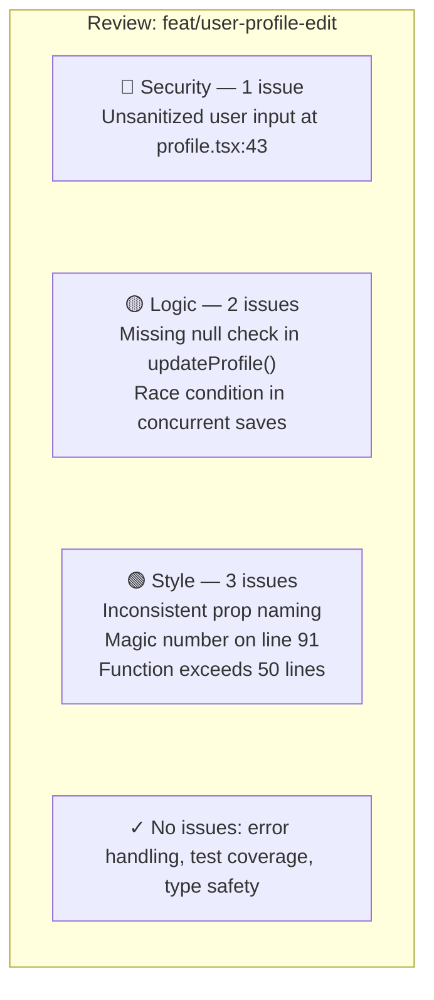
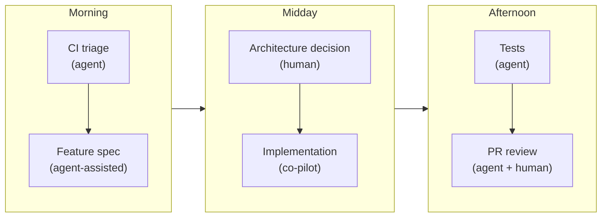
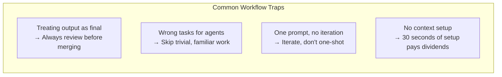

At some point, knowing how agents work stops being the bottleneck. The bottleneck becomes figuring out where they actually fit in the way you already build software.

That's what this article is about. Not theory — workflow. Specifically: which parts of the development cycle agents are genuinely good at, which parts they're not, and what a realistic day looks like when you're building with them.

I'll be honest about where the ROI is real and where the hype outruns the reality. Because there's plenty of both.

---

## The Development Cycle, Revisited

Let's walk through the standard development lifecycle and look at each stage honestly.

### Planning

This is where agents are more useful than most people expect — and in a different way than you might think.

Agents aren't great at making architectural decisions. They'll give you an answer, but it'll be a confident synthesis of common patterns rather than genuine judgment about your specific constraints. Don't use an agent to decide whether to use a monorepo or how to structure your microservices.

What they *are* good at: turning a vague idea into a concrete starting point.

Feed an agent a feature description and ask it to generate a first-draft technical spec — the entities involved, the API surface, the edge cases to consider, the open questions. It'll produce something 70% right in two minutes that would have taken you twenty to draft from scratch. You edit the 30%. Net win.

The same applies to breaking down work. "Here's the feature — what are the logical implementation tasks?" is a prompt that agents handle well, especially when they have access to your existing codebase for context.

### Coding

This is the obvious one, and yes — it's real. Agents genuinely accelerate implementation work, particularly for:

**New feature scaffolding.** Give it the spec, point it at similar existing features for style reference, and let it build the skeleton. You review, you refine, but you're not starting from a blank file.

**Boilerplate-heavy work.** CRUD endpoints, form components, database migrations, test fixtures — the stuff that's necessary but not intellectually interesting. Agents eat this for breakfast.

**Working in unfamiliar territory.** Need to write a Kubernetes config and you've never touched one? An agent that can read your existing setup and generate a consistent addition is dramatically faster than you learning the syntax from scratch, then having it reviewed by someone who knows it.

What I've found works best: treat the agent like a pairing partner, not a vending machine. Stay in the loop as it works. Read the plan before it executes. Redirect early when it's heading somewhere wrong. The developers I've seen get the most out of agents are the ones who've learned to co-pilot, not the ones who walk away and come back to a surprise.

### Code Review

This one's underrated. Agents are excellent reviewers — patient, thorough, and not worried about hurting your feelings.

Before you open a PR, run your diff through an agent with a prompt like: "Review these changes for correctness, edge cases, security issues, and consistency with the rest of the codebase." You'll catch things. Not everything — but enough to make it a habit worth building.

What agents aren't good at: reviewing for architectural intent. They can tell you *what* the code does. They can't always tell you whether it's the *right* approach given where the system is going. That judgment still lives with you.

### Testing

Agents are strong here, with one important caveat.

Writing tests for existing code is a task agents handle extremely well. Give it a function, ask for unit tests, and it'll cover the happy path, the edge cases, and the error conditions — usually better than a developer doing it under deadline pressure. Writing tests for *new* code as part of generation is also natural, especially if you prompt for it explicitly.

The caveat: agents write tests that pass the code they see. If the code has a conceptual bug — a wrong assumption baked in — the agent may write tests that validate the wrong behavior. Tests aren't a substitute for understanding; they're a complement to it. Review the test logic, not just the coverage numbers.

### Documentation

Possibly the highest effort-to-value ratio of anything in this list.

Documentation is the task everyone knows matters and no one wants to do. Agents don't mind. Give one a module, ask for a README, JSDoc comments, or an architecture overview — it'll produce something accurate, consistent, and professional in seconds.

The one thing to watch: agents document what the code does, not necessarily why it exists or what decisions were made along the way. That institutional context still needs to come from you. But "here's the code, add the what, I'll add the why" is a very workable division of labor.

---

## The Productivity Multipliers

Beyond the basic prompt-and-iterate loop, modern agents expose features that compound — small mechanical helpers that turn repeat tasks into single keystrokes. They're easy to overlook and disproportionately valuable.

**Slash commands and custom skills.** Most current agents let you save reusable prompt templates as named commands — `/review` runs your code-review template, `/spec` scaffolds a feature spec, `/test` writes tests with your team's conventions baked in. Five seconds of setup, daily payoff. Worth standardizing across your team so everyone's `/review` does the same thing.

**Hooks.** A hook is a script that fires automatically on agent events — before a tool call, after a file edit, on session start. Use them for things you want enforced rather than remembered: auto-formatting after every edit, blocking writes to certain directories, running a typecheck before any commit. Hooks are how you turn process discipline into something that just happens.

**Subagents.** When a task naturally splits into independent pieces — research three options, audit five files, run six checks in parallel — modern agents can spawn focused subagents for each. The main agent coordinates; the subagents do the legwork without polluting the parent's context. For the right shape of task, this is meaningfully faster than serial work.

**Background and async runs.** The biggest workflow change in the last year is that agents no longer demand to be babysat. Long tasks run in the background while you do something else — kick off a refactor, switch to a meeting, come back to a summary and a diff. The shift from synchronous co-pilot to asynchronous teammate is bigger than it sounds. Treat it like delegating to a fast junior who pages you when they're done.

These are not edge features. They're where the daily-driver developers find their leverage.

---

## A Real Day with Agents

Rather than listing principles, let me walk through what a realistic agent-augmented workday actually looks like for me.

**Morning.** I'll usually start by reviewing what shipped or what's failing overnight — CI results, error logs, anything that needs attention. If there are test failures, I'll drop the output into Claude Code with the relevant files and let it take a first pass at the diagnosis. Often it finds the issue in under a minute. Sometimes it doesn't, but it narrows the search space enough to be useful.

**Scoping new work.** Before I start implementing anything non-trivial, I'll do a quick agent-assisted spec pass. I describe the feature, paste in the relevant existing code, and ask for a breakdown of the implementation approach and likely edge cases. This has replaced the "stare at the screen and think" phase for me — I still think, but I'm reacting to something concrete rather than starting from nothing.

**Implementation.** For anything that's well-defined, I'll give it to the agent with a clear prompt and let it run. I read the plan before execution, I watch the tool calls as it goes, and I step in when it goes sideways. For anything that's genuinely ambiguous or architecturally sensitive, I write the core logic myself and use the agent for the surrounding work — tests, validation, error handling, documentation.

**Before I open a PR.** I run the diff through a review prompt. Not because I don't trust my own code, but because it catches the things you stop seeing when you've been staring at something for three hours.

The honest version: on a good day with well-defined work, I ship roughly twice what I'd ship solo. On a day with ambiguous problems, messy legacy code, or decisions that require real judgment, the agent is more of a sounding board than a force multiplier. The variance is real, and it's not random — clarity multiplies, ambiguity stalls. Managing that gap is part of the skill.

---

## The Workflow Traps to Avoid

A few patterns I see teams fall into that undercut the value. There's a line from a [Towards AI deep-dive on production-grade agents](https://pub.towardsai.net/building-production-grade-ai-agents-in-2025-the-complete-technical-guide-9f02eff84ea2) that captures the root cause well: agent failures are almost never about model intelligence — they're about system fragility. The model is smart enough. The surrounding workflow isn't robust enough. That's worth keeping in mind as you read these traps, because the fix is never "get a better model." It's "build a better process."

**Treating agent output as final.** It isn't. Agent output is a strong first draft, not a finished product. The review step isn't optional. Teams that skip it end up with bugs that are harder to find because the code looks cleaner than it is.

**Using agents for the wrong tasks.** The temptation is to throw everything at the agent. But there are tasks where the friction of prompting, waiting, and reviewing costs more than just writing it yourself. Short, simple, highly familiar tasks are often faster done directly. Reserve agents for tasks with meaningful complexity or volume.

**Prompting once and hoping.** One prompt, one shot, no iteration. This is how you get mediocre output and conclude agents aren't useful. The best workflows are conversational — you prompt, review, redirect, and iterate.

**Ignoring the context setup.** As we covered in [Part 3](/blog/agentic-ai-3-prompting-context-control), context is everything. Teams that drop agents into new tasks cold — no codebase context, no conventions, no constraints — get generic output. Teams that invest thirty seconds in setup get output that fits.

---

## What This Actually Costs

The productivity gains are real but uneven. They're highest for work that's well-specified in familiar domains. They're lower for work that's exploratory, architectural, or context-dependent.

The learning curve is real too. Teams don't hit peak productivity with agents on day one. There's a period of figuring out the prompting patterns, the workflow integration, and the right division of labor. Budget for it.

And the dollar cost is non-trivial. Per-token API usage scales with how much you actually use the agent. Here's a rough profile-based breakdown for a single developer running Claude Code or an equivalent:

| Profile | Typical use | Monthly cost (per dev) |
|---|---|---|
| Light | Occasional helper, a few short tasks per day | $20–$40 |
| Medium | Daily driver, mixed task sizes | $80–$150 |
| Heavy | Long-horizon multi-step tasks, frequent tool calls | $200–$400+ |

Numbers will shift as pricing and model efficiency change, but the shape holds: the cost is dominated by tokens, not seats. That's easy to justify with modest productivity gains — it's also easy to let drift unnoticed if no one's watching.

The compounding effect is where the real story is. Teams that adopt agents early and get good at working with them develop a capability advantage that grows over time. The gap between teams who use these tools well and teams who don't is going to widen. That's the actual case.

---

## What's Coming Next

We've been looking at agents from the individual developer perspective. [Part 5](/blog/agentic-ai-5-agentic-development-at-team-scale) zooms out to the team level: how organizations are restructuring around AI agents, which roles are shifting, how to make toolchain decisions, and what governance looks like when agents have access to your systems.

If you're a team lead, an engineering manager, or a PM — [Part 5](/blog/agentic-ai-5-agentic-development-at-team-scale) is written for you.

*See you in [Part 5](/blog/agentic-ai-5-agentic-development-at-team-scale).*
