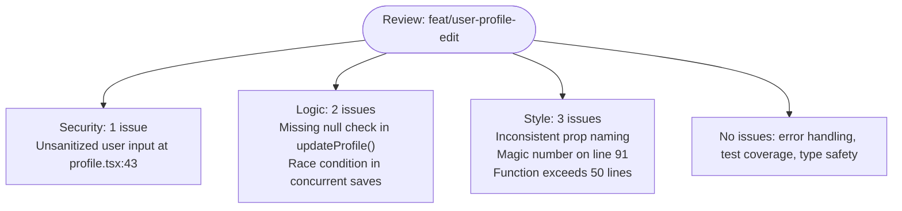
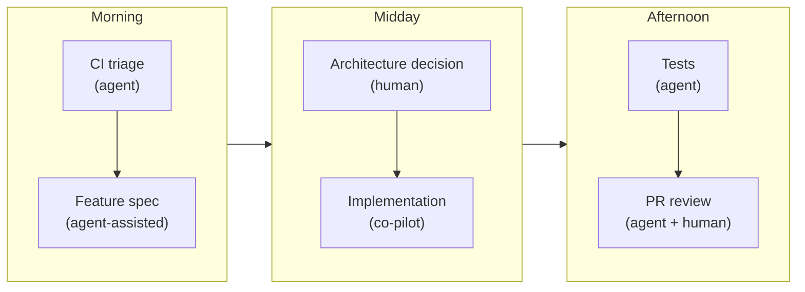
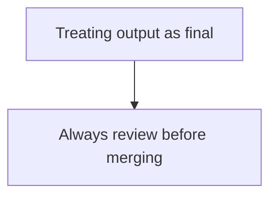
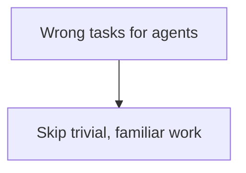
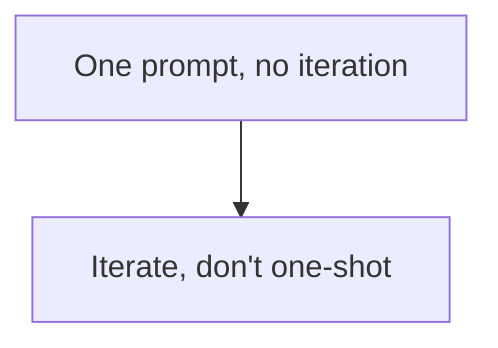
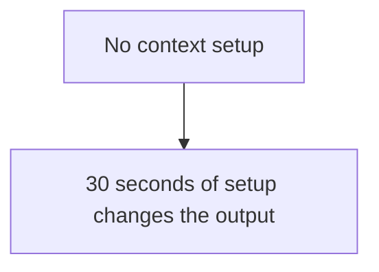

At some point, knowing how agents work stops being the bottleneck. The bottleneck becomes figuring out where they actually fit in the way you already build software.

That's what this article is about. Not theory, workflow. Which parts of the development cycle agents are good at, which parts they aren't, and what a realistic day looks like when you build with them.

I'll be honest about where the ROI is real and where the hype outruns the reality. Because there's plenty of both.

---

## The development cycle, revisited

Let's walk through the standard development lifecycle and look at each stage honestly.

### Planning

This is where agents are more useful than most people expect, and useful in a different way than you'd guess.

Agents aren't great at making architectural decisions. They'll give you an answer, but it'll be a confident synthesis of common patterns rather than genuine judgment about your specific constraints. Don't use an agent to decide whether to use a monorepo or how to structure your microservices.

What they *are* good at: turning a vague idea into a concrete starting point.

Feed an agent a feature description and ask for a first-draft technical spec. The entities involved, the endpoints, the edge cases, the open questions. It produces something 70% right in two minutes that would have taken you twenty from a blank file. You edit the 30%. Net win.

The same goes for breaking down work. "Here's the feature. What are the implementation tasks?" is a prompt agents handle well, especially with access to your existing codebase.

### Coding

The obvious one, and yes, it's real. Agents speed up implementation work, especially for:

**New feature scaffolding.** Give it the spec, point it at similar existing features for style reference, and let it build the skeleton. You review, you refine, but you're not starting from a blank file.

**Boilerplate-heavy work.** CRUD endpoints, form components, database migrations, test fixtures. Necessary, not interesting. Agents eat this for breakfast.

**Working in unfamiliar territory.** Need to write a Kubernetes config and you've never touched one? An agent that reads your existing setup and generates a consistent addition beats learning the syntax from scratch and then queueing for review from the one person who knows it.

What works best for me is treating the agent like a pairing partner rather than a vending machine. Stay in the loop while it works. Read the plan before it executes. Redirect early when it heads somewhere wrong. The developers getting the most out of agents learned to co-pilot. The ones who walk away come back to a surprise.

### Code review

This one's underrated. Agents are excellent reviewers. Patient, thorough, and unbothered about hurting your feelings.

Before you open a PR, run your diff through an agent with a prompt like: "Review these changes for correctness, edge cases, security issues, and consistency with the rest of the codebase." You'll catch things. Not everything, but enough that the habit pays for itself.

What agents aren't good at: reviewing for architectural intent. They can tell you *what* the code does. They can't always tell you whether it's the *right* approach given where the system is going. That judgment still lives with you.

```mermaid
flowchart TB
    review(["Review: feat/user-profile-edit"])
    review --> sec["Security: 1 issue\nUnsanitized user input at profile.tsx:43"]
    review --> logic["Logic: 2 issues\nMissing null check in updateProfile()\nRace condition in concurrent saves"]
    review --> styling["Style: 3 issues\nInconsistent prop naming\nMagic number on line 91\nFunction exceeds 50 lines"]
    review --> ok["No issues: error handling, test coverage, type safety"]
```

### Testing

Agents are strong here, with one important caveat.

Writing tests for existing code is something agents handle very well. Give it a function, ask for unit tests, and you get the happy path, the edge cases, and the error conditions, usually better covered than a developer manages under deadline pressure. Asking for tests alongside new code works just as well, as long as you ask.

The caveat is that agents write tests which pass the code in front of them. If that code carries a conceptual bug, a wrong assumption baked in early, the agent will happily write tests that lock the wrong behavior in place. Tests don't replace understanding. Review the test logic, not the coverage number.

### Documentation

Probably the best effort-to-value ratio on this list.

Documentation is the task everyone knows matters and nobody wants to do. Agents don't mind. Give one a module and ask for a README, JSDoc comments, or an architecture overview, and it comes back accurate and consistent in seconds.

The thing to watch is that agents document what the code does, not why it exists or which decisions got made along the way. That context comes from you. "You add the what, I'll add the why" is a workable division of labor.

---

## The features that compound

Past the basic prompt-and-iterate loop, modern agents have features that compound. Small mechanical helpers that turn a repeat task into one keystroke. Easy to overlook, worth more than they look.

**Slash commands and custom skills.** Most current agents let you save reusable prompt templates as named commands. `/review` runs your code-review template, `/spec` drafts a feature spec, `/test` writes tests with your team's conventions baked in. Five seconds of setup, daily payoff. Standardize them across the team so everyone's `/review` does the same thing.

**Hooks.** A hook is a script that fires on agent events. Before a tool call, after a file edit, on session start. Use them for what you want enforced rather than remembered: auto-formatting after every edit, blocking writes to certain directories, running a typecheck before any commit. Hooks turn process discipline into something that happens whether or not anyone remembers.

**Subagents.** When a task splits into independent pieces, research three options, audit five files, run six checks at once, modern agents can spawn a focused subagent for each. The main agent coordinates while the subagents do the legwork, and none of their intermediate output clutters the parent's context. For the right shape of task it beats working the list serially.

**Background and async runs.** The biggest workflow change in the last year is that agents no longer demand to be babysat. Long tasks run in the background while you do something else. Kick off a refactor, go to a meeting, come back to a summary and a diff. Going from synchronous co-pilot to asynchronous teammate is a bigger change than it sounds. Treat it like delegating to a fast junior who pages you when they're done.

These aren't edge features. They're where the heavy users get their speed.

---

## A real day with agents

Rather than more principles, here's what a workday actually looks like for me.

**Morning.** I start with whatever shipped or broke overnight. CI results, error logs, anything shouting. If tests are failing, I drop the output into Claude Code with the relevant files and let it take the first pass at diagnosis. Often it finds the issue in under a minute. When it doesn't, it still narrows the search.

**Scoping new work.** Before I start implementing anything non-trivial, I'll do a quick agent-assisted spec pass. I describe the feature, paste in the relevant existing code, and ask for a breakdown of the implementation approach and likely edge cases. This replaced the "stare at the screen and think" phase for me. I still think. I'm just reacting to something concrete instead of a blank file.

**Implementation.** For anything that's well-defined, I'll give it to the agent with a clear prompt and let it run. I read the plan before execution, I watch the tool calls as it goes, and I step in when it goes sideways. For anything ambiguous or architecturally sensitive, I write the core logic myself and hand the agent the surrounding work. Tests, validation, error handling, documentation.

**Before I open a PR.** I run the diff through a review prompt. Not because I don't trust my own code, but because it catches the things you stop seeing when you've been staring at something for three hours.

```mermaid
flowchart LR
    subgraph morning["Morning"]
        CI["CI triage\n(agent)"] --> Spec["Feature spec\n(agent-assisted)"]
    end

    subgraph midday["Midday"]
        Arch["Architecture decision\n(human)"] --> Impl["Implementation\n(co-pilot)"]
    end

    subgraph afternoon["Afternoon"]
        Tests["Tests\n(agent)"] --> PR["PR review\n(agent + human)"]
    end

    morning --> midday --> afternoon
```

The honest version. On a good day with well-defined work, I ship roughly twice what I'd ship solo. On a day of ambiguous problems, messy legacy code, and calls that need judgment, the agent is a sounding board rather than a second pair of hands. The variance is real and it isn't random. Clarity multiplies, ambiguity stalls. Managing that gap is part of the skill.

---

## The workflow traps to avoid

A few patterns I see teams fall into that undercut the value. There's a line from Ahmed Adam's [Towards AI deep-dive on production-grade agents](https://pub.towardsai.net/building-production-grade-ai-agents-in-2025-the-complete-technical-guide-9f02eff84ea2) that names the root cause. Agent failures are almost never about model intelligence. They're about system fragility. The model is smart enough. The workflow around it isn't sturdy enough. Keep that in mind through the list below, because the fix is never "get a better model." It's "build a better process."

**Treating agent output as final.** It isn't. Agent output is a strong first draft, not a finished product. The review step isn't optional. Teams that skip it end up with bugs that are harder to find because the code looks cleaner than it is.

**Using agents for the wrong tasks.** The temptation is to throw everything at the agent. But prompting, waiting, and reviewing carries its own cost, and on short familiar work that cost is higher than just writing the thing. Reserve agents for tasks with real complexity or volume.

**Prompting once and hoping.** One prompt, one shot, no iteration. This is how you get mediocre output and conclude agents aren't useful. The best workflows are conversational. Prompt, review, redirect, iterate.

**Ignoring the context setup.** As we covered in [Part 3](/blog/agentic-ai-3-prompting-context-control), context is everything. Teams that drop agents into new tasks cold, with no codebase context, no conventions, and no constraints, get generic output. Teams that spend thirty seconds on setup get output that fits.

**Common workflow traps and their fixes:**

```mermaid
flowchart TB
    T1["Treating output as final"] --> F1["Always review before merging"]
```

```mermaid
flowchart TB
    T2["Wrong tasks for agents"] --> F2["Skip trivial, familiar work"]
```

```mermaid
flowchart TB
    T3["One prompt, no iteration"] --> F3["Iterate, don't one-shot"]
```

```mermaid
flowchart TB
    T4["No context setup"] --> F4["30 seconds of setup changes the output"]
```

---

## What this actually costs

The productivity gains are real but uneven. They're highest for work that's well-specified in familiar domains. They're lower for work that's exploratory, architectural, or context-dependent.

The learning curve is real too. Teams don't hit peak productivity with agents on day one. There's a period of figuring out the prompting patterns, the workflow integration, and the right division of labor. Budget for it.

And the dollar cost is non-trivial. Per-token API usage scales with how much you actually use the agent. Here's a rough profile-based breakdown for a single developer running Claude Code or an equivalent:

| Profile | Typical use | Monthly cost (per dev) |
|---|---|---|
| Light | Occasional helper, a few short tasks per day | $20 to $40 |
| Medium | Daily driver, mixed task sizes | $80 to $150 |
| Heavy | Long multi-step tasks, frequent tool calls | $200 to $400+ |

Numbers will shift as pricing and model efficiency change, but the shape holds. Tokens dominate the cost, not seats. Modest productivity gains justify that easily, and it also drifts upward unnoticed when nobody is watching.

The compounding effect is the real story. Teams that adopt early and get good at this build an advantage that grows. The gap between teams who use these tools well and teams who don't will widen. That's the case for spending the money.

---

## What's coming next

We've been looking at agents from the individual developer perspective. [Part 5](/blog/agentic-ai-5-agentic-development-at-team-scale) zooms out to the team level: how organizations are restructuring around AI agents, which roles are shifting, how to make toolchain decisions, and what governance looks like when agents have access to your systems.

If you're a team lead, an engineering manager, or a PM, [Part 5](/blog/agentic-ai-5-agentic-development-at-team-scale) is written for you.

*See you in [Part 5](/blog/agentic-ai-5-agentic-development-at-team-scale).*
