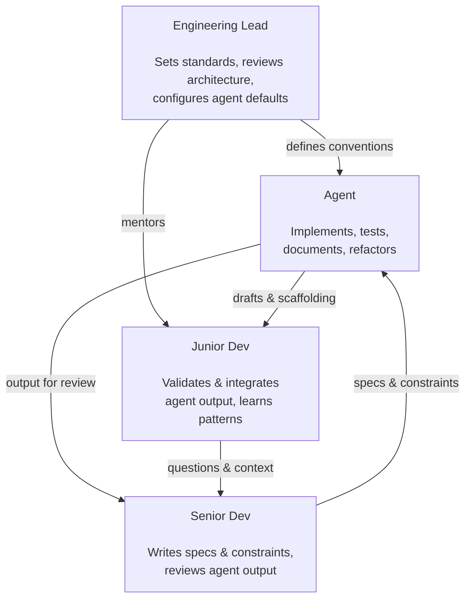

Everything we've covered so far has been about one developer and one agent.

That's where most people start, and it's the right place to start. But the moment you zoom out to a team — five engineers, a lead, a PM, a backlog, a set of shared standards — the dynamics change. The questions change too. It's no longer just "how do I use this thing?" It's "how do we use this thing, together, without stepping on each other, without introducing new risks, and without the tool becoming a liability instead of an asset?"

Those are harder questions. This article is an attempt to answer them honestly.

> **For readers on the manager track:** if you came here directly from Part 1 and skipped Parts 2–4, you have what you need. The mechanics in those parts are useful if you're hands-on, but everything in this article and Part 6 stands on its own.

---

## How Teams Are Actually Changing

Let's start with what's really happening in teams that have meaningfully adopted agentic tools — not the marketing version, but the ground-level reality.

The most consistent shift I've seen is in where senior developer time goes. When agents handle implementation boilerplate, test generation, and first-pass documentation, senior engineers don't necessarily do less — they do *different*. More time on architecture and system design. More time reviewing agent output for correctness and coherence. More time writing the context, constraints, and conventions that make agent output actually usable.

In other words: the leverage point moves upstream. The most valuable thing a senior engineer does is no longer writing the code — it's defining the system well enough that others (human or agent) can implement it correctly.

For junior developers, the picture is more nuanced. Agents are exceptional at the kind of boilerplate-heavy, pattern-following work that used to be a learning environment for new engineers. That's worth taking seriously. The "implement this CRUD endpoint" task that used to teach a junior dev how the codebase works is now often done by an agent. Teams that care about developing junior talent need to be intentional about preserving learning opportunities — or creating new ones.



---

## The Roles That Are Shifting

You don't need to change your org chart. But you do need to understand how the substance of certain roles is evolving.

**Engineering Lead.** The lead's job has always been partly technical and partly organizational — making sure the team is building the right things the right way. With agents in the mix, the "right way" now includes agent configuration, prompt standards, and output review practices. Leads who set up good defaults early save their teams enormous amounts of drift and inconsistency later.

**Senior Developer.** Increasingly a specification writer as much as an implementer. The clearer and more precise a senior dev can be about what needs to be built and how, the more effectively an agent can execute on it. This is a different skill from writing the code yourself — it's closer to technical writing, system design, and architecture than to implementation.

**Junior Developer.** The role is shifting from "implements well-defined tasks" toward "reviews, validates, and integrates agent output." That requires a different kind of rigor — you need to understand what correct looks like to catch when it's wrong. Teams that invest in helping junior developers build that judgment will have a significant advantage over those who just hand them a prompt and hope for the best.

**PM / Product.** Specification quality matters more now. A vague ticket has always been a problem; with agents, it's a bigger one, because the agent will confidently produce something for a vague brief — it just won't be what you wanted. PMs who write tight acceptance criteria, clear edge cases, and explicit constraints will see their teams ship faster. PMs who don't will see the agent-shaped version of the same ambiguity problem they already have.

---

## Making Toolchain Decisions

At some point, someone in the team needs to make a call: which agent, how, and for what?

This is a decision that's easy to under-invest in — people try something, it works okay, it becomes the default, and suddenly the entire team is using a tool no one properly evaluated. Here's a framework for doing it more deliberately.

**Start with the workflow, not the tool.** Before you evaluate agents, map where the time actually goes in your development cycle. Where's the friction? Where's the boilerplate? Where do things slow down? The best agent for your team is the one that addresses your specific bottlenecks — not the one with the best marketing.

**Evaluate on your actual work.** Run a genuine pilot on real tasks from your real backlog. Not toy examples — actual work. Give the same task to two agents and compare output quality, not just speed. The difference in fit often becomes obvious quickly.

**Consider the integration points.** Does it live in the IDE or the terminal? Does it integrate with your CI pipeline? Can it access your internal docs or your issue tracker? A technically inferior agent that's deeply integrated into your existing workflow will often outperform a technically superior one that lives outside it.

**Think about the trust model.** Different agents have different autonomy defaults. Some are built for high-autonomy, long-running tasks. Others are built for tight, collaborative loops. Match the tool's autonomy model to your team's risk tolerance and review culture — not the other way around.

**Don't forget the total cost.** Seat licenses, API usage, the time to configure and maintain — all of it adds up. For a team of ten, agent tooling can easily run $500-1000 per month or more depending on usage. That's easy to justify, but it should be a conscious decision, not an invisible line item that grows unnoticed.

| Criteria | Agent A | Agent B |
|---|---|---|
| Workflow fit | ● ● ● ○ | ● ● ○ ○ |
| Integration depth | ● ● ○ ○ | ● ● ● ● |
| Autonomy model | ● ● ● ● | ● ● ○ ○ |
| Cost | ● ● ● ○ | ● ● ● ● |
| Output quality | ● ● ● ○ | ● ● ● ○ |

---

## Governance, Security, and IP

This is the section that gets skipped in most agent adoption conversations. It's also the section that causes the most problems down the line.

**Code and data leaving the building.** When a developer pastes code into an agent, that code leaves your environment and hits an external API. For most commercial code, this is a tolerable risk. For code that touches sensitive data, proprietary algorithms, or regulated systems, it may not be. Know your data classification policy before you deploy agents broadly. If you don't have one, write one.

This isn't theoretical. The packaging and supply-chain incidents covered in [Part 3](/blog/agentic-ai-3-prompting-context-control) — including Anthropic accidentally publishing 500,000 lines of Claude Code's source via a public npm release — show that even the company building the agent can ship its own source code by accident. The risk of your team's code ending up somewhere it shouldn't is real enough to plan for.

**Credentials in context.** Agents that have terminal access can see environment variables, config files, and credentials. This is usually fine in practice, but it needs to be a conscious choice — not an accident. Establish clear guidelines about what agents can and can't see.

**IP ownership of generated code.** The legal landscape here is still evolving, but most enterprise-grade agent providers have clear policies about code ownership — output belongs to the user, not the provider. Check the terms of service of whatever you're using and make sure your legal team is aware. This is especially important if you're in a regulated industry or building in a domain with sensitive IP.

**Audit trails.** One of the underrated advantages of agentic tools is that tool calls are logged — you can see exactly what the agent read, wrote, and executed. Build on this. In a well-run team, agent sessions should be as reviewable as commits. Not because you distrust the agent, but because auditability is a good engineering practice regardless of who wrote the code.

The [Towards AI guide on production-grade agents](https://pub.towardsai.net/building-production-grade-ai-agents-in-2025-the-complete-technical-guide-9f02eff84ea2) goes deeper on the engineering side of this — circuit breakers that kill runaway agent sessions, observability dashboards that track what agents are doing across the team, and compliance trails that satisfy auditors. If governance feels abstract, their treatment makes it concrete. For engineering leads who want implementation-level detail on these patterns, the [Anthropic Cookbook's agent patterns](https://github.com/anthropics/anthropic-cookbook/tree/main/patterns/agents) section is worth bookmarking — it's less about philosophy and more about working code.

---

## Setting Standards Across the Team

The biggest operational risk with agents at team scale isn't security — it's inconsistency. Five developers using the same agent without shared conventions will produce five different styles of output, five different levels of quality, and five different assumptions about what review looks like.

The fix is a lightweight shared standard. It doesn't need to be a 40-page document. It needs to cover:

**A shared system prompt.** The project-level conventions, standards, and constraints that every agent session should know about. Stored in the repo, versioned, and updated when the codebase standards change. Think of it as `AGENTS.md` — right next to your `README.md`.

**Prompt templates for common tasks.** A template for "generate tests for this module," a template for "review this diff," a template for "generate a spec from this feature description." Common tasks with agreed formats produce consistent, comparable output.

**A review standard.** What does agent output review look like? Who does it? What's the bar for merging agent-assisted code? This should be the same bar as human-written code — reviewed, tested, understood. The fact that an agent wrote it is not a reason to lower the bar. If anything, it's a reason to be slightly more rigorous about edge cases.

**A feedback loop.** When agent output is consistently wrong about something — a pattern it misunderstands, a convention it keeps violating — there should be a way to capture that and update the system prompt. Treat the agent configuration as a living artifact, not a one-time setup.

```text
my-project/
├── README.md
├── package.json
├── tsconfig.json
├── AGENTS.md          ← shared agent context
└── src/
    └── ...
```

> **AGENTS.md** — project conventions, shared constraints, coding standards, and links to prompt templates. Versioned alongside the code, updated when standards change. Think of it as the onboarding doc you'd give a new hire — except the new hire is an agent.

A skeleton looks something like this:

```markdown
# AGENTS.md

## Stack
- TypeScript strict mode. No `any` types.
- React 18, Next.js 14, SCSS modules.
- Prefer `es-toolkit` for utilities and `usehooks-ts` for hook patterns. Ask before adding new dependencies.

## Conventions
- File naming: kebab-case with dot-suffixes (`my-thing.component.tsx`, `my-thing.helpers.ts`).
- Co-locate types in sibling `*.types.ts` files. No inline type definitions in component files.
- Functional components only. Internal order: state → refs → context → hooks → memos → callbacks → effects → guards → render.
- Callback props passed to client components end with `Action` (e.g. `onCloseAction`).

## Workflow
- Plan before executing on multi-file changes. Wait for approval before applying.
- Run tests after every meaningful change. Don't mark a task done if tests fail.
- When context is missing, ask. Don't guess.
```

Keep it tight. Five lines per section beats forty — agents read it on every task, and a bloated AGENTS.md eats your context budget for no benefit.

---

## Measuring Impact

How do you know if this is actually working?

The naive answer is story points or tickets closed per sprint. That's a trap — agents change the distribution of work, not just the volume, and raw velocity metrics often miss the picture.

Better signals to watch:

**Review cycle length.** Are PRs getting through review faster? Are there fewer rounds of back-and-forth? Agent-assisted code, when it's working well, tends to be more consistent and better-documented, which makes review smoother.

**Time to first working version.** How long from "ticket assigned" to "something running that can be reviewed"? This is where agent impact is usually most visible — first drafts are faster.

**Bug rate in agent-assisted code vs. human-only code.** This one takes a few sprints to have enough data, but it's the most important signal. If agent-assisted code has a higher bug rate, something is wrong with your review process. If it's comparable or lower, you're doing it right.

**Developer satisfaction.** Underrated. Developers who spend less time on boilerplate and more time on interesting problems tend to be happier and stay longer. That's a real business outcome, even if it's hard to put in a spreadsheet.

---

## What's Coming Next

We've covered the full journey — from what agents are to how to use them to how teams restructure around them. The final part brings it all together with a practical decision framework: how to evaluate agents against each other, how to run a meaningful pilot, and where the technology is heading next.

[Part 6](/blog/agentic-ai-6-choosing-your-agent-stack) is the one to bookmark when someone asks you "so which agent should we use?"

*See you in [Part 6](/blog/agentic-ai-6-choosing-your-agent-stack).*
