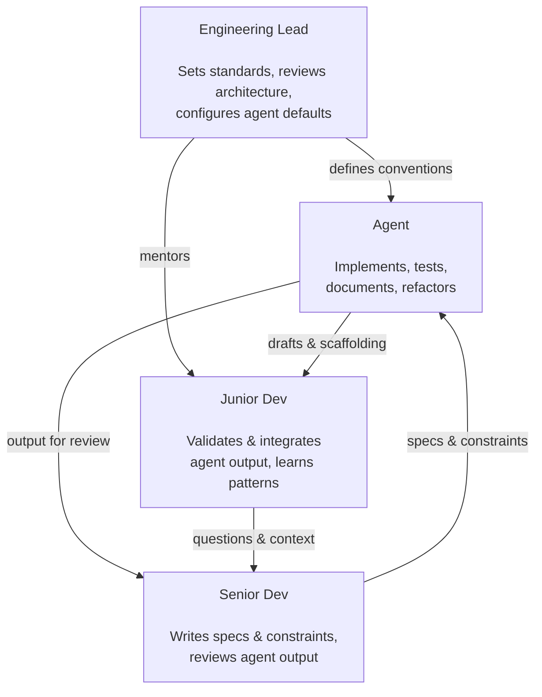

Everything we've covered so far has been about one developer and one agent.

That's where most people start, and it's the right place to start. Zoom out to a team, though, five engineers and a lead and a PM and a backlog and a set of shared standards, and the dynamics change. So do the questions. "How do I use this thing?" becomes "how do we use this thing together, without stepping on each other, without new risks, and without the tool turning into a liability?"

Those are harder questions. This article is an attempt to answer them honestly.

> **For readers on the manager track.** If you came here straight from Part 1 and skipped Parts 2 through 4, you have what you need. The mechanics in those parts help if you're hands-on, but this article and Part 6 stand on their own.

---

## How teams are actually changing

Let's start with what's happening inside teams that have genuinely adopted agentic tools. Not the marketing version. The ground-level one.

The most consistent shift I've seen is in where senior developer time goes. When agents handle implementation boilerplate, test generation, and first-pass documentation, senior engineers don't do less. They do *different*. More architecture and system design. More reviewing agent output for correctness and coherence. More writing the context, constraints, and conventions that make agent output usable at all.

The valuable work moves upstream. The most useful thing a senior engineer does is no longer writing the code. It's defining the system precisely enough that someone else, human or agent, can implement it correctly.

For junior developers, the picture is more nuanced. Agents are exceptional at the kind of boilerplate-heavy, pattern-following work that used to be a learning environment for new engineers. That's worth taking seriously. The "implement this CRUD endpoint" task that used to teach a junior dev how the codebase works is now often done by an agent. Teams that care about developing junior talent have to deliberately preserve the learning opportunities, or invent new ones.


```mermaid
flowchart TD
    Lead["Engineering Lead\n\nSets standards, reviews architecture,\nconfigures agent defaults"]

    Senior["Senior Dev\n\nWrites specs & constraints,\nreviews agent output"]

    Junior["Junior Dev\n\nValidates & integrates\nagent output, learns patterns"]

    Agent["Agent\n\nImplements, tests,\ndocuments, refactors"]

    Lead -- "defines conventions" --> Agent
    Lead -- "mentors" --> Junior
    Senior -- "specs & constraints" --> Agent
    Agent -- "output for review" --> Senior
    Agent -- "drafts & scaffolding" --> Junior
    Junior -- "questions & context" --> Senior
```

---

## The roles that are shifting

You don't need to change your org chart. You do need to understand how the substance of certain roles is changing.

**Engineering lead.** The job has always been part technical and part organizational, making sure the team builds the right things the right way. With agents in the mix, "the right way" now includes agent configuration, prompt standards, and review practices. Leads who set good defaults early save their teams months of drift.

**Senior developer.** A specification writer as much as an implementer now. The sharper a senior dev is about what gets built and how, the better an agent executes it. That's a different skill from writing the code, closer to technical writing and system design than to implementation.

**Junior developer.** The role is moving from "implements well-defined tasks" toward "reviews, validates, and integrates agent output." That takes a different kind of rigor. You have to know what correct looks like before you can catch wrong. Teams that help juniors build that judgment will pull away from teams that hand them a prompt and hope.

**PM and product.** Specification quality matters more now. A vague ticket was always a problem. With agents it's a bigger one, because the agent will confidently build something from a vague brief and it won't be what you wanted. PMs who write tight acceptance criteria, clear edge cases, and explicit constraints ship faster. PMs who don't get an agent-shaped version of the ambiguity problem they already had.

---

## Making toolchain decisions

At some point someone has to make the call: which agent, how, and for what?

This decision is easy to under-invest in. Someone tries something, it works okay, it becomes the default, and now the whole team runs on a tool nobody evaluated. Here's how to do it deliberately.

**Start with the workflow, not the tool.** Before you evaluate agents, map where the time actually goes in your development cycle. Where's the friction? Where's the boilerplate? Where do things stall? The best agent for your team is the one that hits your bottlenecks, not the one with the best marketing.

**Evaluate on your actual work.** Run the pilot on real tasks from your real backlog. Not toy examples. Give the same task to two agents and compare output quality, not only speed. The difference in fit shows up fast.

**Consider the integration points.** Does it live in the IDE or the terminal? Does it hook into your CI pipeline? Can it reach your internal docs or your issue tracker? A weaker agent wired into your existing workflow usually beats a stronger one sitting outside it.

**Think about the trust model.** Agents ship with different autonomy defaults. Some are built for long, high-autonomy runs. Others are built for tight collaborative loops. Match the tool's autonomy to your team's risk tolerance and review culture, rather than reshaping the team around the tool.

**Don't forget the total cost.** Seat licenses, API usage, and the time to configure and maintain it all add up. For a team of ten on the mixed-usage profile from [Part 4](/blog/agentic-ai-4-integrating-agents-workflow), that lands somewhere around $800 to $1500 a month, and higher where usage runs heavy. Easy to justify, but make it a conscious decision rather than an invisible line item that grows on its own.

| Criteria | Agent A | Agent B |
|---|---|---|
| Workflow fit | ● ● ● ○ | ● ● ○ ○ |
| Integration depth | ● ● ○ ○ | ● ● ● ● |
| Autonomy model | ● ● ● ● | ● ● ○ ○ |
| Cost | ● ● ● ○ | ● ● ● ● |
| Output quality | ● ● ● ○ | ● ● ● ○ |

---

## Governance, security, and IP

This is the section that gets skipped in most agent adoption conversations. It's also the section that causes the most problems down the line.

**Code and data leaving the building.** When a developer pastes code into an agent, that code leaves your environment and hits an external API. For most commercial code, this is a tolerable risk. For code that touches sensitive data, proprietary algorithms, or regulated systems, it may not be. Know your data classification policy before you deploy agents broadly. If you don't have one, write one.

This isn't theoretical. The packaging and supply-chain incidents in [Part 3](/blog/agentic-ai-3-prompting-context-control), including Anthropic publishing 500,000 lines of Claude Code's source through a public npm release, show that even the company building the agent can ship its own source by accident. Plan for your team's code ending up somewhere it shouldn't.

**Credentials in context.** Agents with terminal access can see environment variables, config files, and credentials. Usually fine in practice, but make it a choice rather than an accident. Set clear guidelines about what agents can and can't see.

**IP ownership of generated code.** The law here is still unsettled, but most enterprise-grade providers state it plainly: output belongs to the user, not the provider. Read the terms of service for whatever you use and make sure your legal team has seen them. That matters more in a regulated industry or a domain with sensitive IP.

**Audit trails.** An underrated advantage of agentic tools is that every tool call is logged. You can see exactly what the agent read, wrote, and executed. Use that. In a well-run team, agent sessions are as reviewable as commits. Not out of distrust, but because auditability is good practice no matter who wrote the code.

Ahmed Adam's [Towards AI guide on production-grade agents](https://pub.towardsai.net/building-production-grade-ai-agents-in-2025-the-complete-technical-guide-9f02eff84ea2) goes deeper on the engineering side. Circuit breakers that kill runaway sessions, dashboards that track what agents are doing across the team, compliance trails that satisfy auditors. If governance feels abstract, that piece makes it concrete. For implementation-level detail, the [Anthropic Cookbook's agent patterns](https://github.com/anthropics/anthropic-cookbook/tree/main/patterns/agents) section is worth bookmarking. Less philosophy, more working code.

---

## Setting standards across the team

The biggest operational risk with agents at team scale isn't security. It's inconsistency. Five developers using the same agent without shared conventions produce five styles of output, five levels of quality, and five assumptions about what review means.

The fix is a lightweight shared standard. It doesn't need to be a 40-page document. It needs to cover:

**A shared system prompt.** The project-level conventions, standards, and constraints every agent session should know. Stored in the repo, versioned, updated when the standards change. Think of it as `AGENTS.md`, sitting right next to your `README.md`.

**Prompt templates for common tasks.** A template for "generate tests for this module," a template for "review this diff," a template for "generate a spec from this feature description." Common tasks with agreed formats produce consistent, comparable output.

**A review standard.** What does reviewing agent output look like? Who does it? What's the bar for merging agent-assisted code? The same bar as human-written code. Reviewed, tested, understood. An agent writing it is not a reason to lower the bar, and is a decent reason to push harder on edge cases.

**A feedback loop.** When agent output is reliably wrong about something, a pattern it misreads or a convention it keeps breaking, there needs to be a way to capture that and update the system prompt. The agent configuration is a living document, not a one-time setup.

```text
my-project/
├── README.md
├── package.json
├── tsconfig.json
├── AGENTS.md          ← shared agent context
└── src/
    └── ...
```

> **AGENTS.md.** Project conventions, shared constraints, coding standards, and links to prompt templates. Versioned alongside the code, updated when standards change. The onboarding doc you'd give a new hire, except the new hire is an agent.

A skeleton looks something like this:

```markdown
# AGENTS.md

## Stack
- TypeScript strict mode. No `any` types.
- React 18, Next.js 14, SCSS modules.
- Prefer `es-toolkit` for utilities and `usehooks-ts` for hook patterns. Ask before adding new dependencies.

## Conventions
- File naming: kebab-case with dot-suffixes (`my-thing.component.tsx`, `my-thing.helpers.ts`).
- Co-locate types in sibling `*.types.ts` files. No inline type definitions in component files.
- Functional components only. Internal order: state → refs → context → hooks → memos → callbacks → effects → guards → render.
- Callback props passed to client components end with `Action` (e.g. `onCloseAction`).

## Workflow
- Plan before executing on multi-file changes. Wait for approval before applying.
- Run tests after every meaningful change. Don't mark a task done if tests fail.
- When context is missing, ask. Don't guess.
```

Keep it tight. Five lines per section beats forty. Agents read this file on every task, and a bloated AGENTS.md eats context budget for nothing.

---

## Measuring impact

How do you know if this is actually working?

The naive answer is story points or tickets closed per sprint. That's a trap. Agents change the distribution of work as much as the volume, and raw velocity misses it.

Better signals to watch:

**Review cycle length.** Are PRs getting through review faster? Are there fewer rounds of back-and-forth? Agent-assisted code, when it's working well, tends to be more consistent and better-documented, which makes review smoother.

**Time to first working version.** How long from "ticket assigned" to "something running that can be reviewed"? This is where agent impact shows up most clearly. First drafts arrive faster.

**Bug rate in agent-assisted code vs. human-only code.** This one takes a few sprints to have enough data, but it's the most important signal. If agent-assisted code has a higher bug rate, something is wrong with your review process. If it's comparable or lower, you're doing it right.

**Developer satisfaction.** Underrated. Developers who spend less time on boilerplate and more time on interesting problems tend to be happier and stay longer. That's a real business outcome, even if it's hard to put in a spreadsheet.

---

## What's coming next

We've gone from what agents are, to how to use them, to how teams restructure around them. The final part turns that into a decision framework: how to evaluate agents against each other, how to run a pilot worth trusting, and where this is heading next.

[Part 6](/blog/agentic-ai-6-choosing-your-agent-stack) is the one to bookmark when someone asks you "so which agent should we use?"

*See you in [Part 6](/blog/agentic-ai-6-choosing-your-agent-stack).*
