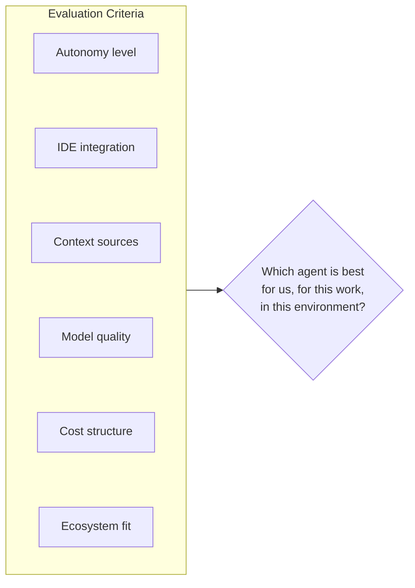
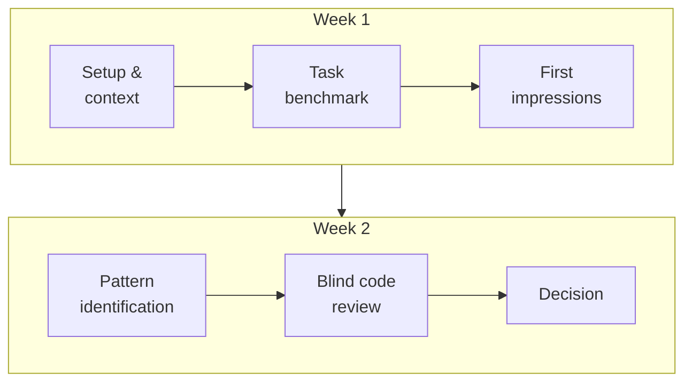
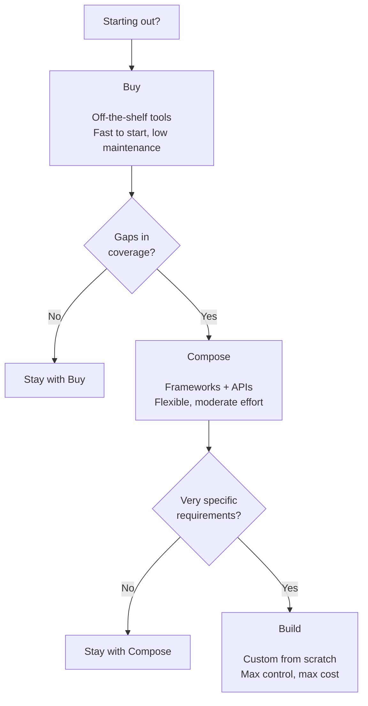

Six articles in, you have the mental model. Now comes the part everyone actually Googled first: which agent should I use?

This is the article I wish existed when I started. Not a feature comparison table lifted from a vendor's website, but an honest framework for making the decision based on your actual situation — your team, your workflow, your risk tolerance, your budget.

We'll compare the main players, walk through how to run a meaningful pilot, and close with an honest look at where this is all going. By the end, you'll have what you need to make a confident choice — or at least a confident first move.

---

## The Evaluation Criteria That Actually Matter

Before we look at specific tools, let's establish what we're evaluating. Because "which agent is best" is the wrong question. The right question is "which agent is best for us, for this kind of work, in this environment?"

Here are the dimensions that actually determine fit:

**Autonomy level.** How much does the agent do before checking in with you? High-autonomy agents run longer, do more, and require more trust. Low-autonomy agents keep you tightly in the loop. Neither is better in the abstract — it depends on your risk tolerance and the nature of your work.

**IDE integration.** Does it live inside your editor, or does it run in a terminal alongside it? IDE-native agents feel more like a co-pilot — they see what you see, inline. Terminal-based agents feel more like delegating to someone else. Both are valid mental models; they produce different working styles.

**Context sources.** What can the agent actually see? Just your open file? The whole repository? Your GitHub issues? Your internal documentation? The wider the context, the more informed the decisions — and the more you need to think carefully about what you're sharing.

**Model quality.** The underlying model matters. Reasoning ability, instruction following, code quality — these vary meaningfully across providers. This is also the dimension that changes fastest, so any specific comparison I make here will be outdated within months. Treat current benchmarks as a starting point, not a verdict.

**Cost structure.** Per-seat pricing, per-token usage, or both? For light users, per-seat is often better. For heavy users running long agentic tasks, token-based costs can add up fast. Model this against your expected usage before you commit.

**Ecosystem fit.** Does it integrate with your version control, your CI system, your issue tracker? An agent that lives inside your existing tools creates less friction than one that lives outside them. Friction compounds at team scale.

---

## The Main Players, Honestly Assessed

### Claude Code

Claude Code is Anthropic's CLI-first agent. It runs in your terminal, operates directly on your filesystem, and is built around the assumption that you want a capable, somewhat autonomous collaborator you can drop into a project and give a meaningful task.

Its strengths are reasoning quality and instruction following. For complex, multi-step tasks — debugging a subtle interaction between systems, refactoring a large module consistently, implementing a feature across a full stack — it tends to produce coherent, high-quality work. It's also notably good at reading existing codebases and matching their conventions, which matters enormously in practice.

The tradeoffs: it's terminal-based, which some developers find less natural than inline IDE integration. And because it's designed for meaningful autonomy, it works best when you've invested in the context setup we covered in [Article 3](/blog/agentic-ai-3-prompting-context-control) — it rewards good prompting more than some alternatives.

Best fit for: developers and teams who work on complex, well-specified tasks and want an agent they can genuinely delegate to. Also a strong choice if you want to integrate agents into CI pipelines or automated workflows.

### Cursor

Cursor is a fork of VS Code with deep agent integration baked in. If you already live in VS Code, the transition is nearly frictionless — it's your editor, but with a capable agent woven into the editing experience.

Its strength is the inline collaboration model. You can chat with it about the file you're editing, apply suggestions directly, and stay tightly in control throughout. For developers who want to augment their flow without handing off control, this feels natural fast.

The tradeoffs: because it's designed for tight collaboration, it's less suited to longer autonomous runs. It excels at "help me with this" more than "go build this." Also worth noting: Cursor's underlying model varies by plan — the quality ceiling is directly tied to what you're paying for.

Best fit for: individual developers who want an always-on coding companion inside their editor. Particularly good for developers new to agents who want to stay in control while they build trust in the tool.

### GitHub Copilot

Copilot has grown substantially from its autocomplete origins. Its agent mode, available in VS Code and JetBrains, can work across files, execute terminal commands, and handle multi-step tasks. The major advantage it brings that nothing else can fully replicate: GitHub context.

If your team is already living in GitHub — issues, PRs, code review, Actions — Copilot can see all of it. An agent that understands your issue history, your PR feedback patterns, and your CI configuration is meaningfully more informed than one working from the code alone.

The tradeoffs: the agent experience is less polished than dedicated agent-first tools. It's caught up significantly but still feels like a very good IDE assistant that grew into agents, rather than something designed around agentic workflows from the start.

Best fit for: teams already deep in the GitHub ecosystem, particularly those where the GitHub context integration creates clear value. Also a safe enterprise choice — Microsoft's support, security posture, and compliance story are mature.

### Devin

Devin sits at the far end of the autonomy spectrum. It's designed for longer-horizon tasks — the kind where you describe a feature or a bug and come back later to review the result. It operates in a sandboxed environment, can browse the web, write and run code, and iterate independently for extended periods.

The honest assessment: Devin represents where the category is going more than where it is today. It's capable and genuinely impressive on the right tasks, but the practical day-to-day reality is narrower than the launch demos suggested. Long-horizon autonomous work is hard — error accumulation is real, and the tasks where you can genuinely walk away and come back to something usable are more limited than the marketing implies.

Best fit for: teams experimenting with the frontier of agent autonomy, or organizations with specific long-horizon tasks that fit the model well. Worth following closely as the technology matures.

### Custom Agents via API

One option that doesn't get enough attention in these comparisons: building your own.

All the major model providers expose APIs that let you build agents tailored exactly to your workflow. You control the tools, the memory architecture, the autonomy model, the context sources. You can integrate directly with your internal systems in ways that off-the-shelf tools can't.

The tradeoffs are real: it takes engineering time to build and maintain, and you're on the hook for everything the managed tools handle for you. But for organizations with specific requirements — particular security constraints, deep internal tool integration, domain-specific workflows — a custom agent can outperform any off-the-shelf option.

Best fit for: engineering teams with the capacity to build and maintain tooling, where the specific requirements of the org make custom the right call.

| Tool | Tagline | Strengths | Best for |
| --- | --- | --- | --- |
| **Claude Code** | CLI-first autonomous agent | Reasoning quality, instruction following, CI integration | Complex multi-step tasks, teams that delegate |
| **Cursor** | AI-native code editor | Inline collaboration, low friction, tight control | Individual devs who want a co-pilot in the editor |
| **GitHub Copilot** | Agent mode in your IDE | GitHub context, ecosystem breadth, enterprise-ready | Teams deep in the GitHub ecosystem |
| **Devin** | High-autonomy agent | Long-horizon tasks, sandboxed execution | Frontier autonomy experiments |
| **Custom (API)** | Build your own | Full control, deep internal integration | Orgs with specific requirements |

---

## How to Run a Meaningful Pilot

The worst way to evaluate an agent is to let five developers try it however they want for a month and then take a vote. You'll get five different experiences, measuring five different things, and the discussion will be more about personal preference than about fit.

Here's a more structured approach.

**Define the task set first.** Before you start, pick three to five representative tasks from your actual backlog. One simple, well-specified task. One complex, multi-file task. One debugging task with a real stack trace. One documentation task. These become your benchmark — you run every agent candidate through the same set.

**Control the context.** Give each agent the same context setup. Same system prompt, same relevant files, same project conventions. You're evaluating the agent, not your prompting — variation in context will swamp the signal.

**Measure what matters.** For each task: how long did it take to reach a usable result (including iteration time)? How much manual correction was needed? Was the output consistent with your codebase conventions? Did it require significant re-prompting? Score each agent on each task with a simple rubric — don't rely on vibes.

**Include a real review step.** Don't just evaluate "did it produce code" — evaluate "would this pass code review?" Have a senior developer review the output without knowing which agent produced it. Blind review removes a lot of bias.

**Run it for at least two weeks.** First impressions with agents are unreliable. The first few days are dominated by the novelty effect — everything seems impressive. The second week is when the real patterns emerge: where it's consistently useful, where it keeps failing, what the friction points are.

---

## Build vs. Buy vs. Compose

One framework that helps clarify the decision:

**Buy** (off-the-shelf agent tools like Cursor, Copilot, Claude Code): Fast to start, low maintenance overhead, limited customization. Right for most teams most of the time.

**Compose** (using agent frameworks and model APIs to assemble a workflow): More flexible than buying, less overhead than full custom. Tools like LangGraph, CrewAI, or Anthropic's own agent primitives let you wire together agents with custom tools and memory without building from scratch. Good for teams with specific workflow requirements that off-the-shelf tools don't cover.

**Build** (custom agent from scratch via API): Maximum control, maximum maintenance cost. Right for organizations with very specific requirements or where the agent is itself a product or core capability.

Most teams should start with Buy, learn what doesn't fit, and move toward Compose for the gaps. Full Build is a deliberate choice for specific situations, not a default.

One piece of guidance worth internalizing here: Anthropic's own [guide to building effective agents](https://www.anthropic.com/research/building-effective-agents) spends a surprising amount of time explaining when *not* to build an agent — when a simpler chain of prompts, or even a single well-crafted API call, is the right answer. The instinct to reach for the most powerful pattern is strong, but the best teams match the tool to the task. Sometimes Buy is right not because you can't Build, but because you shouldn't.

---

## Where This Is Going

Any honest look at the agent landscape has to acknowledge how fast it's moving. Tools that were state-of-the-art six months ago have been superseded. Capabilities that seemed years away have shipped. The specific comparisons I've made in this article will need updating — probably sooner than you think.

But a few directional bets feel durable enough to be worth making:

**Agents will get more autonomous.** The trend line is clear: from autocomplete to copilot to agent, and from single-step agents to multi-step agents to agents that can run for hours on complex tasks. The question isn't whether this happens but how quickly the reliability catches up to the ambition.

**Multi-agent systems will become practical.** Right now, most people are working with one agent at a time. The frontier is multiple specialized agents working in parallel — one writing code, one running tests, one reviewing output, one updating documentation. The coordination overhead is real, but the tools for managing it are maturing fast.

**Context will get bigger and smarter.** Context windows are expanding, but raw size isn't the whole story — agents are also getting better at deciding what to put in context, what to retrieve from external memory, and what to ignore. The practical limit on "how much can the agent know about my project" is moving rapidly.

**The skill of working with agents will become a core engineering competency.** Right now it feels like a specialty. In two to three years, it'll feel like knowing how to use version control — table stakes, not differentiating.

The teams that treat this as a moment to learn rather than a moment to wait will be in a very different position than those who don't.

---

## Closing the Series

Six articles ago, I asked whether you understood this technology well enough to use it well. I hope the answer now is closer to yes.

We've covered a lot of ground: the fundamentals of generative AI and LLMs, the anatomy of a coding agent, how to communicate with agents effectively, how to integrate them into real workflows, how teams are reorganizing around them, and how to choose the right tools for your situation.

The through-line, if there is one, is this: these tools are powerful, imperfect, and genuinely transformative — but only if you engage with them actively. The developers and teams getting the most out of agents aren't the ones who handed over the wheel. They're the ones who figured out a new way to drive.

That's the shift. And it's worth making.

---

*This is the final article in the "Agentic AI Development: From Zero to Hero" series. If you found it useful, the earlier pieces are worth reading in order — each one builds on the last. And if something here is wrong, outdated, or missing — I'd genuinely like to know.*

---

**Resources worth bookmarking:** Two references that go deeper than this series could. The [Anthropic Cookbook's agent patterns](https://github.com/anthropics/anthropic-cookbook/tree/main/patterns/agents) section has working implementations of the orchestration patterns we discussed in [Part 2](/blog/agentic-ai-2-what-is-a-coding-agent) — routing, handoffs, tool use, memory. And [21 Agentic Design Patterns](https://github.com/CarlBarl/agentic-design-patterns) is a well-organized catalog of the architectural patterns emerging across the field. Both are living documents that get updated as the space moves. Good starting points for going from "I understand this" to "I'm building with this."
