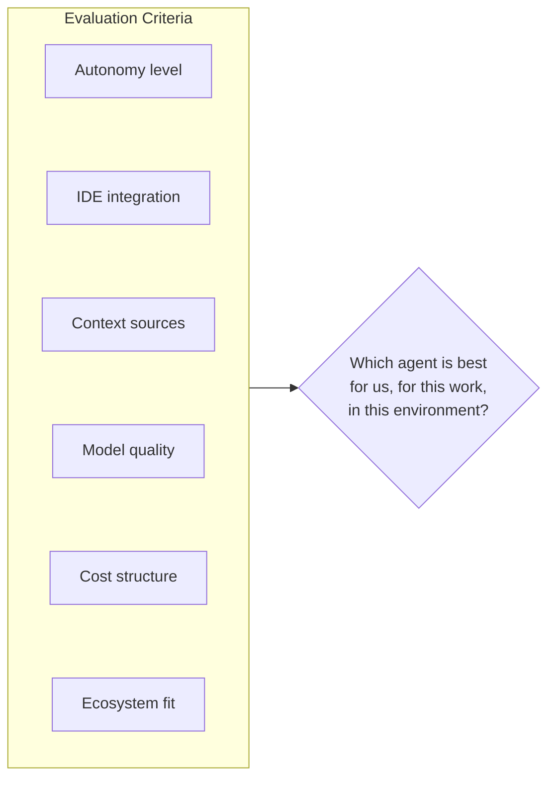
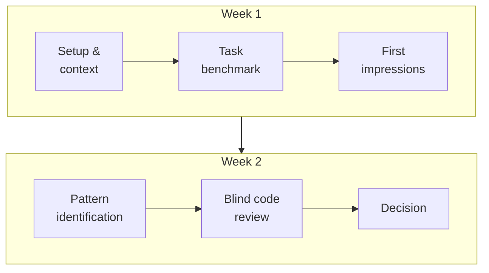
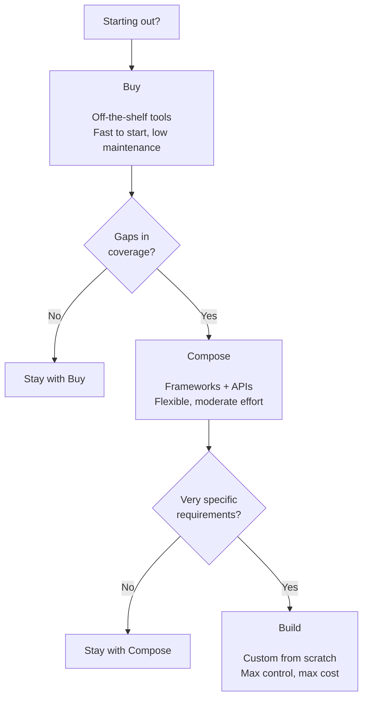

Six parts in, you have the mental model. Now comes the part everyone actually Googled first: which agent should I use?

This is the article I wish existed when I started. Not a feature comparison lifted from a vendor's website, but a framework for deciding based on your actual situation. Your team, your workflow, your risk tolerance, your budget.

We'll compare the main players, walk through how to run a pilot worth trusting, and close with an honest look at where this is heading. By the end you'll have what you need to make a confident choice, or at least a confident first move.

---

## The evaluation criteria that actually matter

Before we look at specific tools, let's establish what we're evaluating. Because "which agent is best" is the wrong question. The right question is "which agent is best for us, for this kind of work, in this environment?"

Here are the dimensions that actually determine fit:

**Autonomy level.** How much does the agent do before checking in? High-autonomy agents run longer, do more, and ask for more trust. Low-autonomy agents keep you in the loop. Neither is better in the abstract. It depends on your risk tolerance and the kind of work you do.

**IDE integration.** Does it live inside your editor or run in a terminal alongside it? IDE-native agents feel like a co-pilot. They see what you see, inline. Terminal-based agents feel like delegating to someone else. Both are valid, and they produce different working styles.

**Context sources.** What can the agent see? Your open file? The whole repository? Your GitHub issues? Your internal documentation? The wider the context, the better informed the decisions, and the more carefully you need to think about what you're sharing.

**Model quality.** The underlying model matters. Reasoning, instruction following, code quality, all of it varies across providers. This is also the dimension that changes fastest, so any comparison I make here goes stale within months. Treat current benchmarks as a starting point, not a verdict.

**Cost structure.** Per-seat pricing, per-token usage, or both? For light users, per-seat is often better. For heavy users running long agentic tasks, token-based costs can add up fast. Model this against your expected usage before you commit.

**Ecosystem fit.** Does it integrate with your version control, your CI system, your issue tracker? An agent that lives inside your existing tools creates less friction than one that lives outside them. Friction compounds at team scale.

```mermaid
flowchart LR
    subgraph criteria["Evaluation Criteria"]
        direction TB
        A["Autonomy level"] ~~~ B["IDE integration"]
        B ~~~ C["Context sources"]
        C ~~~ D["Model quality"]
        D ~~~ E["Cost structure"]
        E ~~~ F["Ecosystem fit"]
    end

    criteria --> Q{"Which agent is best\nfor us, for this work,\nin this environment?"}
```

---

## The main players, honestly assessed

### Claude Code

Claude Code is Anthropic's CLI-first agent. It runs in your terminal, operates directly on your filesystem, and is built around the assumption that you want a capable, somewhat autonomous collaborator you can drop into a project and give a meaningful task.

Its strengths are reasoning quality and instruction following. On complex multi-step work, debugging a subtle interaction between systems, refactoring a large module consistently, implementing a feature across the stack, it produces coherent work. It's also good at reading an existing codebase and matching its conventions, which matters more in practice than any benchmark.

The tradeoffs. It's terminal-based, which some developers find less natural than inline IDE integration. And because it's built for real autonomy, it works best once you've done the context setup from [Part 3](/blog/agentic-ai-3-prompting-context-control). It rewards good prompting more than some alternatives do.

Best fit for: developers and teams who work on complex, well-specified tasks and want an agent they can genuinely delegate to. Also a strong choice if you want to integrate agents into CI pipelines or automated workflows.

### Cursor

Cursor is a fork of VS Code with agent integration baked in. If you already live in VS Code, the transition costs you almost nothing. It's your editor, with a capable agent woven into it.

Its strength is the inline collaboration model. You can chat with it about the file you're editing, apply suggestions directly, and stay tightly in control throughout. For developers who want to augment their flow without handing off control, this feels natural fast.

The tradeoffs. Built for tight collaboration, it's less suited to long autonomous runs. It's better at "help me with this" than "go build this." Worth noting too that Cursor's underlying model varies by plan, so the quality ceiling tracks what you pay.

Best fit for: individual developers who want an always-on coding companion inside their editor. Particularly good for developers new to agents who want to stay in control while they build trust in the tool.

### GitHub Copilot

Copilot has grown a long way from its autocomplete origins. Agent mode, in VS Code and JetBrains, works across files, executes terminal commands, and handles multi-step tasks. The advantage nothing else fully replicates is GitHub context.

If your team already lives in GitHub, issues, PRs, code review, Actions, Copilot sees all of it. An agent that knows your issue history, your PR feedback patterns, and your CI configuration is better informed than one working from the code alone.

The tradeoffs. The agent experience is less polished than the agent-first tools. It has closed a lot of ground, but it still feels like a very good IDE assistant that grew into agents rather than something designed around them.

Best fit for: teams already deep in the GitHub ecosystem, especially where that context integration creates clear value. Also the safe enterprise choice. Microsoft's support, security posture, and compliance story are mature.

### Devin

Devin sits at the far end of the autonomy spectrum, built for long tasks. Describe a feature or a bug, come back later, review the result. It works in a sandbox, browses the web, writes and runs code, and iterates on its own for long stretches.

The honest assessment is that Devin shows where the category is going more than where it is. It's impressive on the right task, and the day-to-day reality is narrower than the launch demos suggested. Long autonomous runs are hard. Error accumulates, and the set of tasks where you can walk away and come back to something usable is smaller than the marketing implies.

Best fit for: teams experimenting with the frontier of agent autonomy, or organizations with specific long-horizon tasks that fit the model well. Worth following closely as the technology matures.

### Custom agents via API

One option that doesn't get enough attention: building your own.

All the major model providers expose APIs that let you build agents tailored exactly to your workflow. You control the tools, the memory architecture, the autonomy model, the context sources. You can integrate directly with your internal systems in ways that off-the-shelf tools can't.

The tradeoffs are real. It takes engineering time to build and maintain, and you own everything the managed tools would have handled. But for an organization with specific requirements, particular security constraints, deep internal tool integration, domain-specific workflows, a custom agent beats anything off the shelf.

Best fit for: engineering teams with the capacity to build and maintain tooling, where the specific requirements of the org make custom the right call.

| Tool | Tagline | Strengths | Best for |
| --- | --- | --- | --- |
| **Claude Code** | CLI-first autonomous agent | Reasoning quality, instruction following, CI integration | Complex multi-step tasks, teams that delegate |
| **Cursor** | AI-native code editor | Inline collaboration, low friction, tight control | Individual devs who want a co-pilot in the editor |
| **GitHub Copilot** | Agent mode in your IDE | GitHub context, ecosystem breadth, enterprise-ready | Teams deep in the GitHub ecosystem |
| **Devin** | High-autonomy agent | Long-horizon tasks, sandboxed execution | Frontier autonomy experiments |
| **Custom (API)** | Build your own | Full control, deep internal integration | Orgs with specific requirements |

---

## How to run a pilot worth trusting

The worst way to evaluate an agent is to let five developers try it however they want for a month and then take a vote. You'll get five different experiences, measuring five different things, and the discussion will be more about personal preference than about fit.

Here's a more structured approach.

**Define the task set first.** Pick three to five representative tasks from your actual backlog. One simple and well-specified. One complex and multi-file. One debugging task with a real stack trace. One documentation task. These are your benchmark, and every candidate runs the same set.

**Control the context.** Give each agent the same setup. Same system prompt, same relevant files, same project conventions. You're evaluating the agent, not your prompting, and variation in context swamps the signal.

**Measure what matters.** For each task, how long to a usable result, counting iteration time? How much manual correction? Did the output match your codebase conventions? How much re-prompting? Score each agent on each task with a simple rubric. Don't run on vibes.

**Include a real review step.** The question isn't "did it produce code," it's "would this pass code review?" Have a senior developer review the output without knowing which agent wrote it. Blind review removes a lot of bias.

**Run it for at least two weeks.** First impressions with agents are unreliable. Novelty carries the first few days and everything looks impressive. The second week is when the patterns show: where it's reliably useful, where it keeps failing, where the friction sits.

```mermaid
flowchart TD
    subgraph week1["Week 1"]
        direction LR
        S["Setup &\ncontext"] --> B["Task\nbenchmark"] --> FI["First\nimpressions"]
    end

    subgraph week2["Week 2"]
        direction LR
        P["Pattern\nidentification"] --> R["Blind code\nreview"] --> D["Decision"]
    end

    week1 --> week2
```

---

## Evals outlive the pilot

A pilot is a one-time decision. **Evals** are how you keep that decision honest as models, prompts, and codebases change underneath you.

The minimum viable eval is five to ten representative tasks with known good outcomes, re-run whenever something material changes: a new model version, a system prompt update, a major dependency upgrade. If the score drops, investigate before it reaches the team.

Sophisticated teams run evals continuously and track scores on dashboards. Smaller teams get most of the value from an `/evals` directory holding a handful of golden test cases and the habit of running them on agent-config changes. The point isn't the tooling. It's having a way to notice when the agent's judgment shifts under you.

This connects back to [Part 3](/blog/agentic-ai-3-prompting-context-control). In agent-augmented workflows your test suite validates the agent's judgment as much as the code. Evals formalize that. Without them you're trusting that the model working today still works tomorrow. Sometimes it does.

---

## Build vs. buy vs. compose

One framework that clarifies the decision.

**Buy.** Off-the-shelf tools like Cursor, Copilot, and Claude Code. Fast to start, low maintenance, limited customization. Right for most teams most of the time.

**Compose.** Agent frameworks and model APIs assembled into a workflow. More flexible than buying, less overhead than full custom. LangGraph, CrewAI, and Anthropic's own building blocks let you wire agents to custom tools and memory without starting from nothing. Good for teams whose workflow requirements the off-the-shelf tools don't cover.

**Build.** A custom agent from scratch on the API. Maximum control, maximum maintenance. Right when the requirements are unusual, or when the agent is itself the product.

Most teams should start with Buy, learn what doesn't fit, and move toward Compose for the gaps. Full Build is a deliberate choice for specific situations, not a default.

```mermaid
flowchart TD
    Start["Starting out?"] --> Buy["Buy\n\nOff-the-shelf tools\nFast to start, low maintenance"]
    Buy --> Gaps{"Gaps in\ncoverage?"}
    Gaps -- "No" --> Stay["Stay with Buy"]
    Gaps -- "Yes" --> Compose["Compose\n\nFrameworks + APIs\nFlexible, moderate effort"]
    Compose --> Specific{"Very specific\nrequirements?"}
    Specific -- "No" --> Stay2["Stay with Compose"]
    Specific -- "Yes" --> Build["Build\n\nCustom from scratch\nMax control, max cost"]
```

Worth noting here that Anthropic's own [guide to building effective agents](https://www.anthropic.com/research/building-effective-agents) spends a surprising amount of time on when *not* to build an agent, and when a simple chain of prompts or one well-crafted API call is the right answer. The pull toward the most powerful pattern is strong. The best teams match the tool to the task. Sometimes Buy is right not because you can't Build, but because you shouldn't.

---

## Where this is going

Any honest look at this field has to admit how fast it moves. Tools that led six months ago have been passed. Capabilities that looked years out have shipped. The comparisons in this article will need updating, probably sooner than you'd like.

A few bets still feel durable enough to make.

**Agents will get more autonomous.** The trend line is clear: from autocomplete to copilot to agent, and from single-step agents to multi-step agents to agents that can run for hours on complex tasks. The question isn't whether this happens but how quickly the reliability catches up to the ambition.

**Multi-agent systems will become practical.** Most people work with one agent at a time today. The frontier is several specialized agents in parallel. One writing code, one running tests, one reviewing output, one updating docs. The coordination overhead is real, and the tools for managing it are maturing fast.

**Context will get bigger and smarter.** Windows keep expanding, and raw size isn't the whole story. Agents are getting better at deciding what to load into context, what to retrieve from external memory, and what to ignore. The practical ceiling on how much an agent can know about your project keeps rising.

**Working with agents will become a core engineering skill.** Right now it reads as a specialty. In two or three years it'll read like knowing git. Expected, not impressive.

The teams that treat this as a moment to learn rather than a moment to wait will be in a very different position than those who don't.

---

## Closing the series

Six parts ago, I asked whether you understood this technology well enough to use it well. I hope the answer now is closer to yes.

We've covered a lot of ground: the fundamentals of generative AI and LLMs, the anatomy of a coding agent, how to communicate with agents effectively, how to integrate them into real workflows, how teams are reorganizing around them, and how to choose the right tools for your situation.

The through-line is the one from Part 1. Agents amplify clarity and ambiguity equally. The teams shipping fast aren't the ones with the best model. They're the ones who got better at framing the problem before the agent ever sees it. These tools are powerful and imperfect, and they only pay off while you stay engaged with them. The people getting the most out of agents didn't hand over the wheel. They worked out a new way to drive.

That's the shift. And it's worth making.

---

*This is the final part in the "Agentic AI Development: From Zero to Hero" series. If you found it useful, the earlier pieces are worth reading in order, since each one builds on the last.*

*If you have war stories from your own team, corrections, or you just want to compare notes on what's actually working in production, find me on [LinkedIn](https://linkedin.com/in/rotem-horovitz) or [X](https://x.com/lurx). The conversation is where most of the real learning happens, and none of us is figuring this out alone.*

---

**Resources worth bookmarking.** Two references that go deeper than this series could. The [Anthropic Cookbook's agent patterns](https://github.com/anthropics/anthropic-cookbook/tree/main/patterns/agents) section has working implementations of the orchestration patterns from [Part 2](/blog/agentic-ai-2-what-is-a-coding-agent), covering prompt chaining, routing, parallelization, orchestrator-workers, and evaluator-optimizer. [21 Agentic Design Patterns](https://github.com/josephsenior/Agentic-Design-Patterns) is a runnable catalog of the wider pattern set, one directory per pattern. Both get updated as the space moves. Good places to go from "I understand this" to "I'm building with this."
