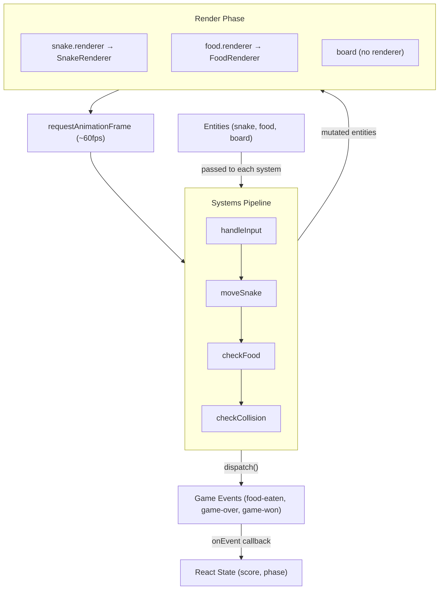

# 🎮 Building a Browser Game with react-game-engine

You've spent years building forms, dashboards, and CRUD apps. One day you wake up and think: _"What if I built a game... in React?"_

Turns out, you can — and it doesn't require throwing away everything you know about components and state. The `react-game-engine` library (RGE) brings the **Entity-Component-System** (ECS) pattern to React, giving you a proper game loop while keeping your UI layer familiar.

This post walks through how I built a snake game using RGE, with real code from the actual implementation. No pseudocode, no hand-waving.

---

## 🧠 The ECS Mental Model

ECS splits your game into three concerns:

- **Entities** — Pure data. No behavior, no rendering logic. Just bags of properties describing _what exists_.
- **Systems** — Pure functions that run every frame. They read entities, apply logic, and return updated entities. They describe _what happens_.
- **Renderers** — React components attached to entities. They describe _how things look_.

This separation is the whole trick. Your game logic doesn't know about React. Your React components don't know about game rules. And your data doesn't know about either.

If you've ever struggled with a React component that handles input, updates state, runs game logic, AND renders — ECS is the antidote.

---

## 🔄 How RGE Runs the Loop

Before diving into the code, here's how `react-game-engine` orchestrates everything at runtime:



The key insight: **your code never calls `requestAnimationFrame` directly**. RGE owns the loop. You give it an array of systems and an object of entities, and it calls your systems on every frame, passing the current entities and a bag of args (input events, timing, a `dispatch` function). After systems run, RGE renders each entity's `renderer` component with the entity's current properties as props.

This means systems don't know about React, renderers don't know about game logic, and the game loop itself is someone else's problem. You just define _what exists_, _what happens_, and _how it looks_.

---

## 📦 Designing the Entities

Entities in RGE are just plain objects. Each one has whatever properties your systems need, plus a `renderer` property that tells RGE which React component to draw.

Here are the types for the snake game:

```typescript
type Position = {
 x: number;
 y: number;
};

type Direction = 'UP' | 'DOWN' | 'LEFT' | 'RIGHT';

type SnakeEntity = {
 body: Position[];
 direction: Direction;
 growing: boolean;
 cellSize: number;
 renderer: ReactElement;
};

type FoodEntity = {
 position: Position;
 cellSize: number;
 renderer: ReactElement;
};

type BoardEntity = {
 width: number;
 height: number;
 cellSize: number;
 tickMs: number;
 lastTickTime: number;
 keyScheme: KeyScheme;
 winLength: number;
};

type Entities = {
 snake: SnakeEntity;
 food: FoodEntity;
 board: BoardEntity;
};
```

Notice anything? There's no `update()` method. No `draw()` call. No class hierarchy. The snake entity is just "here's my body segments, which direction I'm heading, and whether I'm growing." The board entity is just grid dimensions and timing config.

The `board` entity doesn't even have a renderer — it holds config _and_ runtime state (like `lastTickTime`) that systems read from and write to. Not everything needs to be visible.

---

## ⚙️ Writing Systems as Pure Functions

Every system has the same signature:

```typescript
type System = (entities: Entities, args: SystemArgs) => Entities;
```

That's it. Take entities in, return entities out. The `args` object gives you input events, a `dispatch` function for game events, and timing info.

The snake game has four systems, and **order matters**:

```typescript
const SYSTEMS = [handleInput, moveSnake, checkFood, checkCollision];
```

Input first (so the snake's direction is set before it moves), then movement, then food checks, then collision checks. Swap the order and you get bugs — a snake that eats food _after_ crashing into a wall, for example.

### 1️⃣ handleInput — Reading Keyboard Events

```typescript
export const handleInput = (entities: Entities, { input }: SystemArgs): Entities => {
 const keyDownEvents = input.filter((event) => event.name === 'onKeyDown');
 const directionMap = DIRECTION_MAPS[entities.board.keyScheme];

 for (const event of keyDownEvents) {
  const key = event.payload.key ?? '';
  const newDirection = directionMap[key];

  if (!newDirection) continue;

  const currentDirection = entities.snake.direction;
  const isReversal = OPPOSITE_DIRECTIONS[newDirection] === currentDirection;

  if (!isReversal) {
   entities.snake.direction = newDirection;
   break;
  }
 }

 return entities;
};
```

Simple loop: find the first valid key press, make sure it's not a 180-degree reversal (you can't go from UP to DOWN — that's instant death), and update the direction. The `keyScheme` check means the game supports both arrow keys and WASD.

### 2️⃣ moveSnake — Advancing the Snake

```typescript
const DIRECTION_DELTAS: Record<Direction, Position> = {
 UP: { x: 0, y: -1 },
 DOWN: { x: 0, y: 1 },
 LEFT: { x: -1, y: 0 },
 RIGHT: { x: 1, y: 0 },
};

export const moveSnake = (entities: Entities, { time }: SystemArgs): Entities => {
 if (time.current - entities.board.lastTickTime < entities.board.tickMs) return entities;
 entities.board.lastTickTime = time.current;

 const { snake } = entities;
 const head = snake.body[0];
 const delta = DIRECTION_DELTAS[snake.direction];
 const newHead: Position = { x: head.x + delta.x, y: head.y + delta.y };

 snake.body = [newHead, ...snake.body];

 if (snake.growing) {
  snake.growing = false;
 } else {
  snake.body.pop();
 }

 return entities;
};
```

This is the core movement. Add a new head in the current direction, and unless we're growing (just ate food), drop the tail. The snake slides forward.

### 3️⃣ checkFood — Eating and Spawning

```typescript
export const checkFood = (entities: Entities, { dispatch }: SystemArgs): Entities => {
 const head = entities.snake.body[0];
 const foodPos = entities.food.position;

 if (head.x === foodPos.x && head.y === foodPos.y) {
  entities.snake.growing = true;
  entities.food.position = spawnFood(
   entities.snake.body,
   entities.board.width,
   entities.board.height
  );
  dispatch({ type: 'food-eaten' });
 }

 return entities;
};
```

Head on food? Set `growing` to true (so `moveSnake` won't pop the tail next tick), spawn new food somewhere the snake isn't, and dispatch an event so the UI can update the score.

### 4️⃣ checkCollision — Walls and Self

```typescript
export const checkCollision = (entities: Entities, { dispatch }: SystemArgs): Entities => {
 const { snake, board } = entities;
 const head = snake.body[0];

 const hitWall =
  head.x < 0 || head.x >= board.width || head.y < 0 || head.y >= board.height;

 if (hitWall) {
  dispatch({ type: 'game-over' });
  return entities;
 }

 const bodyWithoutHead = snake.body.slice(1);
 const hitSelf = bodyWithoutHead.some(
  (segment) => segment.x === head.x && segment.y === head.y
 );

 if (hitSelf) {
  dispatch({ type: 'game-over' });
  return entities;
 }

 if (snake.body.length >= board.winLength) {
  dispatch({ type: 'game-won' });
 }

 return entities;
};
```

Check walls, check self-collision, check win condition. Each dispatches an event — the system doesn't care what the UI does with it.

---

## ⏱️ Tick-Based Game Loops

RGE calls your systems on every animation frame (~60fps). But snake doesn't move 60 times per second — that would be unplayable chaos. So `moveSnake` throttles itself using a `lastTickTime` value stored on the board entity:

```typescript
if (time.current - entities.board.lastTickTime < entities.board.tickMs) return entities;
entities.board.lastTickTime = time.current;
```

The `tickMs` value (default 150ms) controls game speed. Shorter tick = faster snake.

Keeping `lastTickTime` on the entity instead of in module-level state is important. It means the system stays pure — all its state lives in the entity graph. When the game restarts and `createEntities()` builds a fresh set with `lastTickTime: 0`, the tick resets automatically. No separate cleanup function, no hidden global to remember. It also makes the system trivially testable: just set `board.lastTickTime` in your mock entities and the system behaves predictably, with no `beforeEach` reset ritual.

---

## 🎯 The Focus Trap: Why RGE's Input Pipeline Can Break

There's a subtle gotcha with how `react-game-engine` captures keyboard input that bit me when I added a second game (a Tetris-style brickfall).

RGE renders a `<div>` with `tabIndex={0}` and attaches `onKeyDown` to it. On mount, it calls `this.container.current.focus()`. This works perfectly — until the user clicks _anywhere_ outside that div. A controls panel, a score display, a "restart" button — one click and the div loses focus. `onKeyDown` stops firing. Your systems stop receiving input events. The game appears frozen.

The insidious part: it works flawlessly in initial testing. You load the page, the div auto-focuses, keys work. It only breaks after the user interacts with surrounding UI — which is exactly what a real player does.

### The fix: bypass the engine's input pipeline

Instead of relying on RGE's focus-dependent `onKeyDown`, attach a global listener and queue actions directly on the entity:

```typescript
// In the component — global listener always fires, regardless of focus
useEffect(() => {
 const handleKeyDown = (event: KeyboardEvent) => {
  const action = ACTION_MAPS[keyScheme][event.key];
  if (action) {
   entities.board.pendingActions.push(action);
  }
 };

 globalThis.addEventListener('keydown', handleKeyDown);
 return () => globalThis.removeEventListener('keydown', handleKeyDown);
}, [keyScheme, entities]);
```

```typescript
// In the system — read from the entity, not from RGE's input arg
export const handleInput = (entities: Entities, { dispatch }: SystemArgs): Entities => {
 const { pendingActions } = entities.board;

 for (const action of pendingActions) {
  if (action === 'LEFT' || action === 'RIGHT') {
   handleMove(piece, grid, board, action === 'LEFT' ? -1 : 1);
  }
  // ... other actions
 }

 board.pendingActions = [];
 return entities;
};
```

The component maps raw keys to game actions (respecting the active key scheme) and pushes them onto a `pendingActions` array on the board entity. The system reads and clears that array each frame. No focus required. No dependency on RGE's internal event plumbing.

This is the same principle as `lastTickTime` — store runtime state on the entity, not in a side channel. The system stays pure, the component owns the browser integration, and the two communicate through the entity graph.

---

## 🎨 Renderers as React Components

Renderers are just React components. RGE passes the entity's properties as props and renders them inside its container. Here's the snake:

```tsx
export const SnakeRenderer = ({ body, cellSize }: { body: Position[]; cellSize: number }) => (
 <>
  {body.map((segment, index) => {
   const isHead = index === 0;
   const opacity = 1 - (index / body.length) * 0.5;

   return (
    <div
     key={`snake-${index}`}
     style={{
      position: 'absolute',
      left: segment.x * cellSize,
      top: segment.y * cellSize,
      width: cellSize,
      height: cellSize,
      backgroundColor: '#43d9ad',
      opacity,
      borderRadius: isHead ? 4 : 2,
      boxShadow: isHead ? '0 0 8px rgba(67, 217, 173, 0.4)' : 'none',
     }}
    />
   );
  })}
 </>
);
```

Each body segment is absolutely positioned on the board. The head gets a glow effect and larger border radius. Tail segments fade out — a nice touch that's trivial to add because the renderer is just a component that receives data.

The food renderer is even simpler:

```tsx
export const FoodRenderer = ({ position, cellSize }: { position: Position; cellSize: number }) => (
 <div
  style={{
   position: 'absolute',
   left: position.x * cellSize,
   top: position.y * cellSize,
   width: cellSize,
   height: cellSize,
   backgroundColor: '#ffb86a',
   borderRadius: '50%',
   boxShadow: '0 0 10px rgba(255, 184, 106, 0.6)',
  }}
 />
);
```

A glowing orange circle. That's it. The renderer doesn't know anything about game logic — it just places a dot where the entity says it should be.

---

## 🔌 Wiring It All Up

The main component ties everything together:

```tsx
export const RgeSnakeGame = ({ config }: RgeSnakeGameProps) => {
 const resolved = useMemo(() => resolveConfig(config), [config]);

 const [phase, setPhase] = useState<GamePhase>('idle');
 const [score, setScore] = useState(0);
 const [entities, setEntities] = useState<Entities>(() => createEntities(resolved, keyScheme));

 const engineRef = useRef<GameEngine>(null);

 const handleEvent = useCallback((event: GameEvent) => {
  if (event.type === 'food-eaten') setScore((prev) => prev + 1);
  if (event.type === 'game-over') setPhase('lost');
  if (event.type === 'game-won') setPhase('won');
 }, []);

 const isRunning = phase === 'playing';

 return (
  <div className={styles.wrapper}>
   <div className={styles.board} style={boardCssVariables}>
    <GameEngine
     ref={engineRef}
     systems={SYSTEMS}
     entities={entities}
     running={isRunning}
     onEvent={handleEvent}
    />
    <GameOverlay phase={phase} score={score} onStart={handleStart} onRestart={handleRestart} />
   </div>
   <GameControls score={score} onDirectionPress={handleDirectionPress} />
  </div>
 );
};
```

The component doesn't contain any game logic. It manages lifecycle (`idle → playing → won/lost`), passes a flat `systems` array and `entities` object to `GameEngine`, and listens for events. The `running` boolean pauses/resumes the engine. The `swap` method on the engine ref replaces all entities on restart.

The game flow is dead simple:

1. **Idle** — overlay shows "START GAME"
2. **Playing** — engine runs, systems process every frame
3. **Won/Lost** — engine stops, overlay shows score + replay button

---

## 📐 Config-Driven Sizing

The snake game accepts an optional `config` prop with five fields:

```typescript
type SnakeGameConfig = {
 gridCols?: number;
 gridRows?: number;
 cellSize?: number;
 tickMs?: number;
 winLength?: number;
};
```

All fields have defaults (`10×20` grid, `20px` cells, `150ms` tick, win at `20` body length), but every value is overridable. This means the same component can render as a tiny sidebar widget or a full-screen game — just change the numbers:

```tsx
// Compact sidebar version (default)
<RgeSnakeGame />

// Larger board, bigger cells
<RgeSnakeGame config={{ gridCols: 20, gridRows: 20, cellSize: 24 }} />

// Speed run mode
<RgeSnakeGame config={{ tickMs: 80 }} />

// Quick win (eat 10 food to win, snake starts at length 3)
<RgeSnakeGame config={{ winLength: 13 }} />
```

The trick is that the config drives _both_ the game logic and the visual layout. Entities use `gridCols`, `gridRows`, and `cellSize` to position the snake and food. But the same values also get injected as CSS custom properties:

```typescript
const boardCssVariables = {
 '--board-cols': resolved.gridCols,
 '--board-rows': resolved.gridRows,
 '--board-cell-size': `${resolved.cellSize}px`,
} as React.CSSProperties;
```

The board's SCSS uses these variables to calculate its own dimensions:

```scss
.board {
 width: calc(var(--board-cols) * var(--board-cell-size));
 height: calc(var(--board-rows) * var(--board-cell-size));
 background-size: var(--board-cell-size) var(--board-cell-size);
}
```

The board resizes itself. The grid lines in the background pattern match the cell size. And the renderers already use `cellSize` for absolute positioning — so everything stays in sync. One config object, two rendering systems (JS and CSS), zero manual coordination.

This is why `cellSize` lives on every entity. It's not redundant — the renderers need it to convert grid coordinates to pixel offsets, and the CSS needs it to size the container. The config is the single source of truth for both.

---

## 🧪 Testing the ECS

Here's where ECS really shines. Systems are pure functions — you give them mock entities and mock args, and assert on the output. No DOM, no rendering, no timers.

```typescript
it('changes direction when a valid arrow key is pressed', () => {
 const entities = createMockEntities('UP');
 const result = handleInput(entities, createMockArgs('ArrowRight'));
 expect(result.snake.direction).toBe('RIGHT');
});

it('prevents 180-degree reversal from UP to DOWN', () => {
 const entities = createMockEntities('UP');
 const result = handleInput(entities, createMockArgs('ArrowDown'));
 expect(result.snake.direction).toBe('UP');
});
```

Testing `checkCollision`:

```typescript
it('dispatches game-over when head hits left wall', () => {
 const entities = createMockEntities(-1, 5);
 const args = createMockArgs();
 checkCollision(entities, args);
 expect(args.dispatch).toHaveBeenCalledWith({ type: 'game-over' });
});

it('does not dispatch when snake is in valid position', () => {
 const entities = createMockEntities(7, 7);
 const args = createMockArgs();
 checkCollision(entities, args);
 expect(args.dispatch).not.toHaveBeenCalled();
});
```

No mocking GSAP timelines. No fake timers. No `act()` wrappers. Just function in, assertion out.

For the main component, mock `GameEngine` itself and simulate events through the mock:

```tsx
jest.mock('react-game-engine', () => ({
 GameEngine: jest.fn(({ running, onEvent }) => (
  <div
   data-testid="game-engine"
   data-running={String(running)}
   onClick={() => onEvent?.({ type: 'food-eaten' })}
   onDoubleClick={() => onEvent?.({ type: 'game-over' })}
  />
 )),
}));

it('increments score on food-eaten event', () => {
 render(<RgeSnakeGame />);
 fireEvent.click(screen.getByText('START GAME'));
 fireEvent.click(screen.getByTestId('game-engine'));
 expect(screen.getByTestId('score')).toHaveTextContent('SCORE: 1');
});
```

The mock lets you trigger game events by clicking — no need to simulate 60fps game loops in tests.

---

## 🪆 Embedding in Custom Chrome

The snake game lives on the homepage inside a glassmorphism widget with its own controls panel, food tracker, and skip button. But the `RgeSnakeGame` component has its own wrapper, score display, and d-pad. We need the game board _without_ the surrounding UI, so the host widget can provide its own.

Two props make this possible:

```typescript
type RgeSnakeGameProps = {
 config?: SnakeGameConfig;
 onWin?: () => void;
 onSkip?: () => void;
 onScoreChange?: (score: number) => void;
 hideControls?: boolean;
};
```

When `hideControls` is `true`, the component returns just the board element — no wrapper div, no `GameControls`. The host widget wraps it in its own layout:

```tsx
const HERO_SNAKE_CONFIG = {
 gridCols: 15,
 gridRows: 25,
 cellSize: 16,
 tickMs: 200,
 winLength: 13, // 3 initial + 10 food = quick game
};

<div className={styles.widget}>
 <div className={styles.body}>
  <div className={styles.gridWrapper}>
   <RgeSnakeGame
    config={HERO_SNAKE_CONFIG}
    onWin={handleComplete}
    onScoreChange={setScore}
    hideControls
   />
  </div>
  <div className={styles.controls}>
   {/* instructions, arrow keys, food dots, skip */}
  </div>
 </div>
</div>
```

The `onScoreChange` callback fires whenever the score updates, letting the host track progress externally. The homepage widget uses this to drive a row of food dot indicators — 10 SVG circles that dim as the snake eats:

```tsx
const foodRemaining = FOOD_TOTAL - score;

{Array.from({ length: FOOD_TOTAL }, (_, index) => (
 <svg className={index >= foodRemaining ? styles.eaten : ''}>
  <circle opacity="0.1" cx="10" cy="10" r="10" fill="#46ECD5" />
  <circle opacity="0.2" cx="10" cy="10" r="7" fill="#46ECD5" />
  <circle cx="10" cy="10" r="4" fill="#46ECD5" />
 </svg>
))}
```

The `winLength` config ties everything together: set it to `initialSnakeLength + foodTotal` (3 + 10 = 13), and the game ends exactly when the last food dot dims. One config value, two systems (game logic and UI indicators), zero coordination.

---

## 🏁 Wrap-Up

The ECS pattern through `react-game-engine` gives you:

- **Testability** — Systems are pure functions. Write tests in seconds, not minutes.
- **Separation of concerns** — Input handling, movement, collision, and rendering never touch each other.
- **Easy extensibility** — Want power-ups? Add a `PowerUpEntity` and a `checkPowerUp` system. Drop it into the `SYSTEMS` array. Done.
- **React-friendly rendering** — Renderers are just components. Use CSS, animations, whatever you already know.
- **Configurable game speed** — The tick-based loop decouples game logic from frame rate.

The same architecture scales to more complex games. Swap the snake for a spaceship, add physics and particle systems, and the pattern holds. Entities stay dumb, systems stay pure, renderers stay pretty.

**A note on performance:** The snake game gets away with direct mutation (`entities.board.lastTickTime = time.current`, `snake.body = [newHead, ...snake.body]`) because the entity count is tiny — one snake, one food, one board. At 60fps that's invisible. But the pattern has a cost: every system in the pipeline receives the full entity object, and RGE re-renders every entity's React component each frame. For a game with hundreds of entities, particle effects, or physics bodies, you'd want to be more deliberate — pool arrays instead of allocating new ones, skip unchanged renderers with `React.memo`, or batch mutations. ECS gives you the _structure_ to scale, but you still have to think about allocation and render cost as complexity grows.

If you've been itching to build something that _isn't_ a form, give it a shot. The ECS pattern might just ruin you for traditional state management.

## Links

- [Play the Snake game](/about-me?play-game=snake)
- [See the full code](https://github.com/lurx/lurx-react/tree/main/apps/rotem-is-a-dev/src/games/rge-snake-game/)
