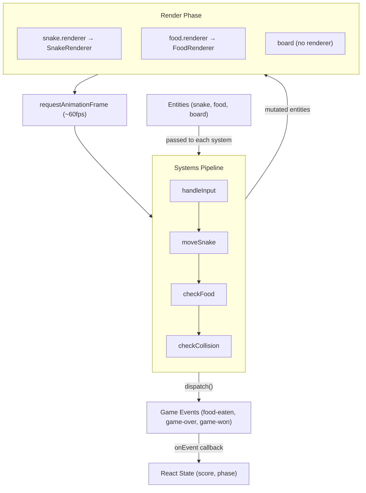

# Building a Browser Game with react-game-engine

You've spent years on forms, dashboards, and CRUD screens. Then one day you wonder what it would take to build a game in React.

Turns out you can, and you keep almost everything you already know. The `react-game-engine` library (RGE) brings the Entity-Component-System (ECS) pattern to React. It runs the game loop for you and leaves your UI layer as ordinary React.

Here's how I built a snake game with it. Every snippet below is copied out of the running implementation.

---

## The ECS mental model

ECS splits a game into three kinds of things.

- **Entities.** Plain objects with no methods. Properties describing _what exists_.
- **Systems.** Functions that run every frame. They read entities, apply logic, and return updated entities. They describe _what happens_.
- **Renderers.** React components attached to entities. They describe _how things look_.

That separation is the whole trick. Your game logic doesn't know about React. Your React components don't know about game rules. And your data doesn't know about either.

If you've ever fought a component that reads input, holds state, runs game rules, and renders, ECS is the fix.

---

## How RGE runs the loop

Before the code, here's what `react-game-engine` does at runtime.


```mermaid
%%{init: {"flowchart": {"subGraphTitleMargin": {"top": 20, "bottom": 4}}} }%%
flowchart TD
    RAF["requestAnimationFrame (~60fps)"] --> Systems

    subgraph Systems["Systems Pipeline"]
        direction TB
        S1["handleInput"] --> S2["moveSnake"]
        S2 --> S3["checkFood"]
        S3 --> S4["checkCollision"]
    end

    Entities["Entities (snake, food, board)"] -- "passed to each system" --> Systems
    Systems -- "mutated entities" --> Render

    subgraph Render["Render Phase"]
        direction TB
        R1["snake.renderer → SnakeRenderer"]
        R2["food.renderer → FoodRenderer"]
        R3["board (no renderer)"]
    end

    Systems -- "dispatch()" --> Events["Game Events (food-eaten, game-over, game-won)"]
    Events -- "onEvent callback" --> State["React State (score, phase)"]
    Render --> RAF
```

Your code never calls `requestAnimationFrame`. RGE owns the loop. You hand it an array of systems and an object of entities, and it calls every system once per frame with the current entities plus an args object holding input events, timing, and a `dispatch` function. Then it renders each entity's `renderer` component with that entity's current properties as props.

So systems don't know about React, renderers don't know about game rules, and the loop is someone else's problem. You define _what exists_, _what happens_, and _how it looks_.

---

## Designing the entities

Entities in RGE are plain objects. Each one carries whatever properties your systems need, plus a `renderer` property naming the React component that draws it.

Here are the types for the snake game.

```typescript
type Position = {
 x: number;
 y: number;
};

type Direction = 'UP' | 'DOWN' | 'LEFT' | 'RIGHT';

type SnakeEntity = {
 body: Position[];
 direction: Direction;
 growing: boolean;
 cellSize: number;
 renderer: ReactElement;
};

type FoodEntity = {
 position: Position;
 cellSize: number;
 renderer: ReactElement;
};

type BoardEntity = {
 width: number;
 height: number;
 cellSize: number;
 tickMs: number;
 lastTickTime: number;
 keyScheme: KeyScheme;
 winLength: number;
};

type Entities = {
 snake: SnakeEntity;
 food: FoodEntity;
 board: BoardEntity;
};
```

No `update()` method. No `draw()` call. No class hierarchy. The snake entity says "here are my body segments, the direction I'm heading, and whether I'm growing." The board entity holds grid dimensions and timing config.

The `board` entity has no renderer at all. It holds config plus runtime state like `lastTickTime` that systems read and write. Not everything needs to be visible.

---

## Writing systems as pure functions

Every system has the same signature.

```typescript
type System = (entities: Entities, args: SystemArgs) => Entities;
```

That's it. Entities in, entities out. The `args` object carries input events, a `dispatch` function for game events, and timing info.

The snake game has four systems, and their order matters.

```typescript
const SYSTEMS = [handleInput, moveSnake, checkFood, checkCollision];
```

Input first, so the direction is set before the snake moves. Then movement, then food, then collisions. Swap two of them and you get a snake that eats food _after_ crashing into a wall.

### 1. handleInput reads the keyboard

```typescript
export const handleInput = (entities: Entities, { input }: SystemArgs): Entities => {
 const keyDownEvents = input.filter((event) => event.name === 'onKeyDown');
 const directionMap = DIRECTION_MAPS[entities.board.keyScheme];

 for (const event of keyDownEvents) {
  const key = event.payload.key ?? '';
  const newDirection = directionMap[key];

  if (!newDirection) continue;

  const currentDirection = entities.snake.direction;
  const isReversal = OPPOSITE_DIRECTIONS[newDirection] === currentDirection;

  if (!isReversal) {
   entities.snake.direction = newDirection;
   break;
  }
 }

 return entities;
};
```

The loop takes the first valid key press, rejects 180-degree reversals (UP straight to DOWN is instant death), and sets the direction. The `keyScheme` lookup is what lets the game accept arrow keys or WASD.

### 2. moveSnake advances the body

```typescript
const DIRECTION_DELTAS: Record<Direction, Position> = {
 UP: { x: 0, y: -1 },
 DOWN: { x: 0, y: 1 },
 LEFT: { x: -1, y: 0 },
 RIGHT: { x: 1, y: 0 },
};

export const moveSnake = (entities: Entities, { time }: SystemArgs): Entities => {
 if (time.current - entities.board.lastTickTime < entities.board.tickMs) return entities;
 entities.board.lastTickTime = time.current;

 const { snake } = entities;
 const head = snake.body[0];
 const delta = DIRECTION_DELTAS[snake.direction];
 const newHead: Position = { x: head.x + delta.x, y: head.y + delta.y };

 snake.body = [newHead, ...snake.body];

 if (snake.growing) {
  snake.growing = false;
 } else {
  snake.body.pop();
 }

 return entities;
};
```

Add a new head in the current direction, and unless we just ate, drop the tail. The snake slides forward.

### 3. checkFood eats and respawns

```typescript
export const checkFood = (entities: Entities, { dispatch }: SystemArgs): Entities => {
 const head = entities.snake.body[0];
 const foodPos = entities.food.position;

 if (head.x === foodPos.x && head.y === foodPos.y) {
  entities.snake.growing = true;
  entities.food.position = spawnFood(
   entities.snake.body,
   entities.board.width,
   entities.board.height
  );
  dispatch({ type: 'food-eaten' });
 }

 return entities;
};
```

Head on food? Set `growing` to true so `moveSnake` keeps the tail next tick, spawn new food somewhere the snake isn't, and dispatch an event so the UI can update the score.

### 4. checkCollision handles walls and self

```typescript
export const checkCollision = (entities: Entities, { dispatch }: SystemArgs): Entities => {
 const { snake, board } = entities;
 const head = snake.body[0];

 const hitWall =
  head.x < 0 || head.x >= board.width || head.y < 0 || head.y >= board.height;

 if (hitWall) {
  dispatch({ type: 'game-over' });
  return entities;
 }

 const bodyWithoutHead = snake.body.slice(1);
 const hitSelf = bodyWithoutHead.some(
  (segment) => segment.x === head.x && segment.y === head.y
 );

 if (hitSelf) {
  dispatch({ type: 'game-over' });
  return entities;
 }

 if (snake.body.length >= board.winLength) {
  dispatch({ type: 'game-won' });
 }

 return entities;
};
```

Walls, then self-collision, then the win condition. Each one dispatches an event and moves on. The system never learns what the UI does with it.

---

## Tick-based game loops

RGE calls your systems on every animation frame, roughly 60 per second. Snake shouldn't move 60 times a second, so `moveSnake` throttles itself against a `lastTickTime` value stored on the board entity.

```typescript
if (time.current - entities.board.lastTickTime < entities.board.tickMs) return entities;
entities.board.lastTickTime = time.current;
```

`tickMs` (default 150ms) controls game speed. Shorter tick, faster snake.

Keeping `lastTickTime` on the entity rather than in module scope matters more than it looks. All of the system's state lives in the entities, so a restart resets the tick for free. `createEntities()` builds a fresh set with `lastTickTime: 0` and there is nothing else to clean up. Tests get the same benefit. Set `board.lastTickTime` on your mock entities and the system does exactly one thing, with no `beforeEach` reset to remember.

---

## The focus trap in RGE's input handling

The way `react-game-engine` captures keyboard input bit me when I added a second game, a Tetris-style brickfall.

RGE renders a `<div>` with `tabIndex={0}`, attaches `onKeyDown` to it, and calls `this.container.current.focus()` on mount. That holds until the user clicks anywhere outside the div. A controls panel, a score display, a "restart" button. One click and the div loses focus, `onKeyDown` stops firing, systems stop receiving input, and the game looks frozen.

The nasty part is that it survives your own testing. You load the page, the div auto-focuses, the keys work. It only breaks once someone touches the surrounding UI, which is the first thing a real player does.

### The fix

Skip RGE's focus-dependent `onKeyDown`. Attach a global listener and queue actions on the entity instead.

```typescript
// In the component. A global listener fires regardless of focus
useEffect(() => {
 const handleKeyDown = (event: KeyboardEvent) => {
  const action = ACTION_MAPS[keyScheme][event.key];
  if (action) {
   entities.board.pendingActions.push(action);
  }
 };

 globalThis.addEventListener('keydown', handleKeyDown);
 return () => globalThis.removeEventListener('keydown', handleKeyDown);
}, [keyScheme, entities]);
```

```typescript
// In the system. Read from the entity, not from RGE's input arg
export const handleInput = (entities: Entities, { dispatch }: SystemArgs): Entities => {
 const { pendingActions } = entities.board;

 for (const action of pendingActions) {
  if (action === 'LEFT' || action === 'RIGHT') {
   handleMove(piece, grid, board, action === 'LEFT' ? -1 : 1);
  }
  // ... other actions
 }

 board.pendingActions = [];
 return entities;
};
```

The component maps raw keys to game actions under the active key scheme and pushes them onto a `pendingActions` array on the board entity. The system drains that array each frame. No focus required, and no dependency on RGE's internal event plumbing.

Same principle as `lastTickTime`. Runtime state goes on the entity, never in a side channel. The system stays pure, the component owns the browser integration, and the two talk through the entities.

---

## Renderers are React components

RGE passes an entity's properties to its renderer as props and mounts the result inside its container. Here's the snake.

```tsx
export const SnakeRenderer = ({ body, cellSize }: { body: Position[]; cellSize: number }) => (
 <>
  {body.map((segment, index) => {
   const isHead = index === 0;
   const opacity = 1 - (index / body.length) * 0.5;

   return (
    <div
     key={`snake-${index}`}
     style={{
      position: 'absolute',
      left: segment.x * cellSize,
      top: segment.y * cellSize,
      width: cellSize,
      height: cellSize,
      backgroundColor: '#43d9ad',
      opacity,
      borderRadius: isHead ? 4 : 2,
      boxShadow: isHead ? '0 0 8px rgba(67, 217, 173, 0.4)' : 'none',
     }}
    />
   );
  })}
 </>
);
```

Each body segment is absolutely positioned on the board. The head gets a glow and a larger border radius, and the tail fades toward the end. That fade cost one line, because the renderer is a component receiving data and nothing more.

The food renderer is shorter still.

```tsx
export const FoodRenderer = ({ position, cellSize }: { position: Position; cellSize: number }) => (
 <div
  style={{
   position: 'absolute',
   left: position.x * cellSize,
   top: position.y * cellSize,
   width: cellSize,
   height: cellSize,
   backgroundColor: '#ffb86a',
   borderRadius: '50%',
   boxShadow: '0 0 10px rgba(255, 184, 106, 0.6)',
  }}
 />
);
```

A glowing orange circle. The renderer knows nothing about game rules. It puts a dot where the entity says.

---

## Wiring it up

The main component ties it together.

```tsx
export const RgeSnakeGame = ({ config }: RgeSnakeGameProps) => {
 const resolved = useMemo(() => resolveConfig(config), [config]);

 const [phase, setPhase] = useState<GamePhase>('idle');
 const [score, setScore] = useState(0);
 const [entities, setEntities] = useState<Entities>(() => createEntities(resolved, keyScheme));

 const engineRef = useRef<GameEngine>(null);

 const handleEvent = useCallback((event: GameEvent) => {
  if (event.type === 'food-eaten') setScore((prev) => prev + 1);
  if (event.type === 'game-over') setPhase('lost');
  if (event.type === 'game-won') setPhase('won');
 }, []);

 const isRunning = phase === 'playing';

 return (
  <div className={styles.wrapper}>
   <div className={styles.board} style={boardCssVariables}>
    <GameEngine
     ref={engineRef}
     systems={SYSTEMS}
     entities={entities}
     running={isRunning}
     onEvent={handleEvent}
    />
    <GameOverlay phase={phase} score={score} onStart={handleStart} onRestart={handleRestart} />
   </div>
   <GameControls score={score} onDirectionPress={handleDirectionPress} />
  </div>
 );
};
```

There's no game logic in the component. It tracks the lifecycle (`idle → playing → won/lost`), hands `GameEngine` a flat `systems` array and an `entities` object, and listens for events. The `running` boolean pauses and resumes the engine. The `swap` method on the engine ref replaces all entities on restart.

The flow is small.

1. **Idle.** The overlay shows START GAME.
2. **Playing.** The engine runs and systems process every frame.
3. **Won or lost.** The engine stops and the overlay shows the score with a replay button.

---

## Config-driven sizing

The snake game takes an optional `config` prop with five fields.

```typescript
type SnakeGameConfig = {
 gridCols?: number;
 gridRows?: number;
 cellSize?: number;
 tickMs?: number;
 winLength?: number;
};
```

Every field has a default (`10×20` grid, `20px` cells, `150ms` tick, win at `20` body length) and every one can be overridden. The same component renders as a sidebar widget or a full-screen game depending on the numbers you pass.

```tsx
// Compact sidebar version (default)
<RgeSnakeGame />

// Larger board, bigger cells
<RgeSnakeGame config={{ gridCols: 20, gridRows: 20, cellSize: 24 }} />

// Speed run mode
<RgeSnakeGame config={{ tickMs: 80 }} />

// Quick win (eat 10 food to win, snake starts at length 3)
<RgeSnakeGame config={{ winLength: 13 }} />
```

The config drives the game logic and the layout at once. Entities use `gridCols`, `gridRows`, and `cellSize` to position the snake and food, and the same values go in as CSS custom properties.

```typescript
const boardCssVariables = {
 '--board-cols': resolved.gridCols,
 '--board-rows': resolved.gridRows,
 '--board-cell-size': `${resolved.cellSize}px`,
} as React.CSSProperties;
```

The board's SCSS sizes itself from those variables.

```scss
.board {
 width: calc(var(--board-cols) * var(--board-cell-size));
 height: calc(var(--board-rows) * var(--board-cell-size));
 background-size: var(--board-cell-size) var(--board-cell-size);
}
```

The board resizes itself, the background grid lines match the cell size, and the renderers already use `cellSize` to place things. Change one number and the JS and the CSS move together with nothing coordinating them.

That's why `cellSize` sits on every entity. It looks redundant, but the renderers need it to turn grid coordinates into pixel offsets and the CSS needs it to size the container. One config value feeds both.

---

## Testing the ECS

This is the payoff. Systems are pure functions, so a test is mock entities in, assertion on the output. No DOM, no rendering, no timers.

```typescript
it('changes direction when a valid arrow key is pressed', () => {
 const entities = createMockEntities('UP');
 const result = handleInput(entities, createMockArgs('ArrowRight'));
 expect(result.snake.direction).toBe('RIGHT');
});

it('prevents 180-degree reversal from UP to DOWN', () => {
 const entities = createMockEntities('UP');
 const result = handleInput(entities, createMockArgs('ArrowDown'));
 expect(result.snake.direction).toBe('UP');
});
```

Same for `checkCollision`.

```typescript
it('dispatches game-over when head hits left wall', () => {
 const entities = createMockEntities(-1, 5);
 const args = createMockArgs();
 checkCollision(entities, args);
 expect(args.dispatch).toHaveBeenCalledWith({ type: 'game-over' });
});

it('does not dispatch when snake is in valid position', () => {
 const entities = createMockEntities(7, 7);
 const args = createMockArgs();
 checkCollision(entities, args);
 expect(args.dispatch).not.toHaveBeenCalled();
});
```

No GSAP timelines to mock, no fake timers, no `act()` wrappers.

The main component needs one mock. Replace `GameEngine` and fire events through it.

```tsx
jest.mock('react-game-engine', () => ({
 GameEngine: jest.fn(({ running, onEvent }) => (
  <div
   data-testid="game-engine"
   data-running={String(running)}
   onClick={() => onEvent?.({ type: 'food-eaten' })}
   onDoubleClick={() => onEvent?.({ type: 'game-over' })}
  />
 )),
}));

it('increments score on food-eaten event', () => {
 render(<RgeSnakeGame />);
 fireEvent.click(screen.getByText('START GAME'));
 fireEvent.click(screen.getByTestId('game-engine'));
 expect(screen.getByTestId('score')).toHaveTextContent('SCORE: 1');
});
```

Clicking the mock fires a game event, so no test has to run a 60fps loop.

---

## Embedding in custom chrome

On the homepage the snake game sits inside a glass widget with its own controls panel, food tracker, and skip button. `RgeSnakeGame` ships its own wrapper, score display, and d-pad, and here I want the board without any of that so the host can supply its own.

Two props handle it.

```typescript
type RgeSnakeGameProps = {
 config?: SnakeGameConfig;
 onWin?: () => void;
 onSkip?: () => void;
 onScoreChange?: (score: number) => void;
 hideControls?: boolean;
};
```

With `hideControls` set, the component returns the board element alone. No wrapper div, no `GameControls`. The host widget supplies the layout.

```tsx
const HERO_SNAKE_CONFIG = {
 gridCols: 15,
 gridRows: 25,
 cellSize: 16,
 tickMs: 200,
 winLength: 13, // 3 initial + 10 food = quick game
};

<div className={styles.widget}>
 <div className={styles.body}>
  <div className={styles.gridWrapper}>
   <RgeSnakeGame
    config={HERO_SNAKE_CONFIG}
    onWin={handleComplete}
    onScoreChange={setScore}
    hideControls
   />
  </div>
  <div className={styles.controls}>
   {/* instructions, arrow keys, food dots, skip */}
  </div>
 </div>
</div>
```

`onScoreChange` fires on every score update so the host can track progress. The homepage widget uses it to drive a row of 10 SVG dots that dim as the snake eats.

```tsx
const foodRemaining = FOOD_TOTAL - score;

{Array.from({ length: FOOD_TOTAL }, (_, index) => (
 <svg className={index >= foodRemaining ? styles.eaten : ''}>
  <circle opacity="0.1" cx="10" cy="10" r="10" fill="#46ECD5" />
  <circle opacity="0.2" cx="10" cy="10" r="7" fill="#46ECD5" />
  <circle cx="10" cy="10" r="4" fill="#46ECD5" />
 </svg>
))}
```

`winLength` ties the two halves together. Set it to `initialSnakeLength + foodTotal` (3 + 10 = 13) and the game ends on the frame the last dot dims.

---

## Wrap-up

What I got out of ECS here: tests that are ordinary function calls, input and movement and collision code that never touch each other, and a rendering layer that's plain React. Adding power-ups means writing a `PowerUpEntity` and a `checkPowerUp` system and appending it to the `SYSTEMS` array. Changing the speed means changing one number, because the tick loop is separate from the frame rate.

The structure holds for bigger games. Swap the snake for a spaceship, add physics, and entities stay dumb while systems stay pure.

Performance is the caveat. The snake game mutates entities directly (`entities.board.lastTickTime = time.current`, `snake.body = [newHead, ...snake.body]`) and gets away with it because there are three entities. At 60fps nobody notices. The cost shows up at scale, since every system receives the whole entity object and RGE re-renders every entity's component each frame. With hundreds of entities, particles, or physics bodies you'd pool arrays instead of allocating new ones, wrap unchanged renderers in `React.memo`, and batch mutations. ECS gives you somewhere to put that work. It doesn't do the work for you.

If you've been itching to build something that _isn't_ a form, this is a good weekend. Fair warning, going back to reducers afterwards is a letdown.

## Links

- [Play the Snake game](/games?play-game=snake)
- [See the full code](https://github.com/lurx/lurx-react/tree/main/apps/rotem-is-a-dev/src/games/rge-snake-game/)
