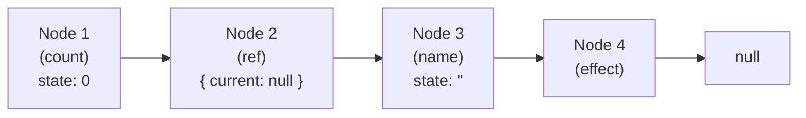
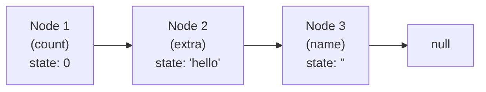
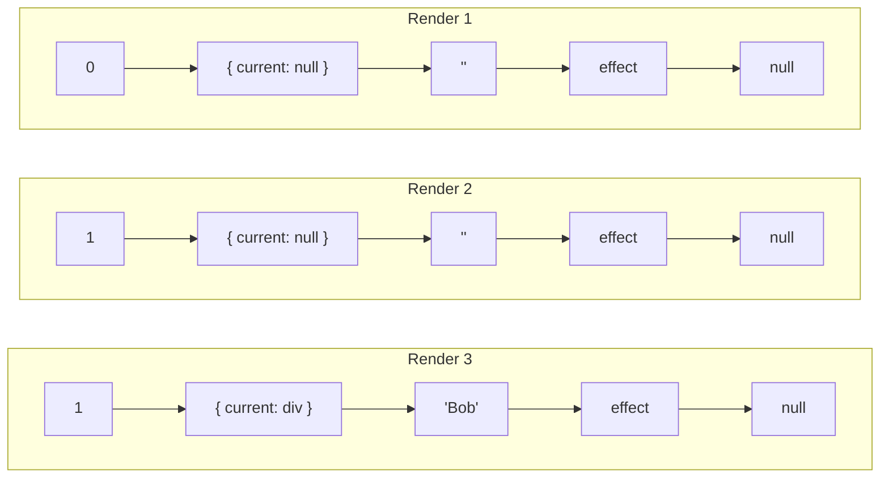

*Most React developers follow the rules of hooks. Fewer understand why they exist. This article changes that.*

---

## Something Is Wrong Here

Before we talk about how hooks work, let's break them.

```js
function MyComponent({ showExtra }) {
  const [count, setCount] = useState(0);

  if (showExtra) {
    const [extra, setExtra] = useState('hello');
  }

  const [name, setName] = useState('');
}
```

First render, `showExtra` is `true`. Everything works. Second render, `showExtra` flips to `false`. Suddenly `name` is `'hello'` — a value it was never given.

React didn't get confused. It did exactly what it was designed to do. *You* confused it by changing the order of hook calls. But what does "order" even mean here? Why would React care?

To answer that, we need to look at what React actually builds when your component runs.

---

## There Is No Magic. There Is Only a Linked List

When React renders your component for the first time, it builds a linked list — one node per hook call, in the exact order they appear in your code.

Think of it as React quietly following you around with a notepad, writing things down as you call hooks:

```js
function MyComponent() {
  const [count, setCount] = useState(0);   // React writes: "Node 1 → 0"
  const ref = useRef(null);                // React writes: "Node 2 → { current: null }"
  const [name, setName] = useState('');    // React writes: "Node 3 → ''"
  useEffect(() => { ... }, [count]);       // React writes: "Node 4 → effect"
}
```

Each node looks something like this:

```js
{
  memoizedState: 0,    // whatever value lives here right now
  queue: { ... },      // pending state updates (for useState)
  next: { ... },       // pointer to the next hook's node
}
```

After the first render, the linked list looks like this:



On **every re-render**, React doesn't build a new list. It walks back to the head of the existing one and reads top to bottom — matching each hook call to the node at that position. Not by variable name. Not by some hidden label. By position alone.

React has no idea that Node 1 is called `count`. It just knows it's first.

Where does this notepad live? On an internal object called a **fiber** — React's representation of your component instance. We'll explore fibers in depth in Part 4. For now, just know that every component has one, and the hook linked list hangs off its `memoizedState` property.

---

## Inside useState: What React Actually Does

Let's look at simplified versions of what React runs internally. These are based on [`ReactFiberHooks.js`](https://github.com/facebook/react/blob/main/packages/react-reconciler/src/ReactFiberHooks.js) — the actual source file where hooks live.

**On first render (mount):**

```js
// Simplified from mountState in ReactFiberHooks.js
function mountState(initialState) {
  const hook = {
    memoizedState: initialState,
    queue: { pending: null },
    next: null,
  };
  // Append to the linked list...
  const dispatch = dispatchSetState.bind(null, currentFiber, hook.queue);
  return [hook.memoizedState, dispatch];
}
```

React creates a new node, stores your initial value, and creates a `dispatch` function — your setter — permanently bound to this node's update queue.

**On every re-render (update):**

```js
// Simplified from updateState in ReactFiberHooks.js
function updateState(initialState) {
  const hook = getNextHookNode(); // walk to the next node in the list
  // initialState? Ignored. Completely. Gone.
  return [hook.memoizedState, hook.queue.dispatch];
}
```

That `0` you passed to `useState(0)`? Discarded after the first render like a receipt you'll never need. React reads whatever's already in `memoizedState` and returns it. The setter is the same function reference it created at mount — bound to the queue, never recreated.

This is why you don't need to include `setCount` in `useEffect` dependency arrays. It's the same function every time. React wired it once and moved on.

---

## Two Dispatchers, One Linked List

React doesn't just ignore the initial value on re-renders through an if-check. It swaps out the entire hook implementation. During a render, React sets an active **dispatcher** — a different set of hook functions depending on whether the component is mounting or updating. Both dispatchers live in the same [`ReactFiberHooks.js`](https://github.com/facebook/react/blob/main/packages/react-reconciler/src/ReactFiberHooks.js) file:

```js
// Simplified from ReactFiberHooks.js
const HooksDispatcherOnMount = {
  useState: mountState,
  useEffect: mountEffect,
  useRef: mountRef,
  // ...
};

const HooksDispatcherOnUpdate = {
  useState: updateState,
  useEffect: updateEffect,
  useRef: updateRef,
  // ...
};
```

**Mount dispatcher:** *"No nodes exist yet. Create them."*

**Update dispatcher:** *"Nodes already exist. Walk the list and read them."*

This is also why calling a hook outside a component — in a utility function, an event handler, or at the top level of a module — throws the infamous *"Invalid hook call"* error. There's no active dispatcher because React isn't rendering anything. The linked list doesn't exist. There's nowhere to write, and nothing to read.

---

## Every Hook Is a Node

The linked list isn't just for `useState`. Every hook — `useRef`, `useMemo`, `useCallback`, `useEffect` — gets a node. They just store different things in `memoizedState`.

**useRef** is the simplest hook of all:

```js
// Simplified from mountRef
function mountRef(initialValue) {
  const hook = createNewHookNode();
  const ref = { current: initialValue };
  hook.memoizedState = ref;
  return ref;
}

// Simplified from updateRef
function updateRef() {
  const hook = getNextHookNode();
  return hook.memoizedState; // same { current } object, always
}
```

That's it. No queue. No dispatch. Just an object with a `current` property, stored in the linked list. This is why `useRef` persists across renders — it returns the same object every time, and mutations to `.current` survive because React never replaces the container.

**useMemo** stores the computed value *and* the dependencies:

```js
// Simplified from mountMemo
function mountMemo(create, deps) {
  const hook = createNewHookNode();
  const value = create();
  hook.memoizedState = [value, deps];
  return value;
}

// Simplified from updateMemo
function updateMemo(create, deps) {
  const hook = getNextHookNode();
  const [prevValue, prevDeps] = hook.memoizedState;
  if (areDepsEqual(prevDeps, deps)) return prevValue; // skip recalculation
  const value = create();
  hook.memoizedState = [value, deps];
  return value;
}
```

Same linked list. Same positional indexing. Different payload.

**useEffect** carries a bit more luggage:

```js
{
  memoizedState: {
    deps: [count],    // dependencies from the last render
    create: fn,       // the effect callback
    destroy: fn,      // the cleanup function (if you returned one)
  },
  next: ...
}
```

On re-render, React compares old and new deps using `Object.is`. If everything matches, the effect is skipped. If anything changed, the effect is queued to run after the browser paints.

This is why `[]` means "run once" — there's nothing to compare against that could ever change, so the check always passes.

It's also why `[{}]` is a trap — `Object.is({}, {})` is `false` because it's a new object reference every render. Your effect runs every time, and you stare at it wondering what you did wrong.

---

## What About Custom Hooks?

A question that comes up naturally: does `useMyCustomHook()` get its own node?

No. Custom hooks are just functions. They have no special relationship with React. When you call a custom hook, the `useState`, `useRef`, and `useEffect` calls *inside* it each get their own node — exactly as if you'd written them directly in the component.

```js
function useCounter(initial) {
  const [count, setCount] = useState(initial);  // Node at position N
  const increment = useCallback(                // Node at position N+1
    () => setCount(c => c + 1), []
  );
  return { count, increment };
}

function MyComponent() {
  const { count, increment } = useCounter(0);   // Uses nodes N, N+1
  const [name, setName] = useState('');          // Node N+2
}
```

React doesn't see `useCounter`. It sees `useState`, then `useCallback`, then `useState` — three nodes in the list. Custom hooks are an organizational abstraction, not a React primitive.

---

## Why Conditions Break Everything

Now the opening example makes sense. Let's walk through it with what we know:

```js
function MyComponent({ showExtra }) {
  const [count, setCount] = useState(0);          // Node 1

  if (showExtra) {
    const [extra, setExtra] = useState('hello');  // Node 2 (sometimes)
  }

  const [name, setName] = useState('');           // Node 2 or 3?
}
```

First render, `showExtra = true`. React fills out three nodes:



Re-render, `showExtra = false`. The `if` block is skipped — but the linked list still has three nodes. React walks forward:

- Hook call 1 (`useState(0)` for count) → Node 1 ✅ reads `0`
- Hook call 2 (`useState('')` for name) → Node 2 ❌ reads `'hello'`

Your `name` just inherited someone else's value. React didn't get confused — it marched through the list exactly as designed. *You* shifted the mapping by removing a hook call from the middle.

This isn't a design flaw. It's a deliberate tradeoff. React could attach a label to each hook call — a name, a key, a symbol. But that would add overhead to every hook call, in every component, on every render. Instead, React keeps the mechanism lean and trusts you to keep the call order stable.

The ESLint plugin [`eslint-plugin-react-hooks`](https://github.com/facebook/react/tree/main/packages/eslint-plugin-react-hooks) exists to enforce that trust programmatically — because React knows we can't always be trusted.

---

## The Mental Model, Distilled

If you carry one image away from this article, make it this:



Same structure every time. Same number of nodes. Same order. Values change; positions don't.

Hooks are slots. Slots are positional. Position must never change.

React doesn't know your variable names. It knows where things live — in a linked list hanging off a fiber node. Your job, and the entire point of the rules of hooks, is to make sure things always live in the same place.

No magic. Just a linked list and a contract.

---

## What's Next

Now that you know how React *stores* hook state, the natural next question is: what about the hook that causes the most confusion — `useEffect`?

You probably learned it as "componentDidMount but in hooks." That analogy is wrong, and it's the reason effects feel unpredictable. In **Part 2 — useEffect Is Not a Lifecycle Method**, we'll bury that mental model and replace it with one that actually predicts how effects behave — including why cleanup runs before the new effect, why Strict Mode fires everything twice, and why your effect keeps seeing stale values.

---

*Part of the "React Internals — Under the Hood" series.*
