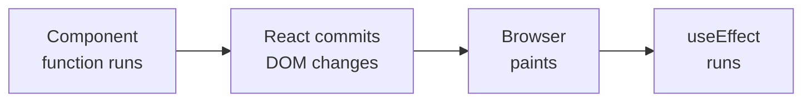
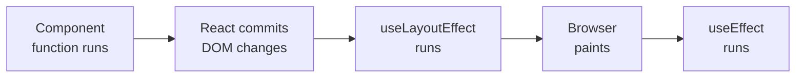
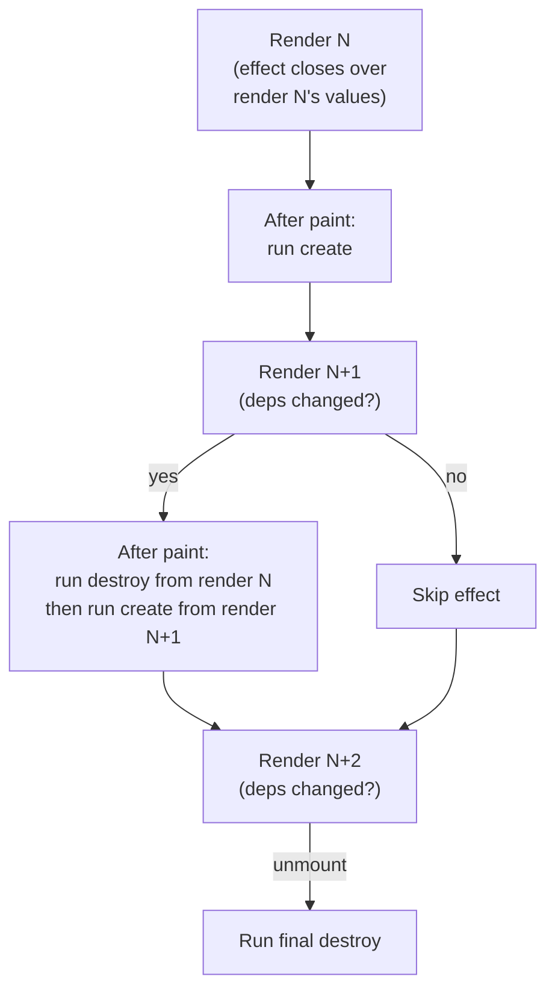

*You were told `useEffect` with an empty dependency array is `componentDidMount`. That mental model is wrong — and it's the reason effects feel unpredictable.*

---

## The Analogy That Won't Die

If you learned React during the class component era — or from someone who did — you probably carry this mapping in your head:

```text
componentDidMount    → useEffect(() => {}, [])
componentDidUpdate   → useEffect(() => {}, [dep])
componentWillUnmount → the cleanup function
```

It's tidy. It's intuitive. It's also wrong in ways that will bite you the moment your effects get non-trivial.

The class lifecycle model asks: *"What phase of the component's life are we in?"*

`useEffect` asks something entirely different: *"What state did I just synchronize with, and has it changed?"*

That distinction sounds academic until your cleanup runs when nothing unmounted, your effect fires twice on mount, and your event listener captures a value from three renders ago.

---

## Effects Are Not Events. They're Synchronization.

Here's the mental model that actually works: **an effect synchronizes a side effect with the current render's state and props.**

It doesn't respond to lifecycle events. It doesn't care whether the component just mounted or updated. It asks one question: *"Did my dependencies change since last time?"*

```js
useEffect(() => {
  document.title = `${count} new messages`;
}, [count]);
```

This doesn't mean "when count updates, change the title." It means: **keep the document title in sync with `count`.** The distinction matters because React decides *when* and *whether* to run the effect — you just declare what should be true.

If `count` didn't change between renders, the effect doesn't run. Not because React is optimizing — because there's nothing to synchronize.

---

## When Effects Actually Run

Here's a fact that surprises most developers: `useEffect` does not run immediately after your component renders. It runs **after the browser has painted**.

The timeline for a render looks like this:



Your component function returns JSX. React diffs it and applies DOM mutations (the commit phase). The browser paints those changes to the screen. *Then* — and only then — React flushes your effects.

This is deliberate. Effects often do things that shouldn't block the user from seeing the update — fetching data, setting up subscriptions, logging analytics. If they ran before the paint, your UI would freeze while the effect executed.

`useLayoutEffect` is the exception. It runs **after the commit but before the paint** — synchronously, blocking the browser. Use it when you need to measure the DOM or adjust layout before the user sees anything (like positioning a tooltip). For everything else, `useEffect` is the right choice.



This timing is why `useEffect(() => {}, [])` is *not* `componentDidMount`. `componentDidMount` runs before the browser paints — it can block rendering. `useEffect` runs after the paint. The user already sees the initial render before your effect fires. For most effects that's fine. For a flicker-sensitive DOM measurement, it's a bug — and that's what `useLayoutEffect` is for.

---

## The Effect Lifecycle: Create, Destroy, Repeat

An effect doesn't just run. It has a lifecycle of its own, and understanding it eliminates an entire category of bugs.

Here's the full cycle:

1. **Render N:** React calls your component. The effect callback closes over Render N's state and props.
2. **After paint:** React runs the effect's `create` function.
3. **Render N+1:** React calls your component again. New callback, new closure, new deps.
4. **After paint:** React runs the *previous* effect's `destroy` function (cleanup), *then* runs the new effect's `create`.

The critical insight is in step 4: **cleanup belongs to the previous render, not to the current one.**

```js
useEffect(() => {
  const handler = () => console.log(count);
  window.addEventListener('click', handler);

  return () => {
    // This closure still sees the OLD count —
    // the one from the render that created this effect
    window.removeEventListener('click', handler);
  };
}, [count]);
```

When `count` changes from `3` to `4`:

1. React runs the cleanup from the `count = 3` render — removing the handler that logs `3`
2. React runs the new effect from the `count = 4` render — adding a handler that logs `4`

The cleanup doesn't see `4`. It sees `3` — because it closed over the values from the render that created it. This is not a bug. This is the design. Each render's effect is a self-contained unit: it sets something up, and its cleanup tears *that specific thing* down.

If you think in class lifecycle terms — "cleanup is `componentWillUnmount`" — you'll expect it to run once, at the end. In reality, it runs *between every re-execution of the effect*. Unmount is just the final cleanup, with no new effect following it.

---

## What React Actually Stores

In [Part 1](/blog/react-internals-1-how-hooks-work), we saw that every hook gets a node in the fiber's linked list. An effect node carries this payload in its `memoizedState`:

```js
{
  deps: [count],    // dependencies from the last render
  create: fn,       // the effect callback
  destroy: fn,      // the cleanup returned by the previous create
  tag: HookPassive, // flags indicating effect type
}
```

On re-render, React walks to this node and runs a comparison. The code in [`ReactFiberHooks.js`](https://github.com/facebook/react/blob/main/packages/react-reconciler/src/ReactFiberHooks.js) does something like this:

```js
// Simplified from updateEffect in ReactFiberHooks.js
function updateEffect(create, deps) {
  const hook = getNextHookNode();
  const prevDeps = hook.memoizedState.deps;

  if (areDepsEqual(prevDeps, deps)) {
    // Deps unchanged — push a no-op effect (keeps the node, skips execution)
    return;
  }

  // Deps changed — schedule this effect to run after paint
  hook.memoizedState = { create, deps, destroy: undefined, tag: HookHasEffect };
}
```

The `areDepsEqual` function iterates the arrays and compares each element with `Object.is`. This is strict reference equality — no deep comparison, no serialization.

With that in mind, the three dependency patterns make sense mechanically:

- **`useEffect(fn, [a, b])`** — React compares `[a, b]` against the previous `[a, b]` using `Object.is` on each element. Effect re-runs only when something changed.
- **`useEffect(fn, [])`** — React compares `[]` against `[]`. An empty array always equals an empty array — there's nothing to differ. The effect runs on mount and never again. React isn't special-casing `[]`; the comparison just always passes.
- **`useEffect(fn)`** — no deps array at all. React sees `undefined` instead of an array, skips the comparison entirely, and schedules the effect on *every* render. This is rarely what you want — it usually means you forgot the array.

---

## The Object.is Trap

Since deps are compared with `Object.is`, anything that creates a new reference on every render will cause the effect to re-run every time:

```js
// Runs every render — {} !== {} by reference
useEffect(() => {
  fetchData(filters);
}, [filters]); // if filters is { page: 1 } created inline

// Also runs every render — new array each time
useEffect(() => {
  subscribe(channels);
}, [channels]); // if channels is ['general'] created inline
```

This is the most common source of "why does my effect keep firing?" bugs. The fix is to stabilize the reference — with `useMemo`, by destructuring to primitives, or by moving the object creation outside the render.

```js
// Option 1: depend on primitives
useEffect(() => {
  fetchData({ page });
}, [page]);

// Option 2: stabilize the reference
const filters = useMemo(() => ({ page }), [page]);
useEffect(() => {
  fetchData(filters);
}, [filters]);
```

---

## Why Strict Mode Fires Effects Twice

In development with Strict Mode enabled, React deliberately mounts your component, unmounts it, and mounts it again. Your effects run, clean up, and run again — all before the user sees anything.

This isn't a bug. It's a lint for your effects.

React is testing whether your effect is *resilient to being torn down and re-created*. If your effect sets up a WebSocket connection and the cleanup closes it, the double-invocation verifies that a fresh connection works after cleanup. If your cleanup is broken — if it doesn't fully undo what `create` did — the double-mount exposes that immediately.

```js
useEffect(() => {
  const ws = new WebSocket(url);

  return () => ws.close(); // Strict Mode tests this cleanup
}, [url]);
```

If you removed the cleanup, Strict Mode would leave you with two open connections — making the bug visible during development instead of in production when a user navigates back and forth.

This also means every effect must be **idempotent** (running it twice produces the same result as running it once). If your effect appends a DOM node without checking if it already exists, or adds an event listener without removing the old one, Strict Mode will surface the problem.

This behavior only happens in development. In production, effects mount once and clean up once (per lifecycle).

---

## Stale Closures: The Bug That Strict Mode Can't Catch

There's one class of effect bugs that no amount of double-mounting will reveal: stale closures.

Every effect callback is a closure. It captures the state and props from the render in which it was created. If your deps are wrong — if you reference a value without including it in the dependency array — the effect keeps seeing the value from the render when it was last created.

```js
function ChatRoom({ roomId }) {
  const [messages, setMessages] = useState([]);

  useEffect(() => {
    const connection = createConnection(roomId);
    connection.on('message', (msg) => {
      // Bug: this closes over the initial empty array
      setMessages([...messages, msg]);
    });

    return () => connection.disconnect();
  }, [roomId]); // messages is missing from deps
}
```

The effect captures `messages` from the render where `roomId` last changed. Every new message appends to *that* snapshot, not the current one. You get a list that keeps resetting to one item.

The fix: use the functional updater form, which doesn't depend on the outer closure:

```js
connection.on('message', (msg) => {
  setMessages(prev => [...prev, msg]);
});
```

Now `messages` isn't needed in the closure at all, and the deps are honest.

The `eslint-plugin-react-hooks` exhaustive-deps rule catches most of these. When it tells you a dependency is missing, it's almost always right. Fighting the linter is fighting the model.

---

## The Mental Model, Distilled

Forget mount. Forget update. Forget unmount.

An effect is a **synchronization declaration**: "keep this side effect in sync with these values." React handles the when. You handle the what.

The lifecycle of an effect is:



Each render's effect is self-contained. The cleanup undoes *that render's* work. The next effect sets up the *new render's* work. They don't share mutable state. They don't know about each other. They're isolated by closures.

This is why the lifecycle analogy fails. `componentDidMount` and `componentWillUnmount` are bookends — one pair per component life. Effects are a *repeating cycle* — one pair per dependency change, with the previous cleanup always running before the next setup.

Once you stop mapping effects onto class lifecycles and start seeing them as synchronization, the behavior becomes predictable. Cleanup runs when deps change because there's new state to sync with. Strict Mode double-fires because it's testing your sync/unsync symmetry. Stale closures happen because you told React the wrong dependencies, so it didn't re-sync when it should have.

---

## What's Next

We've now covered how React stores hooks and how effects synchronize with your render. But we've been treating "rendering" as a black box — your function runs, React does something, pixels appear.

What actually happens in that black box? What does React do between calling your function and updating the DOM?

That's **Part 3 — From JSX to Pixels**, where we'll trace a render from `jsx()` call to DOM mutation, and discover that "rendering" doesn't mean what most developers think it means.

---

*Part of the "React Internals — Under the Hood" series.*
