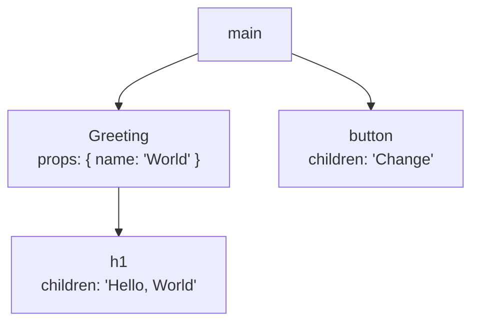
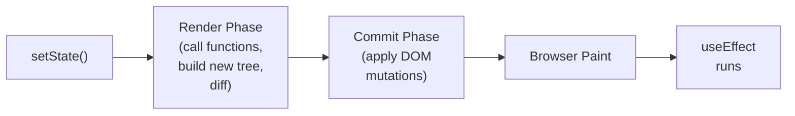
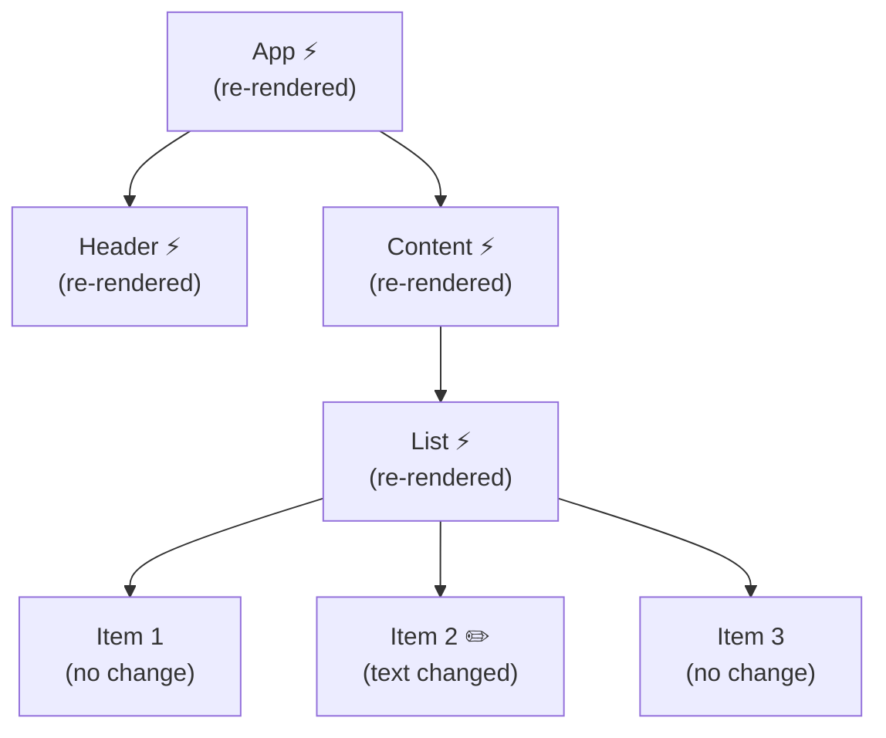

*You call it "rendering." React calls it "calling your function." The DOM update happens later — in a phase most developers don't know exists.*

---

## The Console Log That Printed Twice

Here's a scene that plays out in every React developer's career:

```jsx
function Counter() {
  const [count, setCount] = useState(0);
  console.log('rendered!', count);

  return <button onClick={() => setCount(count + 1)}>{count}</button>;
}
```

You click the button once. The console prints `rendered!` twice. You stare at it. You haven't enabled Strict Mode (or you have, and you don't know what it does). You click again — two more logs. Something feels wasteful. Surely React is doing twice the work?

The anxiety behind this question comes from a fundamental misunderstanding: the belief that "rendering" means "updating the DOM." If that were true, two renders would mean two DOM updates, and two DOM updates for one click would be a performance problem.

But that's not what rendering means in React. Not even close.

---

## JSX Is Not HTML. It's a Function Call.

Let's start at the beginning. When you write JSX:

```jsx
<button className="primary" onClick={handleClick}>
  Save
</button>
```

Your build tool (Babel, SWC, TypeScript) transforms it into a function call:

```js
jsx('button', { className: 'primary', onClick: handleClick, children: 'Save' });
```

This comes from [`react/jsx-runtime`](https://github.com/facebook/react/blob/main/packages/react/src/jsx/ReactJSXElement.js) — a module you never import explicitly but your bundler resolves automatically. The `jsx()` function doesn't create a DOM node. It creates a **React element** — a plain JavaScript object:

```js
{
  type: 'button',
  props: {
    className: 'primary',
    onClick: handleClick,
    children: 'Save',
  },
  key: null,
  ref: null,
}
```

That's it. No `document.createElement`. No `appendChild`. Just a lightweight description of what *should* exist in the DOM. A blueprint, not a building.

When your component returns JSX, it returns a tree of these objects. React collects the tree, compares it to what was there before, and decides what (if anything) needs to change.

---

## The Element Tree: A Description, Not a Reality

Your entire component tree, from the root down, produces a tree of React elements. Each render creates a *new* tree:

```jsx
function App() {
  const [name, setName] = useState('World');

  return (
    <main>
      <Greeting name={name} />
      <button onClick={() => setName('React')}>Change</button>
    </main>
  );
}

function Greeting({ name }) {
  return <h1>Hello, {name}</h1>;
}
```

After the first render, the element tree looks like this:



When you click the button, React calls `App` again. A *new* element tree is produced:


React now has two descriptions: what the UI *was* and what it *should be*. The question becomes: what's different?

---

## Two Phases, One Render

This is where most developers' mental model breaks down. "Rendering" in React is not a single operation. It's two distinct phases with very different rules:

### Phase 1: Render (the "thinking" phase)

React calls your component functions, starting from the component that triggered the update and working down through its children. Each function returns elements. React collects these into the new tree and diffs it against the previous one.

This phase is:
- **Pure** — no side effects, no DOM mutations, no writing to external state
- **Interruptible** — React can pause, discard, or restart this work (more on this in Part 7)
- **Invisible** — nothing the user can see changes during this phase

The render phase is where `beginWork` runs — the internal function that processes each component in the tree. For function components, "processing" means calling your function. For host elements (`div`, `span`), it means comparing the old and new props.

### Phase 2: Commit (the "doing" phase)

Once React has figured out what changed, it applies those changes to the DOM. This phase is:
- **Synchronous** — once started, it runs to completion without interruption
- **Side-effectful** — this is where `appendChild`, `removeChild`, `setAttribute`, and other DOM mutations happen
- **Visible** — after this phase, the browser can paint the new state

The commit phase is where [`commitRoot`](https://github.com/facebook/react/blob/main/packages/react-reconciler/src/ReactFiberCommitWork.js) runs. It walks the list of changes collected during the render phase and applies them.



The key insight: **the render phase doesn't touch the DOM**. Your component function can run ten times, and if nothing in the output changed, the commit phase has zero DOM operations to perform.

---

## What "Re-render" Actually Means

When React developers say "my component re-rendered," they mean React called their function again. That's it. The function ran. Elements were returned. React compared them to the previous elements.

If nothing meaningful changed — same element types, same props, same children — the commit phase skips those parts of the tree entirely. No DOM writes. No layout recalculation. No paint.

This is why the double `console.log` from the opening isn't the performance problem it feels like. Yes, your function ran twice. But a function call that returns a plain object is fast — microseconds, not milliseconds. The expensive work (DOM mutations, layout, paint) only happens once, during the commit phase, and only for the parts that actually changed.

Consider a component tree where the root re-renders but only one leaf has new output:



Every component with ⚡ had its function called (the render phase). But only the one with ✏️ produced different output. The commit phase touches one text node. Everything else is skipped.

---

## When React Skips Work: Bailouts

React doesn't *always* call every component in the subtree. It has several bailout mechanisms — ways to skip rendering a component entirely.

**`React.memo`** wraps a component and tells React: "Don't even call this function if the props haven't changed."

```jsx
const ExpensiveList = React.memo(({ items }) => {
  return items.map(item => <ListItem key={item.id} item={item} />);
});
```

On re-render, React checks whether `items` is the same reference as last time (using `Object.is`, just like effect deps). If it is, React skips the entire subtree — no function call, no element diffing.

This is where `useMemo` and `useCallback` earn their keep. They stabilize references so that `React.memo` can bail out:

```jsx
function App() {
  const [count, setCount] = useState(0);
  const items = useMemo(() => buildItems(data), [data]);

  return (
    <>
      <button onClick={() => setCount(c => c + 1)}>{count}</button>
      <ExpensiveList items={items} />
    </>
  );
}
```

When `count` changes, `App` re-renders. But `items` is memoized — same reference — so `ExpensiveList` bails out entirely. React never calls its function. The render phase skips that entire branch.

Without `useMemo`, `items` would be a new array on every render (even with the same contents), and `React.memo` would see a new reference and render anyway — defeating the whole point.

**Internal bailouts** also happen without `React.memo`. If a component receives the same props *and* its state hasn't changed *and* its context hasn't changed, React may skip it. But this heuristic is an implementation detail you shouldn't rely on — `React.memo` makes the contract explicit.

---

## Strict Mode: Now It Makes Sense

In [Part 2](/blog/react-internals-2-useeffect-is-not-a-lifecycle), we saw that Strict Mode double-fires effects to test cleanup symmetry. Now we can see the other half: **Strict Mode double-invokes your component function during the render phase.**

Why? Because the render phase must be pure. Your function should return the same output given the same inputs, with no side effects. Double-invoking tests that assumption — if your render function writes to a global variable, increments a counter, or logs to an analytics service, the double call makes the impurity visible.

```jsx
let renderCount = 0;

function Counter() {
  renderCount++; // Side effect in render — Strict Mode exposes this
  return <div>{renderCount}</div>;
}
```

With Strict Mode, `renderCount` increments twice per render. The displayed number jumps by two instead of one. Without Strict Mode, this bug hides until React's concurrent features kick in and discard a render — at which point your counter is wrong and you have no idea why.

This is the same principle as the effect double-fire, applied to the render phase: if running your code twice breaks things, your code has a bug that will surface in production under concurrent rendering.

---

## Putting It All Together

Let's trace a full update from click to pixels:

1. **User clicks a button.** The event handler calls `setCount(1)`.
2. **React schedules an update.** It knows the `Counter` component's state changed.
3. **Render phase begins.** React calls `Counter()`. The function returns a new element tree.
4. **React diffs.** It compares the new tree to the previous tree. The button's text child changed from `"0"` to `"1"`.
5. **Render phase ends.** React has a list of changes: "update text node from '0' to '1'."
6. **Commit phase begins.** React walks the change list and calls `textNode.nodeValue = '1'`.
7. **Commit phase ends.** The DOM is now up to date.
8. **Browser paints.** The user sees `1`.
9. **Effects flush.** Any `useEffect` callbacks with changed deps run now.

Steps 3–5 are the render phase — pure computation, no DOM. Step 6 is the commit phase — synchronous DOM mutation. Everything after is post-commit work.

The entire render phase is a function call that returns data. The commit phase is a loop that writes to the DOM. Effects are deferred cleanup. Three distinct stages, each with different rules and timing.

---

## The Mental Model, Distilled

"Rendering" is calling your function. That's the whole render phase. It produces a description — not a reality.

"Committing" is applying the diff to the DOM. It only touches what actually changed.

Most renders produce zero DOM mutations. The ones that do touch the minimum number of nodes. The whole system is designed so that the cheap work (calling functions, comparing objects) happens often, and the expensive work (DOM writes, layout, paint) happens rarely and surgically.

When your `console.log` fires twice, React isn't doing twice the work. It's doing twice the *thinking* — and thinking is free.

---

## What's Next

We've now traced the path from JSX to pixels — but we've glossed over a crucial question. The render phase "walks the tree" and "diffs elements." But what tree? React elements are recreated every render — they're ephemeral. React needs a persistent structure to track components, store hook state, and accumulate changes.

That structure is the **fiber tree** — React's internal skeleton. In **Part 4 — The Fiber Tree**, we'll see what a fiber node actually looks like, how the child/sibling/return pointers form a traversable tree, and why React rebuilt its entire architecture around this data structure.

---

*Part of the "React Internals — Under the Hood" series.*
