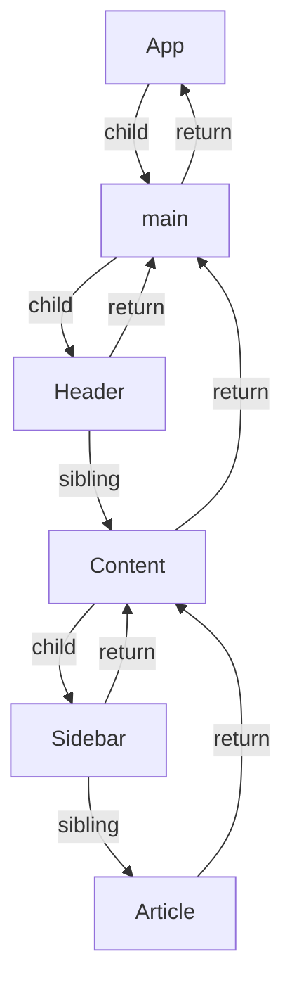
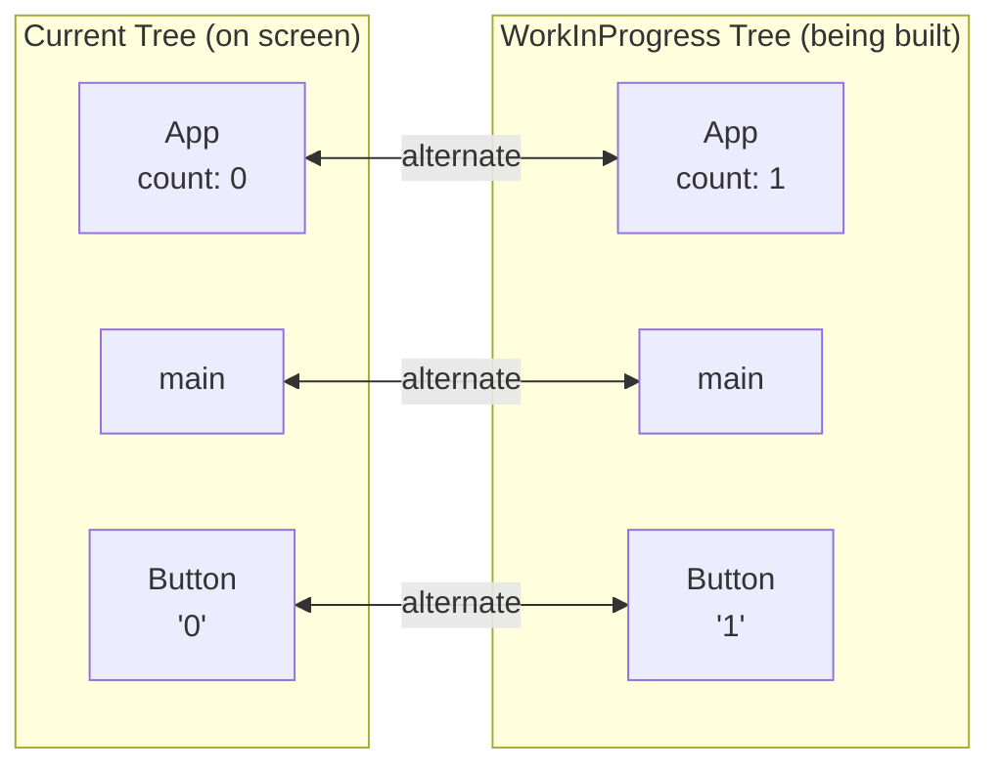
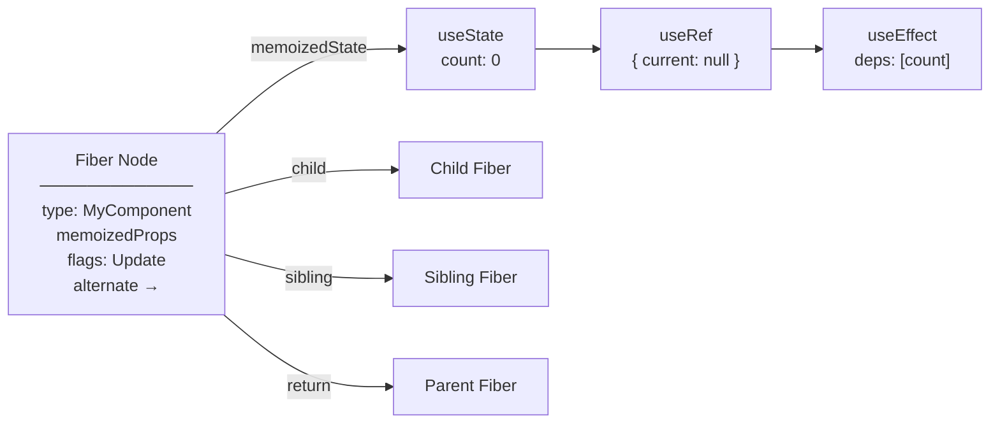

*React DevTools shows something called a "Fiber" next to every component. It's the data structure that makes everything else in React possible.*

---

## The Problem That Created Fiber

Before React 16, rendering was recursive. When you called `setState`, React would walk down from the updated component through every child, grandchild, and great-grandchild — synchronously, in one uninterruptible pass. If you had a tree of a thousand components, React would process all thousand before yielding back to the browser.

This meant a large update could block the main thread for tens of milliseconds. No user input could be processed. No animations could advance. The browser was frozen until React finished thinking.

The React team needed to solve two problems:

1. **Interruptibility** — the ability to pause rendering mid-tree, let the browser handle urgent work (input, animation), and resume later.
2. **Priority** — the ability to decide that some updates (a typed character) matter more than others (a chart re-rendering in the background).

Recursion can't do either of these things. When you're halfway through a recursive call stack, you can't pause — the state lives on the call stack, and yielding means losing it all. You also can't reorder work, because the call stack dictates the execution order.

The solution was to replace the call stack with a data structure. That data structure is the **fiber tree**.

---

## What Is a Fiber?

A fiber is a plain JavaScript object that represents a unit of work. There is one fiber for every component instance, every DOM element, and every other node in your React tree.

The [`FiberNode` constructor](https://github.com/facebook/react/blob/main/packages/react-reconciler/src/ReactFiber.js) creates objects that look like this (simplified):

```js
{
  // What this fiber represents
  tag: FunctionComponent,  // or HostComponent, HostText, etc.
  type: MyComponent,       // the function/class, or 'div', 'span'
  key: null,               // from the JSX key prop
  stateNode: null,         // for host fibers: the actual DOM node

  // Tree structure
  child: Fiber | null,     // first child
  sibling: Fiber | null,   // next sibling
  return: Fiber | null,    // parent

  // Work state
  memoizedState: ...,      // for function components: the hook linked list
  memoizedProps: ...,       // props from the last completed render
  pendingProps: ...,        // props for the current in-progress render
  flags: NoFlags,          // what kind of work this fiber needs (Placement, Update, Deletion)
  lanes: NoLanes,          // priority of pending work

  // Double buffering
  alternate: Fiber | null, // the other version of this fiber
}
```

If you've read [Part 1](/blog/react-internals-1-how-hooks-work), you already know `memoizedState` — it's where the hooks linked list lives. Now you can see the full picture: every hook call writes to a node in a linked list, and that list hangs off a fiber. The fiber is the persistent identity of your component across renders.

---

## The Tree That Isn't a Tree

A typical component tree looks like this:

```jsx
function App() {
  return (
    <main>
      <Header />
      <Content>
        <Sidebar />
        <Article />
      </Content>
    </main>
  );
}
```

You'd expect the fiber tree to mirror this — a parent with children branching out. But fibers don't form a traditional tree with arrays of children. They use three pointers:

- **`child`** — points to the *first* child
- **`sibling`** — points to the *next* sibling
- **`return`** — points to the *parent*



Children are linked as a singly-linked list: `main.child → Header`, `Header.sibling → Content`. To get from a parent to its second child, React goes through the first child, then follows siblings.

This structure has a crucial property: it can be traversed iteratively with a simple loop. No recursion, no call stack, no state to lose if you pause.

---

## Walking the Tree: The Work Loop

The render phase is driven by a function called `performUnitOfWork`. It processes one fiber at a time in a predictable pattern:

1. **Go down.** Process the current fiber (`beginWork`). If it has a child, move to the child.
2. **Go sideways.** If there's no child (or the children are done), complete the current fiber (`completeWork`). If there's a sibling, move to the sibling and start step 1 again.
3. **Go up.** If there's no sibling, go back to the parent (`return`) and complete it. Repeat until you reach the root.

```js
// Simplified from the React reconciler
function workLoop() {
  while (workInProgress !== null) {
    performUnitOfWork(workInProgress);
  }
}

function performUnitOfWork(fiber) {
  const next = beginWork(fiber);  // process this fiber, return its child

  if (next !== null) {
    workInProgress = next;        // has a child — go deeper
  } else {
    completeUnitOfWork(fiber);    // no child — complete and move sideways/up
  }
}
```

For the tree above, the traversal order is:

```text
beginWork(App) → beginWork(main) → beginWork(Header) →
completeWork(Header) → beginWork(Content) → beginWork(Sidebar) →
completeWork(Sidebar) → beginWork(Article) → completeWork(Article) →
completeWork(Content) → completeWork(main) → completeWork(App)
```

Every fiber gets a `beginWork` (entering) and a `completeWork` (leaving). The whole tree is processed in a single flat loop — no recursion.

And here's the payoff: because the current position is stored in the `workInProgress` variable (not on the call stack), React can stop the loop at *any* fiber, yield to the browser, and later resume exactly where it left off. The fiber tree is its own bookmark.

---

## beginWork and completeWork

These two functions are where the actual work happens.

**`beginWork`** looks at a fiber and decides what to do with it:

- **Function component?** Call the function. Reconcile the returned elements against the fiber's existing children (creating, updating, or marking fibers for deletion).
- **Host component (`div`, `span`)?** Compare old and new props. Reconcile children.
- **Nothing changed?** Bail out — skip this entire subtree.

This is where your component function gets called. It's also where [Part 3's](/blog/react-internals-3-jsx-to-pixels) "render phase" lives — `beginWork` *is* the render phase, one fiber at a time.

**`completeWork`** runs when a fiber and all its children are done. It:

- Creates or updates the actual DOM node for host fibers
- Bubbles flags up — if a child needs a DOM update, the parent's flags are marked too, so the commit phase knows to walk into this subtree
- Builds the effect list used by the commit phase

The separation is clean: `beginWork` goes top-down (processing components), `completeWork` goes bottom-up (preparing DOM nodes and collecting effects).

---

## Two Trees: Current and WorkInProgress

React doesn't modify fibers in place during rendering. Instead, it maintains **two versions** of the tree:

- **`current`** — the tree that's currently displayed on screen. The committed state.
- **`workInProgress`** — the tree being built during the current render. A draft.

Each fiber has an `alternate` pointer to its counterpart in the other tree:



When you call `setState`, React creates (or reuses) the `workInProgress` tree by cloning fibers from `current` via [`createWorkInProgress`](https://github.com/facebook/react/blob/main/packages/react-reconciler/src/ReactFiber.js). It then processes the cloned fibers — calling component functions, updating `memoizedState` and `memoizedProps`, and marking `flags` for any DOM mutations needed.

When the render phase finishes and the commit phase applies all DOM changes, React swaps: the `workInProgress` tree *becomes* the new `current` tree. The old `current` becomes the next render's `workInProgress` (it gets reused, not discarded).

This is **double buffering** — the same technique used in game rendering and video playback. You build the next frame offscreen, then swap it in all at once. The user never sees a half-built state.

---

## Fiber Tags: What Kind of Work?

Not all fibers represent components. The `tag` field tells React what a fiber is:

| Tag | What it represents |
|---|---|
| `FunctionComponent` | A function component (`function App()`) |
| `ClassComponent` | A class component (`class App extends React.Component`) |
| `HostComponent` | A DOM element (`div`, `span`, `button`) |
| `HostText` | A text node (`"Hello"`) |
| `Fragment` | A `<React.Fragment>` or `<>` |
| `ContextProvider` | A context `<Provider>` |
| `SuspenseComponent` | A `<Suspense>` boundary |
| `OffscreenComponent` | Used by Suspense and concurrent features |

Only `HostComponent` and `HostText` fibers have a `stateNode` pointing to an actual DOM node. Component fibers (`FunctionComponent`, `ClassComponent`) have no DOM node — they're organizational. This is why the "virtual DOM is a copy of the real DOM" analogy breaks down: most fibers in your tree don't correspond to DOM nodes at all.

---

## Flags: Marking Work for the Commit Phase

During the render phase, `beginWork` and `completeWork` mark fibers with **flags** that tell the commit phase what to do:

```js
fiber.flags |= Placement;  // this fiber needs to be inserted into the DOM
fiber.flags |= Update;     // this fiber's DOM node needs its attributes updated
fiber.flags |= ChildDeletion; // a child of this fiber was removed
```

The commit phase walks the tree and acts on these flags:

- `Placement` → `parentNode.appendChild(fiber.stateNode)` or `insertBefore`
- `Update` → `node.setAttribute(...)`, update `textContent`, etc.
- `ChildDeletion` → `parentNode.removeChild(...)`, run cleanup effects, call unmount

Flags bubble up through `completeWork` — if a deeply nested fiber has a `Placement` flag, every ancestor gets a `Subtree` flag so the commit phase knows to walk into that branch. Subtrees with no flags are skipped entirely.

---

## The Full Picture

Here's how everything connects across the series so far:



The fiber is the hub. Hooks live on it (Part 1). Effects synchronize from it (Part 2). The render phase calls functions through it (Part 3). The tree structure lets React traverse iteratively, pause anywhere, and resume later.

Everything you've learned in the series so far has been building toward this structure. And everything that follows — reconciliation, state updates, concurrent rendering — is operations *on* this structure.

---

## The Mental Model, Distilled

A fiber is a unit of work. The fiber tree is a to-do list that React can walk, pause, resume, and reprioritize.

It's not a copy of the DOM. It's not a virtual DOM (though that term has stuck). It's a persistent data structure that tracks what your components are, what state they hold, and what work they need done — organized so that React can process it one piece at a time, without ever holding the main thread hostage.

---

## What's Next

We've seen the tree. We know how React walks it. But what happens when `beginWork` finds that a component's children have changed — when elements were added, removed, or reordered?

That's **reconciliation** — React's diffing algorithm. In **Part 5 — Reconciliation**, we'll see how React decides which fibers to create, update, or delete, why keys exist (and what happens when you get them wrong), and why the algorithm is O(n) instead of O(n³).

---

*Part of the "React Internals — Under the Hood" series.*
