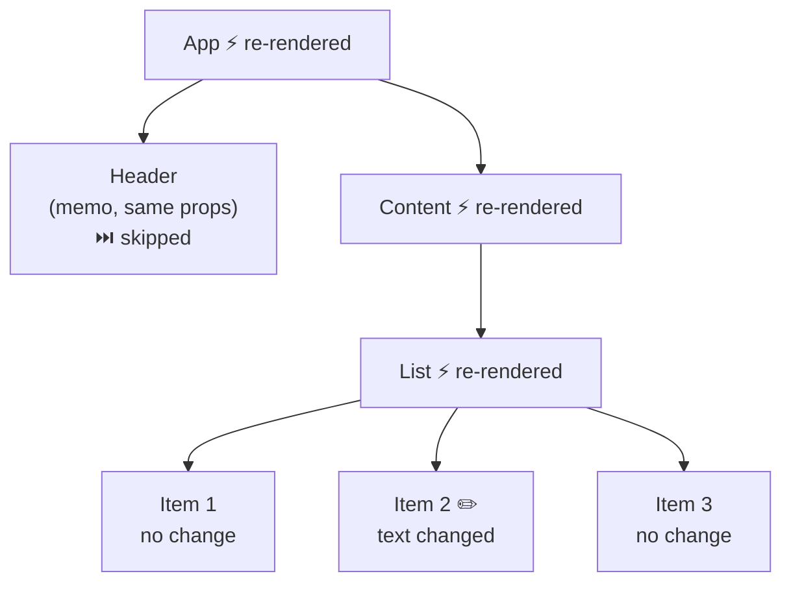

*You were told to always use unique keys. But why? The answer lives inside React's diffing algorithm — and it's simpler than you think.*

---

## The Scrambled Inputs

Here's a bug that has confused every React developer at least once:

```jsx
function TodoList({ todos }) {
  return (
    <ul>
      {todos.map((todo, index) => (
        <li key={index}>
          <input defaultValue={todo.text} />
        </li>
      ))}
    </ul>
  );
}
```

You render three todos. You type into the second input. You delete the first todo. Suddenly the second input shows what you typed — but it's now attached to the wrong todo. The text "moved up" but the input didn't.

This isn't a rendering bug. React did exactly what you told it to. You said `key={index}`, and React believed you. When the first item was removed, what was index `1` became index `0`, and React thought: "same key, same component — just update the props."

To understand why this happens, we need to see what React actually does when it compares old children to new children.

---

## The Problem: Comparing Trees Is Expensive

Given two arbitrary trees, the theoretical minimum algorithm to find the optimal set of transformations is O(n³). For a tree with 1,000 nodes, that's a billion operations. Per render. Obviously unacceptable.

React solves this with two heuristics that reduce the problem to O(n):

1. **Different types produce different trees.** If an element changes from `<div>` to `<span>`, or from `<Header>` to `<Footer>`, React doesn't try to diff the children. It tears down the old subtree entirely and builds a new one.

2. **Keys identify siblings across renders.** When React sees a list of children, it uses `key` props to match old children to new children. Same key = same element, possibly moved. Missing key = removed. New key = inserted.

These heuristics mean React never compares elements across different levels of the tree, and never tries to "match" elements of different types. It trades theoretical optimality for practical speed.

---

## Single-Child Reconciliation

The simplest case: a component returns one element.

```jsx
// Render 1
<div className="old">Hello</div>

// Render 2
<div className="new">Hello</div>
```

React compares the type (`div` === `div`) and sees it's the same. It keeps the existing fiber and DOM node, and updates only the changed prop (`className`). This is an `Update` flag.

```jsx
// Render 1
<div>Hello</div>

// Render 2
<span>Hello</span>
```

Different type (`div` → `span`). React doesn't try to reuse anything. It marks the old fiber for `Deletion`, creates a new fiber for the `<span>`, and marks it for `Placement`. The entire old subtree — including all its state, effects, and children — is destroyed.

This is the logic inside [`reconcileSingleElement`](https://github.com/facebook/react/blob/main/packages/react-reconciler/src/ReactChildFiber.js):

```js
// Simplified from reconcileSingleElement in ReactChildFiber.js
function reconcileSingleElement(current, element) {
  if (current !== null) {
    if (current.type === element.type && current.key === element.key) {
      // Same type and key — reuse the fiber, update props
      return updateExistingFiber(current, element);
    }
    // Different type or key — delete old, create new
    markForDeletion(current);
  }
  return createNewFiber(element);
}
```

This is why wrapping a component in a new HOC during render causes a remount:

```jsx
function App() {
  // New wrapper type on every render — React sees a different type each time
  const Wrapped = withLogger(MyComponent);
  return <Wrapped />;
}
```

`Wrapped` is a new function reference every render. React sees a new type, tears down the old `MyComponent` (losing all state), and mounts a fresh one. The fix: define `Wrapped` outside the component.

---

## List Reconciliation: Where Keys Come In

Single elements are straightforward. Lists are where things get interesting. When a component returns multiple children, React needs to match old children to new children — and it uses keys to do it.

The algorithm lives in [`reconcileChildrenArray`](https://github.com/facebook/react/blob/main/packages/react-reconciler/src/ReactChildFiber.js) and works in two passes:

### First Pass: Linear Scan

React walks both the old and new lists simultaneously, index by index:

```js
// Simplified from reconcileChildrenArray
for (let i = 0; i < newChildren.length; i++) {
  const oldFiber = oldFibers[i];
  const newChild = newChildren[i];

  if (oldFiber.key !== newChild.key) {
    break; // Keys diverged — stop linear scan
  }

  // Same key — update in place
  updateFiber(oldFiber, newChild);
}
```

This handles the common case: the list is the same, maybe with an item appended at the end. The linear scan is fast — O(n) with minimal overhead.

### Second Pass: Keyed Map

If the linear scan breaks early (keys diverged), React builds a Map from the remaining old children, keyed by their `key` prop:

```js
// Build a map of old fibers by key
const existingChildren = new Map();
for (const oldFiber of remainingOldFibers) {
  existingChildren.set(oldFiber.key, oldFiber);
}

// Walk remaining new children, look up by key
for (const newChild of remainingNewChildren) {
  const existing = existingChildren.get(newChild.key);
  if (existing) {
    updateFiber(existing, newChild);   // Reuse — mark for move if needed
    existingChildren.delete(newChild.key);
  } else {
    createNewFiber(newChild);          // New key — Placement
  }
}

// Anything left in the map was removed
for (const leftover of existingChildren.values()) {
  markForDeletion(leftover);           // ChildDeletion
}
```

The Map lookup is O(1) per child, making the whole algorithm O(n).

---

## What Keys Actually Do

Now the opening example makes sense. When you use `key={index}`:

```text
Before delete:        After delete:
  key=0 → "Buy milk"    key=0 → "Walk dog"    (was key=1)
  key=1 → "Walk dog"    key=1 → "Read book"   (was key=2)
  key=2 → "Read book"
```

React sees key `0` in both lists and thinks it's the same element. It updates the props (the todo text changes), but the `<input>` DOM node stays — with whatever the user typed into it. The input didn't "move up." It stayed put, and the data moved around it.

With stable keys (`key={todo.id}`):

```text
Before delete:           After delete:
  key="a" → "Buy milk"     key="b" → "Walk dog"
  key="b" → "Walk dog"     key="c" → "Read book"
  key="c" → "Read book"
```

React looks for key `"a"` in the new list — it's gone. `Deletion`. Key `"b"` exists in both — `Update` (and possibly a `Placement` to reorder). Key `"c"` exists in both — `Update`. The correct DOM nodes move with their data.

**Keys are not a performance optimization.** They are identity. They tell React which element is which across renders. Get them wrong and React reuses the wrong nodes. Get them right and everything — state, DOM, effects — follows the data.

---

## The key Prop as a Reset Mechanism

Since changing a key tells React "this is a different element," you can use it deliberately to force a full remount:

```jsx
function ChatRoom({ roomId }) {
  // Every time roomId changes, this component remounts from scratch
  return <MessageList key={roomId} roomId={roomId} />;
}
```

When `roomId` changes from `"general"` to `"random"`, React sees a different key. It unmounts the old `MessageList` (running all cleanup effects, destroying all state) and mounts a fresh one. This is cleaner than trying to reset state manually with `useEffect`.

This pattern works because of how reconciliation handles keys — it's not a special API, it's just a consequence of the diffing algorithm.

---

## Effect Flags: Reconciliation's Output

Reconciliation doesn't modify the DOM. It marks fibers with **flags** that tell the commit phase what to do. We saw these briefly in [Part 4](/blog/react-internals-4-fiber-tree); here's how they're produced:

| Situation | Flag | Commit phase action |
| --- | --- | --- |
| New element, no matching old fiber | `Placement` | `appendChild` or `insertBefore` |
| Same type and key, props changed | `Update` | `setAttribute`, update text, etc. |
| Old fiber has no matching new element | `ChildDeletion` | `removeChild`, run cleanup effects |
| Existing element moved position | `Placement` | `insertBefore` to reorder |

Multiple flags can be combined on a single fiber. A moved element with updated props gets both `Placement` and `Update`.

These flags bubble up through `completeWork` — if any descendant has work to do, ancestors get a `Subtree` flag. The commit phase uses this to skip entire branches that have no changes. A tree of 10,000 fibers where only one leaf changed? The commit phase walks straight to it.

---

## The Commit Phase: Applying the Diff

After the render phase has walked the entire tree and marked all the flags, the commit phase runs. This happens in [`commitRoot`](https://github.com/facebook/react/blob/main/packages/react-reconciler/src/ReactFiberCommitWork.js), and it's divided into three sub-phases:

### 1. Before Mutation

Reads from the DOM before anything changes. This is where `getSnapshotBeforeUpdate` runs (class components) and where React captures scroll positions.

### 2. Mutation

The actual DOM changes happen here. React walks the fiber tree and acts on flags:

- `Placement` → insert the node into the DOM
- `Update` → modify attributes, text content, styles
- `ChildDeletion` → remove nodes, call `componentWillUnmount` / cleanup effects

This is synchronous. Once it starts, it runs to completion — no yielding, no interruption. The DOM is in an inconsistent state during this phase, so it must finish before the browser can paint.

### 3. Layout

Runs after the DOM has been mutated but before the browser paints. This is where `useLayoutEffect` callbacks fire, and where React updates refs (`ref.current = node`). It's the last chance to read or adjust the DOM before the user sees it.

After the layout phase, the `workInProgress` tree becomes the new `current` tree (the swap from [Part 4](/blog/react-internals-4-fiber-tree)), the browser paints, and then `useEffect` callbacks run.

---

## What React Doesn't Diff

A common misconception: "React diffs the entire virtual DOM on every render." It doesn't. React only reconciles children of components that actually re-rendered. If a parent re-renders but a child bails out (via `React.memo` or unchanged props/state), that child's entire subtree is skipped — no diffing, no flag marking, nothing.

This is why `React.memo` works: it prevents `beginWork` from being called on the child, which means reconciliation never runs for that subtree. The optimization isn't about making diffing faster — it's about not diffing at all.



Only the ⚡ components have their children reconciled. `Header` and its entire subtree? Invisible to the diffing algorithm.

---

## The Mental Model, Distilled

Reconciliation is pattern matching. Given old children and new children, React matches them by type and key, then marks the differences as flags for the commit phase.

Two heuristics make it fast: different types mean different trees (no cross-type diffing), and keys identify siblings (no cross-level matching). The result is an O(n) algorithm that handles real-world UI updates in microseconds.

Keys aren't hints. They're identity. Change a key and you change the identity — React treats it as a different element entirely. Use this deliberately (the `key` reset pattern) or get bitten by it (index keys on reorderable lists).

And the most important thing: reconciliation is lazy. React only diffs what re-rendered. The more subtrees you skip with `React.memo` and stable references, the less work reconciliation has to do. The fastest diff is the one that never runs.

---

## What's Next

We've seen how React decides what changed. But we've been assuming that when you call `setState`, React immediately re-renders. It doesn't. It *enqueues* an update — and sometimes batches multiple updates into a single render.

How does React decide when to process updates? Why did `setState` in a `setTimeout` behave differently before React 18? And what are "lanes"?

That's **Part 6 — State Updates, Batching, and the Lane Model**, where we'll trace the journey from `setState` call to scheduled render, and discover the priority system that powers concurrent React.

---

*Part of the "React Internals — Under the Hood" series.*
