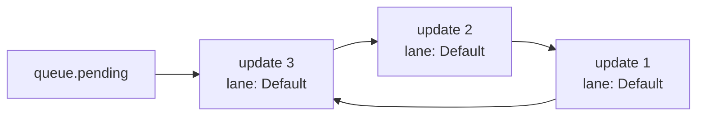
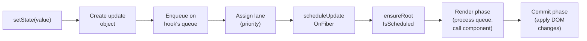

*`setState` doesn't set state. It enqueues an update. What happens between that call and the re-render is one of the most misunderstood parts of React.*

---

## Three Calls, One Render

Here's something that puzzles developers new to React internals:

```jsx
function Counter() {
  const [count, setCount] = useState(0);

  function handleClick() {
    setCount(1);
    setCount(2);
    setCount(3);
    console.log(count); // still 0
  }

  return <button onClick={handleClick}>{count}</button>;
}
```

You call `setCount` three times. The component re-renders once. The `console.log` after the three calls still prints `0`.

If `setState` actually *set* state, you'd expect `count` to be `3` by the time the log runs, and you'd expect three re-renders. Neither happens. Something else is going on.

Before React 18, this got even weirder. Move the same three calls into a `setTimeout`:

```jsx
function handleClick() {
  setTimeout(() => {
    setCount(1); // render!
    setCount(2); // render!
    setCount(3); // render!
  }, 0);
}
```

In React 17, this triggered *three separate renders*. In React 18, it triggers one. Same code, different behavior across versions. What changed?

To answer both questions, we need to trace what `setState` actually does.

---

## What Happens When You Call setState

When you call `setCount(3)`, React doesn't update `count`. It creates an **update object** and enqueues it on the fiber's update queue:

```js
// Simplified from dispatchSetState in ReactFiberHooks.js
function dispatchSetState(fiber, queue, action) {
  const update = {
    action,       // the value or updater function you passed
    next: null,   // pointer to next update in the queue
    lane: requestUpdateLane(),  // priority — we'll get to this
  };

  enqueueUpdate(queue, update);
  scheduleUpdateOnFiber(fiber);
}
```

Three things happen:

1. **An update object is created** with your value (`3`) and a priority lane.
2. **The update is enqueued** on the hook's queue — the same `queue` property from the hook node we saw in [Part 1](/blog/react-internals-1-how-hooks-work).
3. **A re-render is scheduled** — not executed immediately, just scheduled.

The queue is a circular linked list. Multiple `setState` calls in the same event handler each append an update to this list. They don't trigger multiple renders because the render hasn't been scheduled yet — or, more precisely, React knows it already scheduled one and doesn't need to schedule another.

---

## Update Queues: A Circular Linked List

Each `useState` hook has a `queue` object with a `pending` pointer. Updates form a circular linked list hanging off `pending`:



The circularity is a performance trick: `queue.pending` always points to the *last* enqueued update, and `pending.next` points to the *first*. This lets React append in O(1) and iterate from first to last without maintaining two pointers.

When React finally renders the component, it walks this queue in [`processUpdateQueue`](https://github.com/facebook/react/blob/main/packages/react-reconciler/src/ReactFiberHooks.js):

```js
// Simplified from processUpdateQueue
function processUpdateQueue(queue, initialState) {
  let state = initialState;
  let update = queue.pending.next; // start from the first update

  do {
    state = typeof update.action === 'function'
      ? update.action(state)   // functional updater: setCount(c => c + 1)
      : update.action;          // direct value: setCount(3)
    update = update.next;
  } while (update !== queue.pending.next); // circular — stop when we loop

  queue.pending = null; // clear the queue
  return state;
}
```

This is why three calls to `setCount` produce one render: all three updates are collected in the queue, then processed together in a single pass. The final state is `3` — the last direct value wins. If you'd used functional updaters (`setCount(c => c + 1)` three times), you'd get `3` as well, but through incremental application.

---

## Batching: React 17 vs React 18

In React 17, batching only happened inside React event handlers. Any `setState` inside a `setTimeout`, `Promise.then`, or native event listener was processed immediately — each call triggered its own render.

React 18 introduced **automatic batching**. All `setState` calls are batched, regardless of where they happen:

```jsx
// React 18: one render in all cases
button.addEventListener('click', () => {
  setCount(1);
  setFlag(true);
  // → one render
});

setTimeout(() => {
  setCount(1);
  setFlag(true);
  // → one render (was two renders in React 17!)
}, 0);

fetch('/api').then(() => {
  setCount(1);
  setFlag(true);
  // → one render
});
```

How? React 18 wraps all work inside a microtask boundary. When you call `setState`, React schedules the render via `ensureRootIsScheduled`, which uses a microtask (via `queueMicrotask` or `MessageChannel`). All `setState` calls in the same synchronous execution context finish before the microtask fires, so they're all collected before the render begins.

This is why `console.log(count)` still prints the old value — the render hasn't happened yet. The state update is enqueued, not applied.

---

## flushSync: The Escape Hatch

Sometimes you *need* a synchronous update — for example, to read the DOM immediately after a state change:

```jsx
import { flushSync } from 'react-dom';

function handleClick() {
  flushSync(() => {
    setCount(1);
  });
  // DOM is updated here — count is 1
  console.log(inputRef.current.value); // reads the updated DOM

  flushSync(() => {
    setFlag(true);
  });
  // DOM is updated again — flag is true
}
```

`flushSync` forces React to process the enclosed updates synchronously — schedule, render, and commit before returning. It opts out of batching for that specific update.

Use it sparingly. It forces a synchronous render, which blocks the main thread. But for cases where you need the DOM to reflect a state change before the next line of code runs, it's the correct tool.

---

## The Lane Model: Priority for Updates

Not all updates are equally urgent. A user typing into an input should feel instant. A chart re-rendering with new data can wait a frame or two. React needs a way to express this difference.

Before React 18, priorities were expressed as **expiration times** — each update had a timestamp, and React processed whatever was "due." This worked but was rigid: you couldn't easily merge, split, or reorder priorities.

React 18 replaced expiration times with **lanes** — a system based on bitmasks. Each lane is a single bit in a 31-bit integer, defined in [`ReactFiberLane.js`](https://github.com/facebook/react/blob/main/packages/react-reconciler/src/ReactFiberLane.js):

```js
// Simplified from ReactFiberLane.js
const SyncLane       = 0b0000000000000000000000000000010;
const InputContinuousLane = 0b0000000000000000000000000001000;
const DefaultLane    = 0b0000000000000000000000000100000;
const TransitionLane1 = 0b0000000000000000000001000000000;
const TransitionLane2 = 0b0000000000000000000010000000000;
// ... more transition lanes
const IdleLane       = 0b0100000000000000000000000000000;
```

Why bitmasks? Because you can combine lanes with bitwise OR, check membership with bitwise AND, and merge or split priority sets in O(1). A fiber's `lanes` field is just a number where each set bit represents a pending update at that priority.

---

## Which Lane Gets Assigned?

When you call `setState`, React assigns a lane based on context:

| Context | Lane | Priority |
| --- | --- | --- |
| `flushSync` callback | `SyncLane` | Highest — synchronous |
| Click, keydown event handler | `SyncLane` | Highest |
| Continuous input (mousemove, scroll) | `InputContinuousLane` | High |
| Normal update (default) | `DefaultLane` | Normal |
| Inside `startTransition` | `TransitionLane` | Low — interruptible |
| Offscreen / idle work | `IdleLane` | Lowest |

The function `requestUpdateLane()` reads the current execution context to determine which lane to assign. Inside a `startTransition` callback, it returns a transition lane. Inside a click handler, it returns `SyncLane`.

---

## How startTransition Works

`startTransition` is deceptively simple:

```js
// Simplified from ReactFiberHooks.js
function startTransition(callback) {
  const prevTransition = currentTransition;
  currentTransition = {};  // signal: "we're in a transition"

  callback();              // setState calls inside get TransitionLane

  currentTransition = prevTransition;
}
```

It sets a global flag. While that flag is set, any `setState` call inside the callback gets assigned a `TransitionLane` instead of the default lane. That's it.

The magic happens later, during scheduling. When React processes the fiber tree, it looks at which lanes have pending work:

```jsx
function SearchResults({ query }) {
  const [input, setInput] = useState('');
  const [results, setResults] = useState([]);

  function handleChange(e) {
    setInput(e.target.value);                    // SyncLane — urgent
    startTransition(() => {
      setResults(filterResults(e.target.value)); // TransitionLane — can wait
    });
  }

  return (
    <>
      <input value={input} onChange={handleChange} />
      <ResultsList results={results} />
    </>
  );
}
```

When the user types, two updates are enqueued on different lanes. React processes the `SyncLane` update first (the input stays responsive), and schedules the `TransitionLane` update for later. If the user types again before the transition finishes, React *interrupts* the transition render and restarts it with the newer value. The user never sees stale results, and the input never freezes.

---

## How React Decides What to Render

After updates are enqueued, [`ensureRootIsScheduled`](https://github.com/facebook/react/blob/main/packages/react-reconciler/src/ReactFiberRootScheduler.js) decides when to render:

```js
// Simplified from ensureRootIsScheduled
function ensureRootIsScheduled(root) {
  const nextLanes = getNextLanes(root);

  if (nextLanes === NoLanes) return; // nothing to do

  if (includesSyncLane(nextLanes)) {
    // Sync work — schedule on the microtask queue
    scheduleMicrotask(performSyncWorkOnRoot);
  } else {
    // Async work — schedule via the Scheduler with a priority
    const priority = lanesToSchedulerPriority(nextLanes);
    scheduleCallback(priority, performConcurrentWorkOnRoot);
  }
}
```

`getNextLanes` looks at all pending lanes on the root fiber and picks the highest-priority batch. Sync lanes are processed on the microtask queue (before the browser yields). Transition and default lanes are processed through the scheduler, which can yield to the browser between work units — the interruptible render from [Part 4](/blog/react-internals-4-fiber-tree).

During the render, React only processes fibers whose `lanes` overlap with the lanes being rendered. A fiber with only a `TransitionLane` update is skipped during a `SyncLane` render. This is how React keeps urgent updates fast — it doesn't waste time on lower-priority work.

---

## The Mental Model, Distilled

`setState` is synchronous — it enqueues an update in the same call. The *render* is deferred — it happens later, after all pending updates for the current batch are collected.

Batching groups multiple `setState` calls into one render. In React 18, this works everywhere, not just in event handlers.

Lanes assign priority to updates. Urgent work (`SyncLane`) runs first. Transitions (`TransitionLane`) can wait and be interrupted. The bitmask system lets React reason about priorities with simple bitwise operations.

The full journey:



The whole system is designed so that *enqueueing* is always fast (O(1), synchronous), and *processing* can be deferred, batched, and prioritized.

---

## What's Next

We've now traced an update from `setState` through the lane model and into the render phase. But we've been hinting at something throughout the series: React can *interrupt* a render. It can *yield* to the browser. It can *restart* a lower-priority render when a higher-priority update arrives.

How? React is single-threaded. It can't actually do two things at once. Yet `startTransition` keeps inputs responsive while rendering expensive lists.

That's **Part 7 — Concurrent React**, the final article in the series. We'll see how the scheduler cooperatively yields to the browser, how Suspense pauses rendering by throwing a promise, and how everything we've covered — fibers, lanes, the interruptible work loop — comes together to make React feel concurrent on a single thread.

---

*Part of the "React Internals — Under the Hood" series.*
