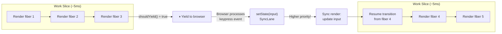
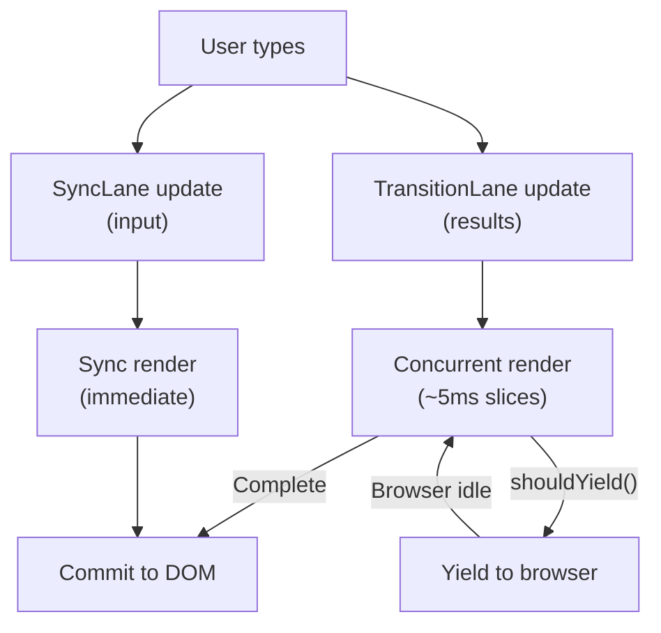

*React is single-threaded. Yet `startTransition` keeps your input responsive while rendering an expensive list. Here's how — and why it's not multithreading.*

---

## The Impossible Demo

Here's a demo that shouldn't work:

```jsx
function App() {
  const [input, setInput] = useState('');
  const [results, setResults] = useState([]);

  function handleChange(e) {
    setInput(e.target.value);
    startTransition(() => {
      setResults(heavyFilter(allItems, e.target.value));
    });
  }

  return (
    <>
      <input value={input} onChange={handleChange} />
      <ResultsList results={results} />
    </>
  );
}
```

`heavyFilter` takes 200ms. Without `startTransition`, every keystroke freezes the input for 200ms while React renders the new list. With it, the input stays perfectly responsive — you can type as fast as you want, and the list updates when React finds time.

But JavaScript is single-threaded. React can't render the list in the background while handling input events. There is no background. There's one thread, one call stack, one event loop.

So how?

The answer has been building across the entire series. The fiber tree ([Part 4](/blog/react-internals-4-fiber-tree)) made rendering interruptible. The lane model ([Part 6](/blog/react-internals-6-state-updates-and-lanes)) made updates prioritizable. Now the scheduler ties them together — React voluntarily pauses its own work to let the browser breathe, then picks up exactly where it left off.

---

## The Scheduler: Cooperative Yielding

React ships its own task scheduler — a standalone package called [`scheduler`](https://github.com/facebook/react/tree/main/packages/scheduler). It's independent of React's rendering logic and could theoretically be used by any framework. Its job is simple: run callbacks, but yield to the browser periodically so the main thread stays responsive.

The core API:

```js
// Simplified from Scheduler.js
function scheduleCallback(priorityLevel, callback) {
  const task = {
    callback,
    priorityLevel,
    expirationTime: currentTime + timeoutForPriority(priorityLevel),
  };
  push(taskQueue, task); // min-heap sorted by expiration
  requestHostCallback(flushWork);
}
```

Tasks go into a min-heap sorted by expiration time. When the browser is idle, the scheduler pops tasks off the heap and runs them. But — and this is the key — it checks between tasks whether it should yield.

### The MessageChannel Trick

How does the scheduler "yield to the browser"? It can't use `setTimeout(fn, 0)` — browsers clamp that to a minimum of 4ms, wasting precious time. It can't use `requestAnimationFrame` — that's tied to the display refresh rate and fires before paint, not after.

Instead, the scheduler uses a [`MessageChannel`](https://github.com/facebook/react/blob/main/packages/scheduler/src/forks/Scheduler.js):

```js
const channel = new MessageChannel();
const port = channel.port2;

channel.port1.onmessage = flushWork;

function requestHostCallback() {
  port.postMessage(null); // schedules flushWork as a macrotask
}
```

`postMessage` schedules a macrotask with near-zero delay. This lets the browser process any pending input events, run microtasks, paint, and *then* come back to React's work. It's the fastest way to yield without wasting time.

---

## The Work Loop: shouldYield

In [Part 4](/blog/react-internals-4-fiber-tree), we saw the work loop that processes fibers one at a time. In concurrent mode, that loop has a crucial addition:

```js
// Simplified from renderRootConcurrent
function workLoopConcurrent() {
  while (workInProgress !== null && !shouldYield()) {
    performUnitOfWork(workInProgress);
  }
}
```

Compare this to the synchronous version:

```js
// Simplified from renderRootSync
function workLoopSync() {
  while (workInProgress !== null) {
    performUnitOfWork(workInProgress);
  }
}
```

The only difference: `&& !shouldYield()`. That single check is what makes concurrent React possible.

[`shouldYieldToHost`](https://github.com/facebook/react/blob/main/packages/scheduler/src/forks/Scheduler.js) checks how much time has elapsed since React started its current work slice:

```js
// Simplified from Scheduler.js
const frameYieldMs = 5; // yield after 5ms

function shouldYieldToHost() {
  const elapsed = getCurrentTime() - startTime;
  return elapsed >= frameYieldMs;
}
```

Every ~5ms, React checks: "Have I been hogging the main thread?" If yes, it stops the work loop, lets the browser handle any pending events and paint, and resumes later via the MessageChannel.

Because the fiber tree stores the current position in `workInProgress` (not on the call stack), React can stop at *any* fiber and resume from exactly that point. The tree is its own bookmark — this was the entire purpose of the Fiber architecture.

---

## Time Slicing in Action

Here's what happens when you type while a transition is rendering:



1. React starts rendering the transition (low-priority).
2. After ~5ms, `shouldYield()` returns true. React pauses.
3. The browser processes the queued keypress event.
4. The event handler calls `setInput()`, creating a `SyncLane` update.
5. React processes the sync update immediately — the input is updated.
6. React resumes the transition render from where it left off.

The user sees the input update instantly. The list renders in the background, spread across multiple 5ms slices. If the user types again before the transition finishes, React *discards* the in-progress transition render and starts a new one with the latest value — no wasted work reaches the DOM.

---

## Interruption and Restart

This is a critical point: when a higher-priority update arrives during a lower-priority render, React doesn't try to merge the results. It **discards the in-progress workInProgress tree** and starts a new render that includes both the high-priority and low-priority updates.

```js
// Simplified from performConcurrentWorkOnRoot
function performConcurrentWorkOnRoot(root) {
  const lanes = getNextLanes(root);

  // Did higher-priority work arrive while we were rendering?
  if (lanes !== workInProgressRootRenderLanes) {
    // Yes — discard current work, start fresh with new lanes
    prepareFreshStack(root, lanes);
  }

  renderRootConcurrent(root, lanes);

  if (workInProgress === null) {
    // Render complete — commit
    commitRoot(root);
  } else {
    // Interrupted — schedule continuation
    scheduleCallback(priority, performConcurrentWorkOnRoot);
  }
}
```

This is safe because the render phase is pure — it has no side effects. Discarding an incomplete render wastes some CPU time but never produces visible artifacts. The DOM is only touched in the commit phase, which runs synchronously after a complete render.

---

## Suspense: Pausing a Render by Throwing a Promise

Suspense looks like a simple component:

```jsx
<Suspense fallback={<Spinner />}>
  <Comments />
</Suspense>
```

But its internal mechanism is unlike anything else in React. When a component inside a Suspense boundary needs data that isn't available yet, it **throws a promise**.

Yes, literally throws it. Not returns. Not calls a callback. Throws.

```js
// Simplified — this is what a Suspense-compatible data library does
function fetchData(resource) {
  if (resource.status === 'resolved') {
    return resource.value;
  }
  throw resource.promise; // this is caught by React, not by try/catch
}
```

React's render phase catches this thrown promise in [`throwException`](https://github.com/facebook/react/blob/main/packages/react-reconciler/src/ReactFiberThrow.js):

```js
// Simplified from throwException
function throwException(fiber, thrownValue) {
  if (typeof thrownValue?.then === 'function') {
    // It's a thenable — this is a Suspense suspension
    const suspenseBoundary = findNearestSuspenseBoundary(fiber);
    suspenseBoundary.flags |= ShouldCapture;

    thrownValue.then(
      () => retryOnResolution(suspenseBoundary),
      () => retryOnResolution(suspenseBoundary),
    );
  }
}
```

When the promise is caught:

1. React finds the nearest `<Suspense>` boundary up the fiber tree.
2. It marks the boundary to show the fallback instead of the suspended subtree.
3. It attaches a listener to the promise — when it resolves, React schedules a re-render of the boundary.
4. The commit phase shows the fallback (`<Spinner />`).
5. When the data arrives and the promise resolves, React re-renders the subtree. This time the component doesn't throw — it returns elements normally.

### The Offscreen Fiber

Suspense doesn't destroy the suspended subtree. It renders it into an **Offscreen fiber** — a special fiber type that keeps the work around but doesn't commit it to the DOM. When the data arrives, React can resume from the offscreen work rather than starting from scratch.

This is why Suspense feels fast even for complex subtrees — React may have already done most of the render work before the data arrived.

---

## useDeferredValue: Suspense Meets Transitions

`useDeferredValue` creates a value that lags behind the current one, rendered in a transition lane:

```jsx
function SearchResults({ query }) {
  const deferredQuery = useDeferredValue(query);

  return (
    <Suspense fallback={<Skeleton />}>
      <Results query={deferredQuery} />
    </Suspense>
  );
}
```

When `query` changes, React renders the component twice:

1. **Urgent render:** Uses the new `query` for the input, but `deferredQuery` still holds the old value. The UI updates immediately with the old results (no spinner).
2. **Deferred render:** In a transition lane, React re-renders with `deferredQuery` updated to the new value. If `Results` suspends, the old content stays visible instead of showing a fallback.

This is the key difference between `useDeferredValue` and a bare `startTransition`: the deferred value lets you keep showing stale content while fresh content loads, instead of showing a spinner.

Internally, `useDeferredValue` is roughly equivalent to:

```jsx
const [deferredQuery, setDeferredQuery] = useState(query);
useEffect(() => {
  startTransition(() => setDeferredQuery(query));
}, [query]);
```

But the actual implementation is more efficient — it's built into the reconciler and avoids the extra state and effect overhead.

---

## Everything Connects

This is the payoff of the series. Every concept we've covered was a building block for concurrent React:

| Concept | Article | Role in Concurrency |
| --- | --- | --- |
| Hook linked list | [Part 1](/blog/react-internals-1-how-hooks-work) | State lives on fibers, survives interrupted renders |
| Effect synchronization | [Part 2](/blog/react-internals-2-useeffect-is-not-a-lifecycle) | Effects run *after* commit — never during interruptible render |
| Render vs. commit | [Part 3](/blog/react-internals-3-jsx-to-pixels) | Render is pure and discardable; commit is synchronous |
| Fiber tree | [Part 4](/blog/react-internals-4-fiber-tree) | Iterative traversal allows pause/resume via `workInProgress` |
| Reconciliation | [Part 5](/blog/react-internals-5-reconciliation) | Flags accumulate during render, applied atomically in commit |
| Lanes | [Part 6](/blog/react-internals-6-state-updates-and-lanes) | Bitmask priorities let React choose what to render first |
| Scheduler | This article | Cooperative yielding keeps the main thread responsive |

Concurrent React isn't a feature bolted onto the existing system. It's the reason the existing system was built the way it was. Fibers exist so rendering can be interrupted. Lanes exist so updates can be prioritized. The scheduler exists so React can share the thread with the browser. Remove any one piece and the whole thing collapses back into synchronous, blocking rendering.

---

## The Mental Model, Distilled

Concurrent React is cooperative multitasking on a single thread.

React splits its rendering work into small chunks (~5ms). Between chunks, it yields to the browser. If a higher-priority update arrives (a keystroke, a click), React handles it immediately, then resumes lower-priority work.

Suspense adds a second dimension: a component can *pause* its own render by throwing a promise. React shows a fallback, waits for the data, and retries — without the component managing any of that complexity.

None of this is multithreading. It's a single thread, carefully sharing its time between React's work and the browser's work. The illusion of concurrency comes from React being disciplined about *when* it works and *how long* it works before yielding.



---

## Series Wrap-Up

We started this series by asking why you can't call hooks in a conditional. We end by understanding how React renders a 10,000-item list without freezing your input field.

The thread that runs through all seven articles is this: **React doesn't do what you think it does.** Hooks aren't magic — they're a linked list. Effects aren't lifecycle methods — they're synchronization. Rendering doesn't touch the DOM — it produces a description. The virtual DOM isn't a copy of the real DOM — it's a work scheduler. And setState doesn't set state — it enqueues a prioritized update.

Every abstraction React gives you — `useState`, `useEffect`, `Suspense`, `startTransition` — is a thin layer over a surprisingly mechanical system of linked lists, bitmasks, and iterative tree traversal. Once you see the machinery, the behavior stops being surprising.

I hope this series has replaced some mental hand-waving with concrete understanding. If you want to go deeper, the source code is all [on GitHub](https://github.com/facebook/react) — and now you know where to look.

---

*Part of the "React Internals — Under the Hood" series.*
