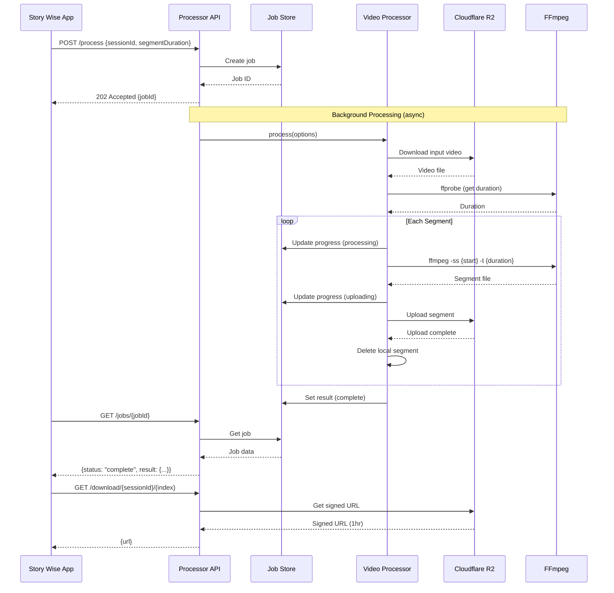
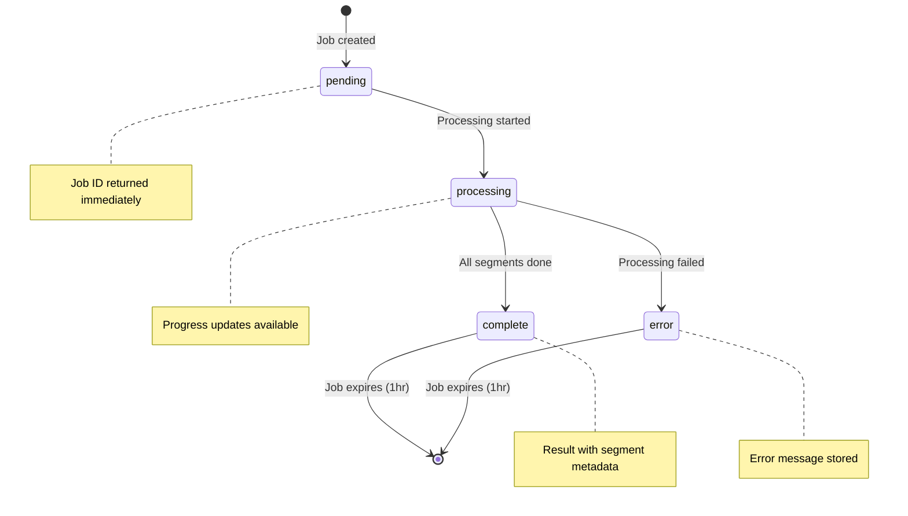
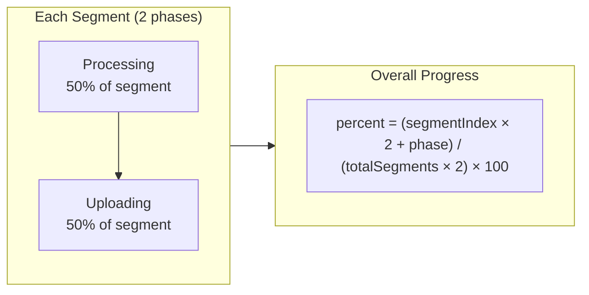
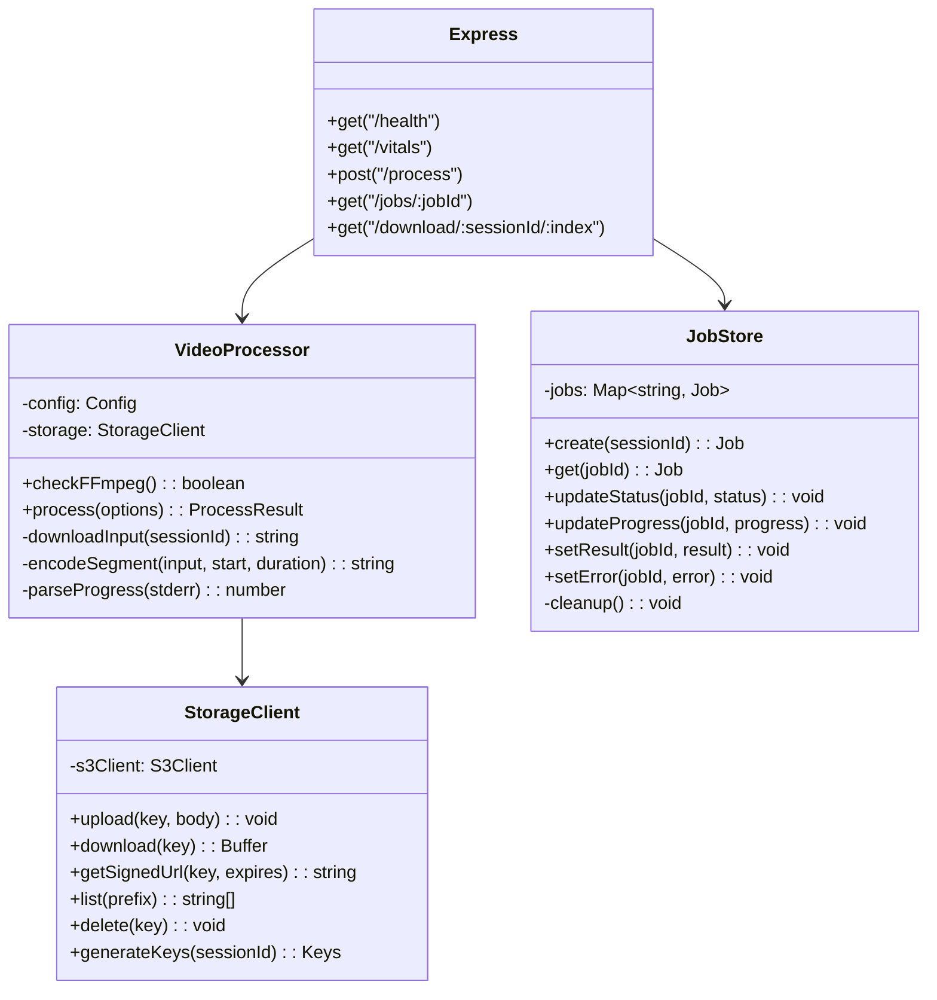

# Story Wise Processor

A Node.js microservice for server-side video processing. Uses FFmpeg to split videos into segments and stores them on Cloudflare R2.

## Overview

Story Wise Processor is a dedicated video processing service designed to offload heavy FFmpeg operations from serverless environments like Vercel. It provides:

- **Asynchronous processing** - Non-blocking job handling with immediate response
- **Real-time progress** - Granular progress tracking through processing stages
- **Scalable storage** - Cloudflare R2 integration for video storage
- **Multiple quality presets** - Configurable output quality and formats

## Why a Separate Processor?

Vercel serverless functions don't include FFmpeg binaries, making server-side video processing impossible. This microservice:

1. Runs on platforms that support system binaries (Railway, Fly.io, Docker)
2. Provides FFmpeg-based processing via a simple REST API
3. Integrates seamlessly with the main Story Wise app
4. Enables faster processing compared to browser-based FFmpeg.wasm

## Architecture

### System Overview

```mermaid
flowchart TB
    subgraph Client["Story Wise App (Vercel)"]
        NextJS[Next.js API Routes]
        React[React Frontend]
    end

    subgraph Processor["Story Wise Processor (Railway/Fly.io)"]
        Express[Express Server]
        FFmpeg[FFmpeg Binary]
        JobStore[Job Store]
        VideoProc[Video Processor]

        Express --> JobStore
        Express --> VideoProc
        VideoProc --> FFmpeg
    end

    subgraph Storage["Cloudflare R2"]
        InputBucket[/sessions/{id}/input//]
        OutputBucket[/sessions/{id}/segments//]
    end

    React --> NextJS
    NextJS --> Express
    VideoProc --> Storage
    NextJS --> Storage
```

### Processing Pipeline



### Job State Machine



### Progress Calculation



**Example**: Processing segment 2 of 5, uploading phase:
- `(2 × 2 + 1) / (5 × 2) × 100 = 50%`

## Project Structure

```
apps/story-wise-processor/
├── src/
│   ├── index.ts              # Express server and API endpoints
│   ├── config.ts             # Environment configuration
│   ├── processor.ts          # VideoProcessor class (FFmpeg logic)
│   ├── r2-client.ts          # StorageClient class (R2 operations)
│   └── job-store.ts          # JobStore class (in-memory tracking)
├── Dockerfile                # Multi-stage Docker build
├── railway.json              # Railway deployment config
├── fly.toml                  # Fly.io deployment config
├── .env.railway.example      # Environment template
├── package.json              # Dependencies
└── tsconfig.json             # TypeScript config
```

### Key Classes



## API Reference

### Health Check

```http
GET /health
```

Returns service health status and FFmpeg availability.

**Response:**
```json
{
  "status": "healthy",
  "ffmpeg": true,
  "timestamp": "2024-01-15T10:30:00.000Z"
}
```

### System Vitals

```http
GET /vitals
```

Returns system metrics for debugging (no authentication required).

**Response:**
```json
{
  "memory": {
    "heapUsedMb": 45,
    "heapTotalMb": 65,
    "rssMb": 120,
    "externalMb": 10
  },
  "system": {
    "freememMb": 1024,
    "totalmemMb": 2048,
    "loadAvg": [0.5, 0.7, 0.6]
  },
  "uptimeSeconds": 3600,
  "timestamp": "2024-01-15T10:30:00.000Z"
}
```

### Start Processing

```http
POST /process
Authorization: Bearer <API_KEY>
Content-Type: application/json
```

Starts an asynchronous video processing job.

**Request:**
```json
{
  "sessionId": "550e8400-e29b-41d4-a716-446655440000",
  "segmentDuration": 59,
  "outputFormat": "mp4",
  "quality": "medium"
}
```

| Field | Type | Required | Default | Description |
|-------|------|----------|---------|-------------|
| `sessionId` | string | Yes | - | Session ID (matches R2 folder) |
| `segmentDuration` | number | No | 59 | Segment duration in seconds |
| `outputFormat` | string | No | "mp4" | Output format: "mp4" or "webm" |
| `quality` | string | No | "medium" | Quality: "high", "medium", "low" |

**Response (202 Accepted):**
```json
{
  "jobId": "job_1705315800000_abc123",
  "status": "pending",
  "message": "Processing started"
}
```

### Get Job Status

```http
GET /jobs/:jobId
Authorization: Bearer <API_KEY>
```

Returns current job status and progress.

**Response (processing):**
```json
{
  "jobId": "job_1705315800000_abc123",
  "sessionId": "550e8400-e29b-41d4-a716-446655440000",
  "status": "processing",
  "progress": {
    "currentSegment": 3,
    "totalSegments": 6,
    "percent": 42,
    "stage": "processing"
  },
  "result": null,
  "error": null,
  "createdAt": "2024-01-15T10:30:00.000Z",
  "updatedAt": "2024-01-15T10:32:15.000Z"
}
```

**Response (complete):**
```json
{
  "jobId": "job_1705315800000_abc123",
  "sessionId": "550e8400-e29b-41d4-a716-446655440000",
  "status": "complete",
  "progress": {
    "currentSegment": 6,
    "totalSegments": 6,
    "percent": 100,
    "stage": "uploading"
  },
  "result": {
    "success": true,
    "duration": 312.45,
    "totalSegments": 6,
    "segments": [
      { "index": 0, "startTime": 0, "endTime": 59, "duration": 59 },
      { "index": 1, "startTime": 59, "endTime": 118, "duration": 59 },
      { "index": 2, "startTime": 118, "endTime": 177, "duration": 59 },
      { "index": 3, "startTime": 177, "endTime": 236, "duration": 59 },
      { "index": 4, "startTime": 236, "endTime": 295, "duration": 59 },
      { "index": 5, "startTime": 295, "endTime": 312.45, "duration": 17.45 }
    ]
  },
  "error": null
}
```

**Response (error):**
```json
{
  "jobId": "job_1705315800000_abc123",
  "sessionId": "550e8400-e29b-41d4-a716-446655440000",
  "status": "error",
  "progress": null,
  "result": null,
  "error": "FFmpeg encoding failed: Invalid input file"
}
```

### Get Download URL

```http
GET /download/:sessionId/:segmentIndex
Authorization: Bearer <API_KEY>
```

Returns a signed URL for downloading a processed segment.

**Parameters:**
| Parameter | Type | Description |
|-----------|------|-------------|
| `sessionId` | string | Session ID |
| `segmentIndex` | number | Segment index (0-based) |

**Query Parameters:**
| Parameter | Type | Default | Description |
|-----------|------|---------|-------------|
| `format` | string | "mp4" | Output format |

**Response:**
```json
{
  "url": "https://bucket.r2.cloudflarestorage.com/sessions/.../segment_000.mp4?X-Amz-..."
}
```

The signed URL expires after 1 hour.

## Configuration

### Environment Variables

| Variable | Required | Default | Description |
|----------|----------|---------|-------------|
| `R2_ACCOUNT_ID` | Yes | - | Cloudflare R2 account ID |
| `R2_ENDPOINT` | Yes | - | R2 endpoint URL |
| `R2_BUCKET_NAME` | Yes | - | R2 bucket name |
| `R2_ACCESS_KEY_ID` | Yes | - | R2 access key |
| `R2_SECRET_ACCESS_KEY` | Yes | - | R2 secret key |
| `API_KEY` | No | - | Bearer token for authentication |
| `ALLOWED_ORIGINS` | No | `localhost:*` | Comma-separated CORS origins |
| `PORT` | No | `3001` | Server port |
| `DEFAULT_SEGMENT_DURATION` | No | `59` | Default segment duration (seconds) |
| `OUTPUT_FORMAT` | No | `mp4` | Output format: `mp4` or `webm` |
| `PROCESSING_QUALITY` | No | `medium` | Quality: `high`, `medium`, `low` |
| `PROCESSING_PRESET` | No | `veryfast` | FFmpeg preset |
| `TEMP_DIR` | No | `/tmp/story-wise` | Temporary processing directory |

### Quality Presets

| Quality | MP4 CRF | WebM CRF | Description |
|---------|---------|----------|-------------|
| `high` | 18 | 20 | Best quality, larger files |
| `medium` | 23 | 30 | Balanced quality/size |
| `low` | 28 | 40 | Smaller files, reduced quality |

### FFmpeg Presets

| Preset | Speed | Quality |
|--------|-------|---------|
| `ultrafast` | Fastest | Lowest |
| `veryfast` | Very fast | Low |
| `fast` | Fast | Medium |
| `medium` | Medium | Good |
| `slow` | Slow | High |

## Deployment

### Railway (Recommended)

#### Option A: GitHub Actions (Automated)

On every push to `main` that changes `apps/story-wise-processor/`, the workflow deploys automatically.

**Setup:**

1. In **Railway**: Project → Settings → Tokens → Create Project Token
2. In **GitHub**: Settings → Secrets → Actions → New secret:
   - Name: `RAILWAY_TOKEN`
   - Value: Your project token
3. In **Railway**: Set environment variables (R2, API_KEY, etc.)

**Manual Deploy:**
- Go to Actions → Deploy processor → Run workflow

#### Option B: CLI Deploy

```bash
# Install Railway CLI
npm i -g @railway/cli

# Login
railway login

# Link project (first time)
cd apps/story-wise-processor
railway link

# Deploy
railway up
```

### Fly.io

```bash
# Install Fly CLI
brew install flyctl

# Login
fly auth login

# Launch (first time)
cd apps/story-wise-processor
fly launch --no-deploy

# Set secrets
fly secrets set \
  R2_ACCOUNT_ID=xxx \
  R2_ENDPOINT=xxx \
  R2_BUCKET_NAME=xxx \
  R2_ACCESS_KEY_ID=xxx \
  R2_SECRET_ACCESS_KEY=xxx \
  ALLOWED_ORIGINS=https://your-app.vercel.app \
  API_KEY=your-secret-key

# Deploy
fly deploy
```

### Docker (Self-hosted)

```bash
cd apps/story-wise-processor

# Build
docker build -t story-wise-processor .

# Run
docker run -p 3001:3001 \
  -e R2_ACCOUNT_ID=xxx \
  -e R2_ENDPOINT=xxx \
  -e R2_BUCKET_NAME=xxx \
  -e R2_ACCESS_KEY_ID=xxx \
  -e R2_SECRET_ACCESS_KEY=xxx \
  -e ALLOWED_ORIGINS=https://your-app.vercel.app \
  -e API_KEY=your-secret-key \
  story-wise-processor
```

### Render

1. Create a new Web Service
2. Connect your GitHub repo
3. Configure:
   - Root Directory: `apps/story-wise-processor`
   - Runtime: Docker
4. Add environment variables
5. Deploy

## Local Development

### Prerequisites

- Node.js 18+
- FFmpeg installed (`brew install ffmpeg` on macOS)
- Cloudflare R2 bucket configured

### Setup

```bash
cd apps/story-wise-processor

# Install dependencies
npm install

# Copy environment template
cp .env.railway.example .env

# Edit .env with your values
```

### Running

```bash
# Development (with hot reload)
npm run dev

# Production build
npm run build
npm start
```

### Testing the API

```bash
# Health check
curl http://localhost:3001/health

# Vitals
curl http://localhost:3001/vitals

# Start processing (with auth)
curl -X POST http://localhost:3001/process \
  -H "Authorization: Bearer your-api-key" \
  -H "Content-Type: application/json" \
  -d '{"sessionId": "test-session", "segmentDuration": 30}'

# Check job status
curl http://localhost:3001/jobs/job_xxx \
  -H "Authorization: Bearer your-api-key"

# Get download URL
curl http://localhost:3001/download/test-session/0 \
  -H "Authorization: Bearer your-api-key"
```

## Integration with Story Wise App

### Configure the Main App

Set these environment variables in your Story Wise deployment (Vercel):

```bash
CLOUD_PROCESSING_ENABLED=true
PROCESSOR_URL=https://your-processor.railway.app
PROCESSOR_API_KEY=your-api-key
```

### How It Works

1. User uploads video → stored in R2 at `sessions/{sessionId}/input/`
2. Main app calls `POST /api/process` → proxied to processor
3. Processor returns job ID immediately
4. Main app polls `GET /api/process-status/{jobId}` every second
5. When complete, main app fetches download URLs via `GET /api/download/...`
6. User downloads segments → auto-cleanup triggered

## Monitoring

### Health Endpoint

Configure your platform's health check to monitor `/health`:

```json
{
  "healthcheck": {
    "path": "/health",
    "interval": 30,
    "timeout": 10
  }
}
```

### Vitals Endpoint

Access system metrics at `/vitals` (no auth required):

- Memory usage (heap, RSS)
- System memory
- CPU load average
- Uptime

Enable vitals display in the main app with `?showVitals` query parameter.

### Logging

The processor logs key events:

```
[API] Process request: { sessionId, segmentDuration, ... }
[Processor] Starting processing: { sessionId }
[Processor] Video duration: 300 Total segments: 6
[Processor] Processing segment 1/6...
[Processor] Uploading segment 1...
[Storage] Uploaded: sessions/.../segments/segment_000.mp4
[API] Process complete: { jobId, totalSegments: 6 }
```

## Performance Considerations

- **FFmpeg Preset**: Use `veryfast` for speed; use `slow` for quality
- **Memory**: Each segment held in memory during processing; ~100MB per concurrent job
- **Disk**: Temp files deleted after upload; ensure adequate `/tmp` space
- **Network**: Direct R2 upload; bandwidth depends on file size

## Security

- **API Key**: All processing endpoints require Bearer authentication
- **CORS**: Configurable allowed origins
- **Signed URLs**: Download URLs expire after 1 hour
- **Session Isolation**: Files organized by session ID (UUID)
- **Auto-cleanup**: Job store clears entries after 1 hour

## Troubleshooting

| Issue | Solution |
|-------|----------|
| "FFmpeg not found" | Ensure FFmpeg is installed and in PATH |
| "R2 connection failed" | Verify R2 credentials and endpoint |
| "Job not found" | Jobs expire after 1 hour; retry processing |
| "CORS error" | Add your domain to `ALLOWED_ORIGINS` |
| "Processing timeout" | Check FFmpeg logs; try smaller segment duration |

## Related Projects

- **[story-wise](../story-wise/README.md)**: Main web application
- **[@lurx-react/video-processing](../../libs/video-processing/README.md)**: Shared utilities

## License

MIT
