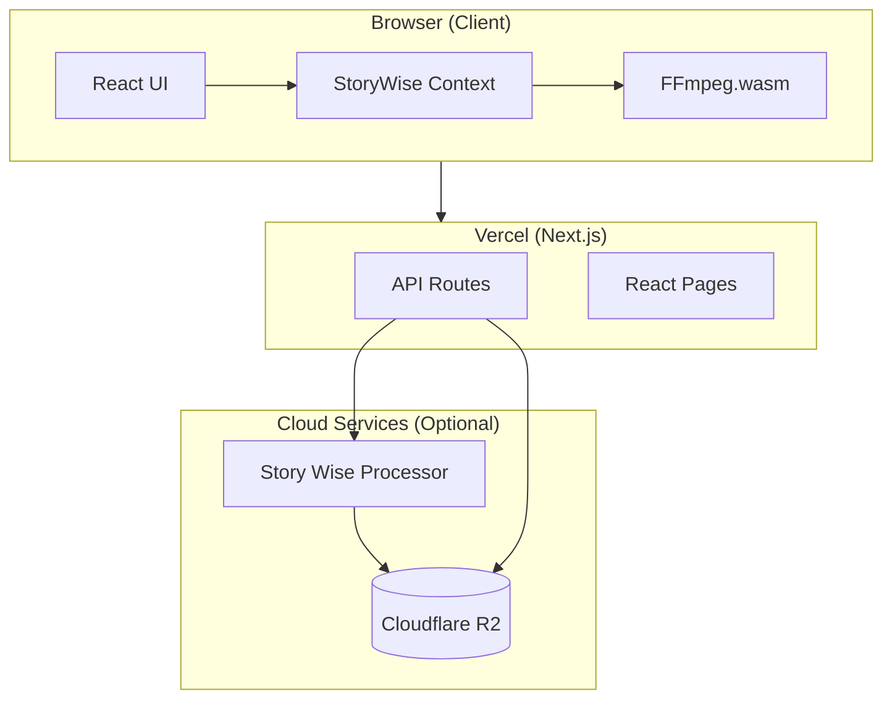
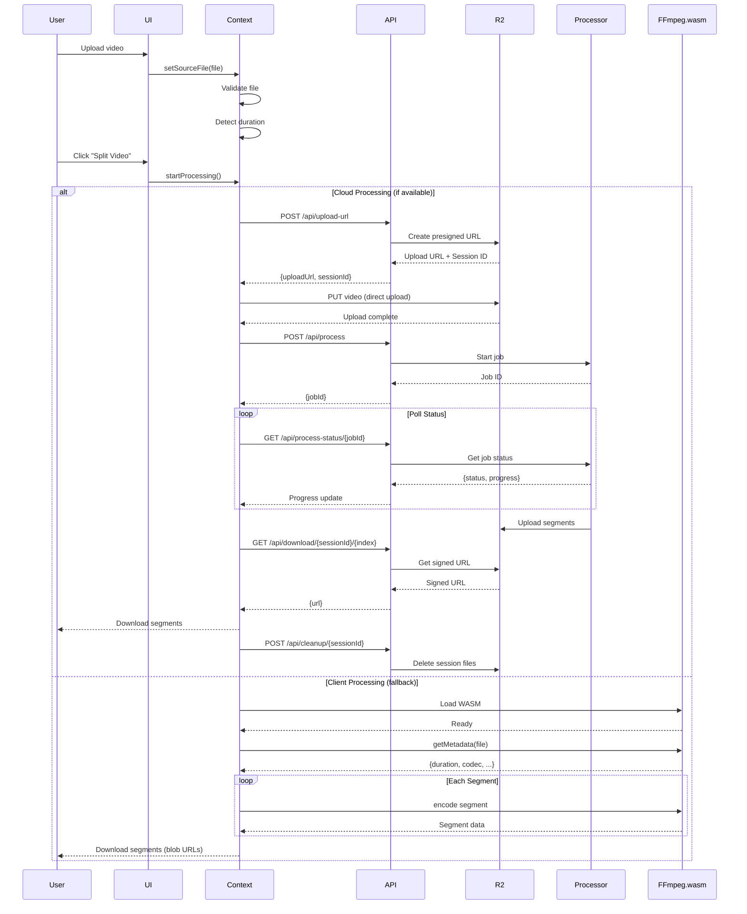
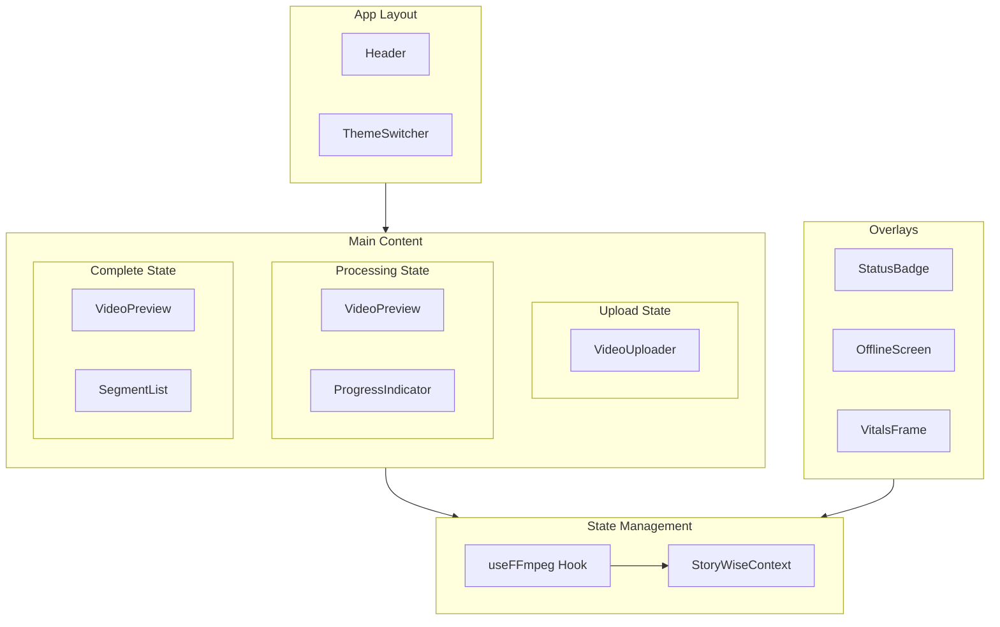
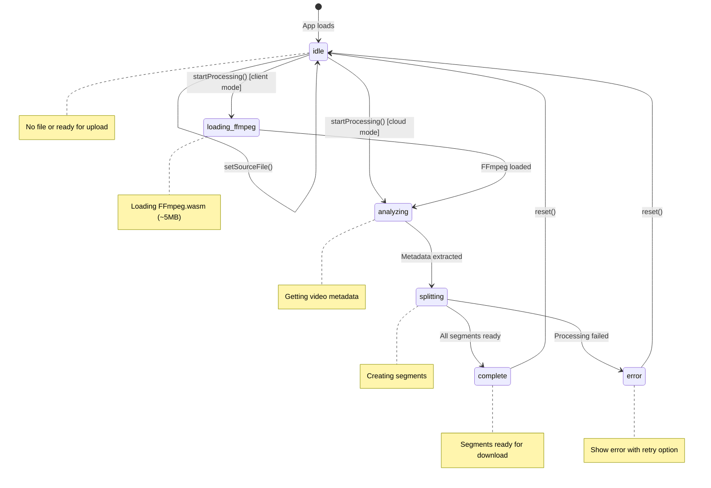

# Story Wise

A modern web application for splitting videos into short, story-sized clips optimized for social media platforms like Instagram Stories, TikTok, and YouTube Shorts.

## Overview

Story Wise provides a seamless video splitting experience with a dual-processing architecture:

- **Client-side processing** (default): Uses FFmpeg.wasm to process videos entirely in the browser - no uploads required, fully private
- **Cloud processing** (optional): Leverages server-side FFmpeg via Cloudflare R2 for faster processing of large files

## Features

- **Drag-and-drop upload** - Easy video upload with format and size validation
- **Customizable segment duration** - Split videos into 5-120 second segments (default: 59s)
- **Smart duration detection** - Auto-adjusts for short videos to ensure multiple segments
- **Real-time progress tracking** - Live progress bar with stage-specific messages
- **Batch download** - Download all segments at once or individually
- **Preview segments** - Preview any segment before downloading
- **Dark/Light theme** - Automatic theme detection with manual toggle
- **Offline support** - Client-side processing works without internet after initial load
- **Auto-cleanup** - Cloud sessions automatically cleaned after download

## Architecture

### High-Level Overview



### Processing Flow



### Component Architecture



### State Flow



## Project Structure

```
apps/story-wise/
├── src/
│   ├── app/
│   │   ├── api/                           # Next.js API routes
│   │   │   ├── cleanup/                   # Session cleanup endpoints
│   │   │   ├── download/                  # Segment download proxy
│   │   │   ├── health/                    # Health check for monitoring
│   │   │   ├── process/                   # Start processing job
│   │   │   ├── process-status/            # Poll job status
│   │   │   ├── status/                    # Service availability
│   │   │   ├── upload-url/                # Presigned upload URLs
│   │   │   ├── upload/                    # Upload handler
│   │   │   └── vitals/                    # System metrics
│   │   ├── components/
│   │   │   ├── header/                    # App header with title
│   │   │   ├── video-uploader/            # Drag-drop upload zone
│   │   │   ├── video-preview/             # Video player with controls
│   │   │   ├── segment-list/              # Segment cards with download
│   │   │   ├── progress-indicator/        # Processing progress bar
│   │   │   ├── status-badge/              # Connection status widget
│   │   │   ├── offline-screen/            # Maintenance/offline UI
│   │   │   ├── vitals-frame/              # Debug metrics panel
│   │   │   └── theme-switcher/            # Light/dark toggle
│   │   ├── context/
│   │   │   └── story-wise-context.tsx     # Main state management
│   │   ├── hooks/
│   │   │   └── use-ffmpeg.ts              # FFmpeg.wasm integration
│   │   ├── constants/                     # Configuration constants
│   │   ├── types/                         # TypeScript interfaces
│   │   ├── layout.tsx                     # Root layout
│   │   └── page.tsx                       # Main page
│   ├── config/
│   │   ├── cloud.config.ts                # Cloud/R2 configuration
│   │   └── themes.ts                      # Theme configuration
│   └── lib/
│       └── r2-client.ts                   # R2 storage client
├── public/                                # Static assets
├── .env.example                           # Environment template
├── next.config.js                         # Next.js configuration
├── tailwind.config.js                     # Tailwind CSS config
└── project.json                           # Nx project config
```

## Getting Started

### Prerequisites

- Node.js 18+
- Yarn package manager
- Nx CLI (optional, but recommended)

### Installation

```bash
# From monorepo root
yarn install

# Build dependencies
npx nx build vanguardis
```

### Development

```bash
# Start development server
npx nx serve story-wise

# Or with port check
if ! lsof -i:4200 >/dev/null 2>&1; then npx nx serve story-wise; fi
```

The app will be available at `http://localhost:4200`

### Building

```bash
# Production build
npx nx build story-wise

# Build with analysis
npx nx build story-wise --analyze
```

## Configuration

### Environment Variables

Create a `.env.local` file based on `.env.example`:

```bash
# ═══════════════════════════════════════════════════════════════
# CLOUD PROCESSING (Optional - disabled by default)
# ═══════════════════════════════════════════════════════════════
CLOUD_PROCESSING_ENABLED=false
CLOUD_STORAGE_PROVIDER=r2

# ═══════════════════════════════════════════════════════════════
# CLOUDFLARE R2 (Required if cloud processing enabled)
# ═══════════════════════════════════════════════════════════════
R2_ACCOUNT_ID=your_account_id
R2_ENDPOINT=https://your_account_id.r2.cloudflarestorage.com
R2_BUCKET_NAME=story-wise-videos
R2_ACCESS_KEY_ID=your_access_key
R2_SECRET_ACCESS_KEY=your_secret_key
R2_PUBLIC_URL=https://your-public-url.com  # Optional

# ═══════════════════════════════════════════════════════════════
# PROCESSOR SERVICE (Required if cloud processing enabled)
# ═══════════════════════════════════════════════════════════════
PROCESSOR_URL=https://your-processor.railway.app
PROCESSOR_API_KEY=your_api_key

# ═══════════════════════════════════════════════════════════════
# PROCESSING DEFAULTS
# ═══════════════════════════════════════════════════════════════
MAX_FILE_SIZE=2147483648              # 2GB
DEFAULT_SEGMENT_DURATION=59           # seconds
OUTPUT_FORMAT=mp4                     # mp4 | webm
PROCESSING_QUALITY=medium             # high | medium | low

# ═══════════════════════════════════════════════════════════════
# CLEANUP
# ═══════════════════════════════════════════════════════════════
CLEANUP_DELETE_AFTER_DAYS=7
CLEANUP_INTERVAL_HOURS=24

# ═══════════════════════════════════════════════════════════════
# SERVICE STATUS
# ═══════════════════════════════════════════════════════════════
SERVICE_OFFLINE=false
OFFLINE_MESSAGE=                      # Custom offline message
```

### Constants

Key processing constants can be found in `src/app/constants/`:

| Constant | Default | Description |
|----------|---------|-------------|
| `DEFAULT_SEGMENT_DURATION` | 59 | Default segment length in seconds |
| `MIN_SEGMENT_DURATION_SEC` | 1 | Minimum segment duration |
| `SHORT_VIDEO_MIN_SEGMENTS` | 2 | Minimum segments for short videos |
| `SEGMENT_DURATION_INPUT.MIN` | 5 | Min duration user can select |
| `SEGMENT_DURATION_INPUT.MAX` | 120 | Max duration user can select |
| `CLOUD_POLLING_MAX_POLLS` | 600 | Max polls (10 min timeout) |
| `DOWNLOAD_DELAY_BETWEEN_MS` | 500 | Delay between batch downloads |

## API Routes

### Public Endpoints

| Endpoint | Method | Description |
|----------|--------|-------------|
| `/api/status` | GET | Service availability check |
| `/api/health` | GET | Detailed health check |
| `/api/vitals` | GET | System metrics (debug) |

### Processing Endpoints

| Endpoint | Method | Description |
|----------|--------|-------------|
| `/api/upload-url` | POST | Get presigned upload URL |
| `/api/process` | POST | Start processing job |
| `/api/process-status/[jobId]` | GET | Poll job status |
| `/api/download/[sessionId]/[index]` | GET | Get segment download URL |
| `/api/cleanup/[sessionId]` | POST | Cleanup session files |

## User Guide

### Splitting a Video

1. **Upload your video**
   - Drag and drop a video file onto the upload zone
   - Or click to browse and select a file
   - Supported formats: MP4, MOV, WebM, AVI, MKV
   - Maximum file size: 2GB

2. **Configure segment duration**
   - Default: 59 seconds (ideal for 60-second story limits)
   - Use the slider or input to adjust (5-120 seconds)
   - For short videos, the app auto-calculates optimal duration

3. **Start processing**
   - Click "Split Video" to begin
   - Watch real-time progress with stage indicators
   - Processing can be cancelled at any time

4. **Download your segments**
   - Preview any segment by clicking on it
   - Download individual segments with the download button
   - Use "Download All" for batch download
   - Filenames include timestamps: `video_00m00s-00m59s.mp4`

### Processing Modes

**Client Mode (Default)**
- Video never leaves your device
- Works offline after initial page load
- Processing speed depends on your device
- Best for: Privacy-conscious users, smaller files

**Cloud Mode (Optional)**
- Video uploaded to secure cloud storage
- Processed on dedicated server with FFmpeg
- Faster for large files
- Automatic cleanup after download
- Requires cloud configuration

### Troubleshooting

| Issue | Solution |
|-------|----------|
| "Invalid file format" | Ensure video is MP4, MOV, WebM, AVI, or MKV |
| "File too large" | Maximum file size is 2GB |
| Processing stuck | Try refreshing and re-uploading |
| Download blocked | Browser may be blocking multiple downloads - try individually |
| Slow processing | Client-side processing depends on device - try smaller files |

## Technology Stack

- **Framework**: Next.js 14 (App Router)
- **UI**: React 18, Tailwind CSS, DaisyUI
- **Video Processing**: FFmpeg.wasm (client), FFmpeg (server)
- **Storage**: Cloudflare R2 (S3-compatible)
- **State Management**: React Context + Hooks
- **File Handling**: react-dropzone, file-saver

## Deployment

### Vercel (Recommended)

The app is optimized for Vercel deployment with client-side processing:

1. Connect your repository to Vercel
2. Configure environment variables
3. Deploy

**Note**: Cloud processing requires a separate processor service (see [story-wise-processor](../story-wise-processor/README.md)).

### Environment-Specific Notes

- **COEP Headers**: Configured in `next.config.js` for SharedArrayBuffer (FFmpeg.wasm requirement)
- **Transpilation**: `@lurx-react/video-processing` is transpiled via Next.js config
- **File Size Limits**: Vercel has 4.5MB body limit - direct R2 upload bypasses this

## Testing

```bash
# Run unit tests
npx nx test story-wise

# Run e2e tests
npx nx e2e story-wise-e2e

# Run with coverage
npx nx test story-wise --coverage
```

## Related Projects

- **[story-wise-processor](../story-wise-processor/README.md)**: Server-side video processing microservice
- **[@lurx-react/video-processing](../../libs/video-processing/README.md)**: Shared video processing utilities

## License

MIT
